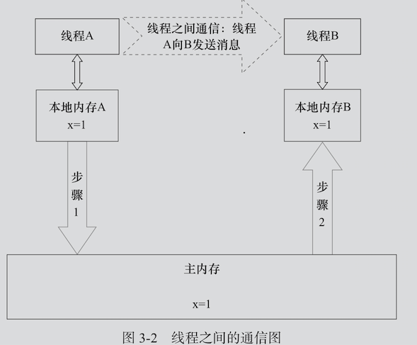

# 010-Java内存模型基础(JMM)

[TOC]

## 并发编程模型的两个关键问题

1. [线程之间如何通信](#线程之间如何通信)
2. [线程之间如何同步](#线程之间如何同步)

### 1.线程之间如何通讯

**通信**是指线程之间以何种机制来交换信息，在命令式编程中，线程之间的通信机制有两种：**共享内存**和**消息传递**。

- 在共享内存的并发模型里,线程之间共享程序的公共状态, 通过**读-写内存中的公共状态**进行隐式通讯
- 在消息传递的并发模型里,线程之间没有公共状态,线程之间必须通过**发送消息**来显式的进行通讯

### 2.线程之间如何同步

这里**同步**是指程序中用于控制不同线程之间操作发生相对顺序的机制。

- 在共享内存并发模型里,同步是显示进行的。程序员必须显式指定某个方法或某段代码需要在线程之间互斥执行
- 在消息传递的并发模型里,由于消息的发送必须在消息的接收之前,因此同步是隐式进行的

Java的并发采用的是共享内存模型,Java 线程之间通讯总是隐式进行,整个通讯过程对程序员完全透明

## Java内存模型的抽象结构

堆内存在线程之间共享,为**共享变量**包括:

- 实例域
- 静态域
- 数组元素

以下不会在线程之间共享,所以不会有内存可见性的问题

- 局部变量 (LocalVariable)
- 方法定义参数 (Formal Method Parameters)
- 异常处理参数 (Exception Handler Parameters)

#### JMM的抽象

Java 线程之间的通讯由 Java 内存模型(JMM) 控制,JMM 决定了一个线程对共享变量的写入何时对另一个线程可见

JMM 定义了线程和主内存之间的抽象关系:

- 线程之间的**共享变量**存储在主内存(Main Memory)中
- 每个线程都有一个私有的本地线程(Local Memory),本地线程中包含了共享内存的副本
- JMM 本地内存的概念是抽象概念,并不是真实存在的,它涵盖了缓存、写缓冲区、寄存器以及其他硬件和编译器优化

#### 线程 A 与线程 B 之间通讯

JMM 通过控制主内存与每个线程的本地内存之间的交互,来为 Java 程序提供内存可见性保证

1. 线程 A写入本地内存 A 中更新过的共享内存刷新到主内存中

 	2. 线程 B到主内存中取读取线程 A之前已更新过的共享变量

当然刷新的操作并不是原子操作,所以会有可见性问题,JMM通过控制主内存与每个线程的本地内存之间的交互来提供可见性保证

## 共享内存模型

Java采用的是**共享内存模型**，在共享内存的并发模型里，线程之间共享程序的公共状态，通过读-写内存中的公共状态进行隐式通讯。
Java线程之间的通讯总是隐式进行，这个通讯过程对于程序员来说完全透明。

如果编写多线程程序的Java程序员不理解隐式进行的线程之间通讯的工作机制，很可能会遇到各种奇怪的内存可见性问题。

JMM 全称是 `Java Memory Model`. 什么是 JMM 呢? 

通过前面的分析发现，导致可见性问题的根本原因是缓存以及重排序。 而 JMM 实际上就是提供了合理的禁用缓存 以及禁止重排序的方法。所以它最核心的价值在于解决可见性和有序性。

JMM 属于语言级别的抽象内存模型，可以简单理解为对硬 件模型的抽象，它定义了共享内存中多线程程序读写操作 的行为规范:在虚拟机中把共享变量存储到内存以及从内 存中取出共享变量的底层实现细节

通过这些规则来规范对内存的读写操作从而保证指令的正 确性，它解决了 CPU 多级缓存、处理器优化、指令重排序 导致的内存访问问题，保证了并发场景下的可见性。

需要注意的是，JMM 并没有限制执行引擎使用处理器的寄 存器或者高速缓存来提升指令执行速度，也没有限制编译 器对指令进行重排序，也就是说在 JMM 中，也会存在缓存 一致性问题和指令重排序问题。

只是 JMM 把底层的问题抽 象到 JVM 层面，再基于 CPU 层面提供的内存屏障指令， 以及限制编译器的重排序来解决并发问题

Java 内存模型底层实现可以简单的认为:

通过内存屏障 (`memory barrier`)禁止重排序，即时编译器根据具体的底层 体系架构，将这些内存屏障替换成具体的 CPU 指令。

对于编译器而言，内存屏障将限制它所能做的重排序优化。 而对于处理器而言，内存屏障将会导致缓存的刷新操作。 比如，对于 volatile，编译器将在 volatile 字段的读写操作 前后各插入一些内存屏障。

## 与可见性有关的关键字

- `volatile` 解决可见性问题
- `synchronized` 加同步锁
- `final` 防止指令重排序,final 修饰的变量只有在构造的时候才会修改,不允许重排序

## JMM 是如何解决可见性有序性问题的

简单来说，JMM 提供了一些禁用缓存以及进制重排序的方 法，来解决可见性和有序性问题。这些方法大家都很熟悉: volatile、synchronized、final;

