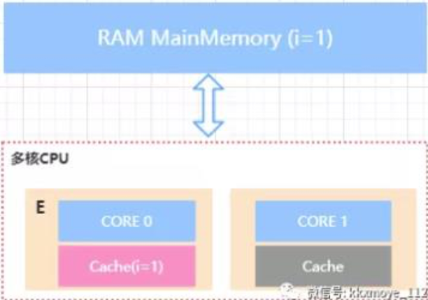
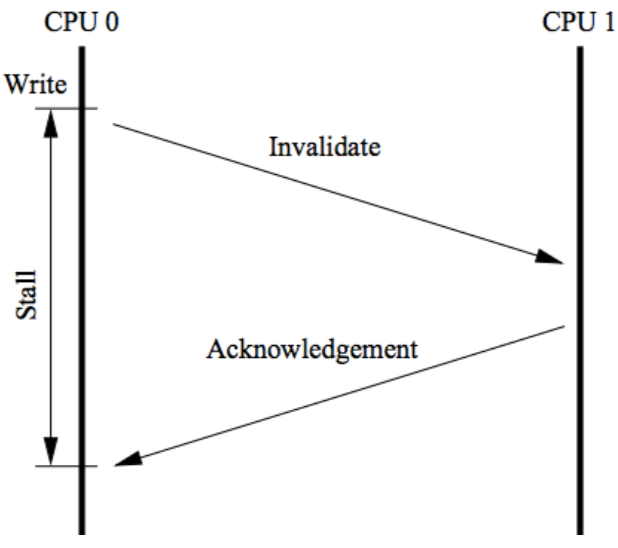
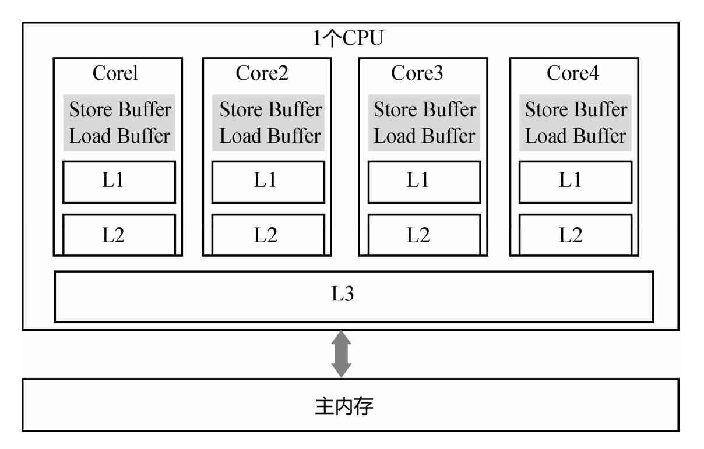
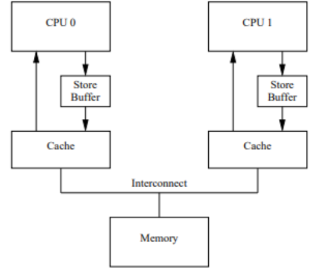

# 缓存一致性协议MESI

## 目录

[TOC]

----

## 什么是缓存一致性协议

为了达到数据访问的一致，需要各个处理器在访问缓存时遵循一些协议，在读写时根据协议来操作，常见的协议有 MSI，MESI，MOSI 等。最常见的就是 MESI 协议。接下来 给大家简单讲解一下 MESI

MESI 表示缓存行的四种状态，分别是

| 状态          | 解释                                                         |
| ------------- | ------------------------------------------------------------ |
| M (Modify)    | 表示共享数据只缓存在当前 CPU 缓存中， 并且是被修改状态，也就是缓存的数据和主内存中的数 据不一致 |
| E (Exclusive) | 表示缓存的独占状态，数据只缓存在当前 CPU 缓存中，并且没有被修改 |
| S (Shared)    | 表示数据可能被多个CPU 缓存，并且各个缓存中的数据和主内存数据一致 |
| I  (Invalid)  | 表示缓存已经失效                                             |

在 MESI 协议中，每个缓存的缓存控制器不仅知道自己的读写操作，而且也监听(snoop)其它 Cache 的读写操作

## 协议工作流程

假如在主内存中有一个  MainMemory 存在变量 i = 1, 

- CORE 0 此时 M 代表修改的状态 

- CORE 1 此时 I 代表失效的状态

下图中 `CORE0 `和 `CORE1` 属于缓存的独占状态

下图中 `CORE0` 和 `CORE1` 属于 S 分享状态 

对于 MESI 协议，从 CPU 读写角度来说会遵循以下原则: 

- CPU 读请求:缓存处于 M、E、S 状态都可以被读取，I 状态 CPU 只能从主存中读取数据

- CPU 写请求:缓存处于 M、E 状态才可以被写。对于 S 状态的写，需要将其他 CPU 中缓存行置为无效才可写

使用总线锁和缓存锁机制之后，CPU 对于内存的操作大概 可以抽象成下面这样的结构。从而达到缓存一致性效果

## MESI带来的问题

MESI 协议虽然可以实现缓存的一致性，但是也会存在一些问题。

就是各个 CPU 缓存行的状态是通过消息传递来进行的。

- 如果 CPU0 要对一个在缓存中共享的变量进行写入，首先需要发送一个`失效的消息`给到其他缓存了该数据的 CPU。并 且要等到他们的确认回执。
- CPU0 在这段时间内都会处于 阻塞状态。

为了避免阻塞带来的资源浪费。在 cpu 中引入 了 **Store Bufferes 和Load Buffer**

CPU0 只需要在写入共享数据时，直接把数据写入到 store bufferes 中，同时发送 invalidate 消息，然后继续去处理其他指令。

当收到其他所有 CPU 发送了 invalidate acknowledge 消息 时，再将 store bufferes 中的数据数据存储至 cache line 中。最后再从缓存行同步到主内存。

但是这种优化存在两个问题

1. 数据什么时候提交是不确定的，因为需要等待其他 cpu给回复才会进行数据同步。这里其实是一个异步操作
2. 引入了 storebufferes 后，处理器会先尝试从 storebuffer 中读取值，如果 storebuffer 中有数据，则直接从 storebuffer 中读取，否则就再从缓存行中读取

Store Buffer 的延迟写入是重排序的一种,称之为内存重排序

 [02-重排序.md](02-重排序.md) 

## 内存屏障

内存屏障有两个作用

1. 阻止屏障两侧的指令重排序
2. 强制把写缓冲区/高速缓存中的脏数据写回主内存,让缓存相应的数据失效

内存屏障就是将 store bufferes 中的指令写入到内存，从 而使得其他访问同一共享内存的线程的可见性。
X86 的 memory barrier 指令包括 lfence(读屏障) sfence(写 屏障) mfence(全屏障)

- Store Memory Barrier(写屏障) 告诉处理器在写屏障之前 的所有已经存储在存储缓存(store bufferes)中的数据同步 到主内存，简单来说就是使得写屏障之前的指令的结果对 屏障之后的读或者写是可见的
- Load Memory Barrier(读屏障) 处理器在读屏障之后的读 操作,都在读屏障之后执行。配合写屏障，使得写屏障之前 的内存更新对于读屏障之后的读操作是可见的
- Full Memory Barrier(全屏障) 确保屏障前的内存读写操作 的结果提交到内存之后，再执行屏障后的读写操作

