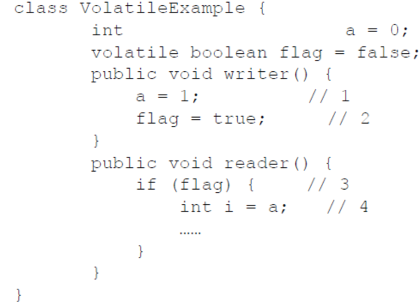

#              happens-before

[TOC]

## 一言蔽之

**happens-before 用来描述操作之间的内存可见性,用来屏蔽程序员与 JMM 内存可见性操作的细节**


**它的意思表示的是前一个操作的结果对于后续操作是可见的，所以它是一种表达多个线程之间对于内存的可见性。**

所以我们可以认为在 JMM 中，如果一个操作执行的结果需要对另一个操作可见，那么这两个操作必须要存在 happens-before 关系。这两个操作可以是同一个线程，也 可以是不同的线程

## 参考

 [020-Java内存模型：看Java如何解决可见性和有序性问题.md](../01-tutorials/010-并发理论基础-1/020-Java内存模型：看Java如何解决可见性和有序性问题.md) 

## 什么是Happens-Before

两个操作之间有 happens-before 关系,并不意味着前一个操作必须要在后一个操作之前执行,happens-before 仅仅要求前一个操作(执行的结果) 对于后一个操作可见,且前一个操作按顺序排在第二个操作之前(the first is visible to the ordered before the second)

对于 Java 程序来说,happens-before 规则简单容易懂,避免Java 程序员为了理解 JMM 提供的内存可见性保证而去学习复杂的重排序规则以及这些规则的具体实现

## happens-before的六个规则

6个规则，都是对 JMM 对内存可见性相关操作的屏蔽， 也是程序员最关心的

1. 程序顺序规则: as-if-serial一个线程中的每个操作, happens-before于该线程中的任意后续操作
2. 监视器锁规则 : 对一个锁的解锁, happens-before 于随后对这个锁加锁
3. volatile变量规则 : 对一个 volatile 域的写,happens-before 于任意后续对这个 volatile 域的读
4. 传递性 : 如果 A happens-before B , 且 B happens-before C , 那么 A 一定 happens-before C
5. start 规则 :  指主线程 A 启动子线程 B 后，子线程 B 能够看到主线程在启动子线程 B 前的操作。
6. join 规则 : 如果线程 A 执行 ThreadB.join(). 那么线程 B 中的任意操作 happen-before与线程 A 从ThreadB.jion 操作成功返回

## 原则1 程序顺序性原则

一个线程中的每个操作, happens-before 于该线程中的任意后续操作

这显然是 JMM 对 重排序的承诺  :  **已经正确同步程序的执行顺序就是程序员代码编写的顺序** ， 我们都知道，JMM 定义了很多重排序规则，以便于优化代码的执行效率 ，主要分为以下三种重排序

 [02-重排序.md](02-重排序.md) 

- 编译器重排序

> 编译器在不改变单线程程序语义的前提下，可以重新安排语句的执行顺序;

- 指令重排序

> 如果不存在数据依赖性,处理器可以改变语句对应机器指令的执行顺序

- 内存系统重排序

> 由于处理器使用缓存和读/写缓冲区，这使得加载和存储操作看上去可能是在乱序执行的

所以实际上 程序顺序规则 就是对着一系列重排序的规则的总结， 让程序员不关心其实现方式，只要按照约定编写程序

## 原则2 监视器锁规则

对一个锁的解锁, happens-before 于随后对这个锁加锁

举个例子， synchronized 关键字 是典型的使用监视器锁的 方式， 通过获取监视器锁，保证程序的顺序一致性

- 同步代码块使用的是`monitorenter`和`monitorexit`
- 同步方法使用的是`ACC_SYNCHRONIZED`完成

实际上监视器锁的规则就是对加锁和解锁的底层实现的总结，让程序员不关系其实现，只要在需要获取锁的地方加锁即可

## 原则3 volatile变量规则

对一个 volatile 域的写,happens-before 于任意后续对这个 volatile 域的读

> 知识点  [volatile 内存语义](04-volatile 内存语义.md) 

- 确保可见性
- 禁止指令重排序

通过使用内存屏障的方式禁止指令重排序， 

## JMM 中有哪些方法建立 happen-before 规则

#### 程序顺序规则

- 一个线程中的每个操作，happens-before 于该线程中的 任意后续操作; 可以简单认为是 as-if-serial。单个线程中的代码顺序不管怎么变，对于结果来说是不变的顺 序 规 则 表 示 
  - 1 happenns-before 2; 
  - 3 happens- before 4



- volatile 变量规则，对于 volatile 修饰的变量的写的操作， 一定 happen-before 后续对于 volatile 变量的读操作; 根据 volatile 规则，2 happens before 3

- 传递性规则，如果 `1 happens-before 2;` `3happens- before 4;` 那么传递性规则表示:` 1 happens-before 4;`

- start 规则，如果线程 A 执行操作` ThreadB.start()`,那么线 程 A 的 `ThreadB.start()`操作 `happens-before `线程 B 中
  的任意操作

```java
public StartDemo{
int x=0;
Thread t1 = new Thread(()->{
// 主线程调用 t1.start() 之前
// 所有对共享变量的修改，此处皆可见 // 此例中，x==10
});
// 此处对共享变量 x 修改 x = 10;
// 主线程启动子线程 t1.start();
}
```

- join 规则，如果线程 A 执行操作 ThreadB.join()并成功返 回，那么线程 B 中的任意操作 happens-before 于线程 A 从 ThreadB.join()操作成功返回。

```java
Thread t1 = new Thread(()->{ // 此处对共享变量 x 修改 x= 100;
});
// 例如此处对共享变量修改，
// 则这个修改结果对线程 t1 可见 // 主线程启动子线程
t1.start();
t1.join()
// 子线程所有对共享变量的修改
// 在主线程调用 t1.join() 之后皆可见 // 此例中，x==100
```

- 监视器锁的规则，对一个锁的解锁，happens-before 于 随后对这个锁的加锁

```java
synchronized (this) { // 此处自动加锁 // x 是共享变量, 初始值 =10
	if (this.x < 12) {
		this.x = 12; 
		}
} // 此处自动解锁
```

- 假设 x 的初始值是 10，线程 A 执行完代码块后 x 的 值会变成 12(执行完自动释放锁)，线程 B 进入代码块 时，能够看到线程 A 对 x 的写操作，也就是线程 B 能 够看到 x==12。