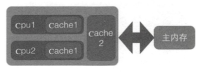
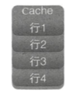
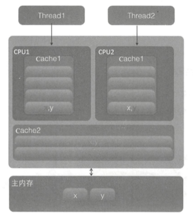

# CPU缓存伪共享问题

---

[TOC]

## CPU缓存伪共享是什么

**伪共享的本质是多个变量被放入了一个缓冲行中,并且有多个线程去写入缓存行中不同的变量**

我们都知道线程之间通讯要么锁总线,要么锁缓存, 常用处理器的缓存行是64字节的，比较旧的处理器缓存行是32字节

 参考 :  [03-原子操作的实现原理](../04-Java并发机制的底层实现原理/03-原子操作的实现原理.md#处理器如何实现原子操作) 

- 锁总线性能太低

- 锁缓存会导致伪共享

## CPU 缓存的结构

为了解决计算机系统中主内存与 CPU 之间的运行速度差问题, 会在 CPU 和主内存之间添加一级或者多级高速缓冲存储器 Cache , 这个 Cache 一般来说是被集成到 CPU内部的,所以也叫做 CPU cache 



- 每个CPU 单独有一个 一级缓存
- 多个 CPU 共享 一个 二级缓存

**Cache 内部是按行存储的**,  其中每一行成为一个Cache 行, Cache 行 是 Cache 与主内存进行数据交换的单位, 一般来说是 2 的幂次数字节



## 访问缓存的过程

当 CPU 访问某个变量时, 

- 首先看 CPU cache 是否有该变量 , 有则读取
- 没有则从主内存中读取, 然后把该变量所在的内存区域的一个 Cache 行大小的内存复制到 Cache 中

由于存放到 cache 行是内存块而不是单个变量,所以可能会把多个变量存放到一个 Cache 行中

**当多个线程去同时修改一个缓存行的多个变量时 , 由于同时只能有一个线程操作缓存行,所以相比将每个变量存放到一个缓存行,性能会有所下降 , 这就是伪共享**

## 图示



变量x 和变量 y 同时被放到了 CPU 的一级和二级缓存,

- 当线程 1 使用 CPU1对变量 x 进行更新时, 首先会修改 CPU 1 的 一**级缓存变量** x 所在的缓存行, 这个时候在缓存一致性协议下

- CPU2 中变量 x 对应的缓存行失效 , 线程 2 在写入变量 x 时就只能去二级缓冲中查找, 这就破坏了一级缓存

而一级缓存比二级缓存更快, 这也说明了多个线程不可能同时去修改自己所使用的CPU 中相同缓存行里面的变量

更坏的情况是

如果 CPU 只有一级缓存, 则会导致频繁地访问主内存

## 为什么会出现伪共享

**伪共享的本质是多个变量被放入了一个缓冲行中,并且有多个线程去写入缓存行中不同的变量**

为什么会出现?

 [局部性原则](101-局部性原理.md) 

因为缓存与内存交换数据的单位就是缓存行, 当 CPU 要访问的变量没有在缓存中找到时,根据程序运行的局部性原理,**会把该变量所在内存中大小为缓存行的内存放入缓存行**

```java
long a;
long b;
long c;
long d;
```

我们假设缓存行大小为 32 字节,

- cpu 访问变量 a 时发现该变量没有在缓存中, 所以就从主内存把变量 a 以及内存地址附件的 b , c ,d  放入缓存行,也就是连续的多个变量才有可能被放到同一个缓存行中
- 当创建数组时, 数组里面的多个元素就会被放入同一个缓存行

那么在单线程下,多个变量被放入同一个缓存行对性能有影响吗, 其实 正常情况下单线程访问时数组元素放入一个或者多个缓存对性能有影响吗? 

其实在正常情况下单线程访问时将数组元素放入一个或者多个缓存行对代码执行是有利的

## 如何避免伪共享

#### JDK8之前的解决办法

JDK8之前一般都是通过字节填充的方式来避免，也就是创建一个变量的时候使用填充字段填充该变量所在的缓存行，这样就避免了多个变量存在同一个缓存行，如下代码：

```java
public final static class FilledLong {
      public volatile long value = 0L;
      public long p1, p2, p3, p4, p5, p6;     
}
```

假如 Cache 行为64个字节，那么我们在 FilledLong 类里面填充了6个 long 类型变量，每个 long 类型占用8个字节，加上 value 变量的8个字节总共 56 个字节，另外这里 FilledLong 是一个类对象，而类对象的字节码的对象头占用了 8 个字节，所以当new一个 FilledLong 对象时候实际会占用64个字节的内存，这个正好可以放入 Cache 的一个行。

#### JDK8之后的解决办法

在 JDK8 中提供了一个 sun.misc.Contended 注解，用来解决伪共享问题，上面代码可以修改为如下：

```java
@sun.misc.Contended 
public final static class FilledLong {
      public volatile long value = 0L;
}
```

上面是修饰类的，当然也可以修饰变量，比如Thread类中的使用：

```java
/** The current seed for a ThreadLocalRandom */
@sun.misc.Contended("tlr")
  long threadLocalRandomSeed;

/** Probe hash value; nonzero if threadLocalRandomSeed initialized */
@sun.misc.Contended("tlr")
  int threadLocalRandomProbe;

/** Secondary seed isolated from public ThreadLocalRandom sequence */
@sun.misc.Contended("tlr")
  int threadLocalRandomSecondarySeed;
```

Thread 类中的这是哪个变量被初始化为 0 , 这三个变量会在 ThreadLocalRandom 类中使用

#### 值得注意的是

默认情况下`  @sun.misc.Contended `注解只用于 Java 核心类, 比如 rt 包下的类, 如果 classpath 下的类需要使用, 则需要加入 JVM 参数 

```
-XX:-RestrictContended	
```

填充的宽度默认为 128, 要自定义宽度则可以设置为

```
-XX:ContendedPaddingWidth 参数
```

