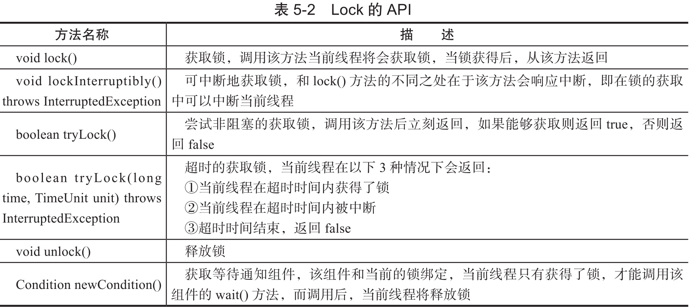

# 030-Lock接口

[TOC]

## Lock接口和synchronized的对比

锁用来控制多个线程访问共享资源的方式,在 Lock 接口之前,Java 程序员使用 sychronized 关键字实现锁的功能

- Lock 缺少了(通过 synchronized 块或者方法所提供的)隐式获取释放锁的便捷性,
- 但是却拥有了锁获取与释放的可操作性, 可中断的获取锁以及超时获取锁的多种方式

具体来说

- synchronized 阻塞不释放锁,无法破解死锁中的不可抢占
- lockInterruptibly 允许 中断释放资源
- tryLock 允许超时
- tryLock允许非阻塞获取锁

## Lock接口提供了 synchronized 关键不具备的主要特性

| 特性               | 方法                                 | 描述                                                         |
| ------------------ | ------------------------------------ | ------------------------------------------------------------ |
| 尝试非阻塞地获取锁 | `tryLock`                            | 当前线程尝试获取锁,如果这一时刻锁没有被其他线程获取到,则成功获取并持有锁 |
| 能被中断地获取锁   | `lockInterruptibly()`                | 与 synchronized 不同, 获取到锁的线程能够响应中断, 当获取到锁的线程被中断时,中断异常将会被抛出,同时锁会被释放 |
| 超时获取锁         | `tryLock(long time , TimeUnit unit)` | 在指定的截止时间之前获取锁,如果截止时间到了仍然无法获取锁,则返回 |

## Lock 的 API

简单的使用

```java
Lock lock = new ReentrantLock();//声明一个重入锁
lock.lock();
try{
  //不要在 try 块中获取锁,因为如果在获取锁的过程中(自定义锁的实现),发生了异常,抛出异常的同时,会导致锁无故释放
	...
}finally{
  //确保锁最终能释放
	lock.unlock();
}
```



Lock 接口的实现基本上都是通过聚合了一个同步器的子类来完成线程访问控制

 