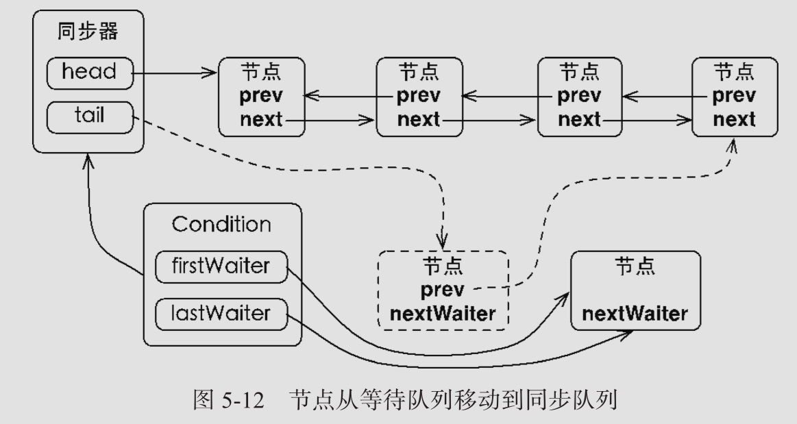
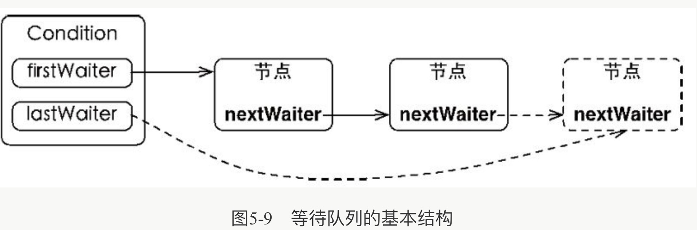

# 050-同步队列中的Condition接口

## 目录

[TOC]

## 简介

在前面学习 synchronized 的时候，有讲到 wait/notify 的基本使用，结合 synchronized 可以实现对线程的通信。既然 J.U.C 里 面提供了锁的实现机制，那 J.U.C 里面有没有提供类似的线程通信的工具呢? 

> Condition 是一个多线程协调通信的工具类，可以让某些线程一起等待某个条件 (condition)，只有满足条件时，线程才会被唤醒

Condition 在 AQS 的基础上,额外添加了一个单向的**等待队列**,当调用 await 方法的时候,相当于AQS同步队列的首节点(获得了锁的节点),移动到 Condition 队列的等待队列中,

## Condition是什么

- CondtionObject 是 AQS 的内部类, 因为Condition 的操作需要获取相关联的锁,所以作为内部类更加合理

- 每个 Condition 都包含一个FIFO 的等待队列 

  - 如果一个线程调用了 Condition.wait() 方法, 那么该线程将 

    > 一个线程调用 wait 方法证明已经获取了锁, 所以整个 condition 队列的入队并没有 CAS 操作

    - 释放锁
    - 构造成 Condition 类型的 Node 节点 
    - 进入等待状态
    - 加入等待队列

  - 如果一个线程调用了Condition.signal() 方法, 那么该线程将等待队列对头元素(等待时间最长)的 Node 加入到 AQS 队列的末尾

- 跟 Object 比较下 , 总体来说是更有灵活性 , 并且可以同时创建多个 condition 队列 , 使用更加灵活支持在等待的时候,忽略中断,支持等待超时退出

- 支持在等待的时候,忽略中断,支持等待超时退出

## Condition实现原理

`CondtionObject`是 AbstractQueuedSynchronzier 的内部类,因为 Condition 的操作需要获取关联的锁,所以作为同步器的内部类也较为合理

每个 Condition 对象都包含着一个队列(等 待队列) , 该队列是 Condition 对象实现等待/通知功能的关键

#### Condition.await() 方法

执行 Condition.await()方法后执行三步

- 构造节点(与` java.util.concurrent.locks.AbstractQueuedSynchronizer.Node`一样)
- 将节点加入等待队列,并进入等待状态
- 线程释放锁

```java
    public final void await() throws InterruptedException {
         if (Thread.interrupted())
             throw new InterruptedException();
      //当前线程加入等待队列
         Node node = addConditionWaiter();
      //释放同步状态,也就是释放锁
         int savedState = fullyRelease(node);
         int interruptMode = 0;
      // 循环判断是否在等待队列
         while (!isOnSyncQueue(node)) {
           //阻塞线程
           LockSupport.park(this);
             if ((interruptMode = checkInterruptWhileWaiting(node)) != 0)
                 break;
         }
         if (acquireQueued(node, savedState) && interruptMode != THROW_IE)
             interruptMode = REINTERRUPT;
         if (node.nextWaiter != null) // clean up if cancelled
             unlinkCancelledWaiters();
         if (interruptMode != 0)
             reportInterruptAfterWait(interruptMode);
     }

	// 是否在同步队列
    final boolean isOnSyncQueue(Node node) {
      //等待状态必须是 -2 且前置节点必须是空 
        if (node.waitStatus == Node.CONDITION || node.prev == null)
          //这里意味着在首节点
            return false;
      //如果后续还有及诶单,那他肯定在队列中
        if (node.next != null) // If has successor, it must be on queue
            return true;
      
        /*
         * node.prev can be non-null, but not yet on queue because
         * the CAS to place it on queue can fail. So we have to
         * traverse from tail to make sure it actually made it.  It
         * will always be near the tail in calls to this method, and
         * unless the CAS failed (which is unlikely), it will be
         * there, so we hardly ever traverse much.
         */
      //从尾结点查询
        return findNodeFromTail(node);
    }
```

#### Condition.singal()方法

调用该方法的前置是当前线程必须获取了锁

- 获取等待队列的首节点将其移动到同步队列并使用 LockSupport 唤醒



```java
        public final void signal() {
            if (!isHeldExclusively())
                throw new IllegalMonitorStateException();
          //获取等待线程的首节点
            Node first = firstWaiter;
            if (first != null)
              //唤醒
                doSignal(first);
        }

        private void doSignal(Node first) {
            do {
                if ( (firstWaiter = first.nextWaiter) == null)
                    lastWaiter = null;
                first.nextWaiter = null;
              //移动到等待队列 transfer
            } while (!transferForSignal(first) &&
                     (first = firstWaiter) != null);
        }

    final boolean transferForSignal(Node node) {
        /*
         * If cannot change waitStatus, the node has been cancelled.
         */
        if (!compareAndSetWaitStatus(node, Node.CONDITION, 0))
            return false;

        /*
         * Splice onto queue and try to set waitStatus of predecessor to
         * indicate that thread is (probably) waiting. If cancelled or
         * attempt to set waitStatus fails, wake up to resync (in which
         * case the waitStatus can be transiently and harmlessly wrong).
         */
      //加入阻塞队列
        Node p = enq(node);
        int ws = p.waitStatus;
        if (ws > 0 || !compareAndSetWaitStatus(p, ws, Node.SIGNAL))
          //唤醒之前在 await 方法中调用的阻塞方法
            LockSupport.unpark(node.thread);
        return true;
```

#### 等待队列图示

等待队列是一个 FIFO 的队列,在队列中,每个节点都包含了一个线程引用,该线程就是在 `Condition` 对象上等待的线程



- Condition 拥有首节点的引用,而新增只需要将原有的尾巴节点 nextWaiter 指向它,并且更新尾结点即可
- 这个节点的更新过程没有 CAS 保证,因为调用 await 方法的线程必定是获取了锁的线程.也就是说这个过程是由锁来保证线程安全的

#### Condition 与监视器模型的比较

在 Object 监视器模型上,一个对象拥有一个同步队列和等待队列,而并发包中的同步器拥有一个同步队列和多个等待队列

> ]\

值得注意的是 Condition 的实现是同步器的内部类,因此每个 Condition 实例都能够访问同步器提供的方法,相当于每个 Condition 都拥有所属同步器的引用

```java
/**
 * Moves the longest-waiting thread, if one exists, from the
 * wait queue for this condition to the wait queue for the
 * owning lock.
 *
 * @throws IllegalMonitorStateException if {@link #isHeldExclusively}
 *         returns {@code false}
 */
public final void signal() {
    if (!isHeldExclusively())//当前线程必须获取了锁,前置条件
        throw new IllegalMonitorStateException();
    Node first = firstWaiter;//获取第一个等待队列节点
    if (first != null)
        doSignal(first); 
}
private void doSignal(Node first) {
  do {
    if ( (firstWaiter = first.nextWaiter) == null)
      lastWaiter = null;
    first.nextWaiter = null;
  } while (!transferForSignal(first) &&// 转移
           (first = firstWaiter) != null);
}
final boolean transferForSignal(Node node) {
  /*
  * If cannot change waitStatus, the node has been cancelled.
  */
  if (!compareAndSetWaitStatus(node, Node.CONDITION, 0))
    return false;

  /*
         * Splice onto queue and try to set waitStatus of predecessor to
         * indicate that thread is (probably) waiting. If cancelled or
         * attempt to set waitStatus fails, wake up to resync (in which
         * case the waitStatus can be transiently and harmlessly wrong).
         */
  Node p = enq(node);//等待队列的头节点安全地移动到同步队列
  int ws = p.waitStatus;
  if (ws > 0 || !compareAndSetWaitStatus(p, ws, Node.SIGNAL))
    LockSupport.unpark(node.thread);//唤醒线程 ,之前在 await 方法阻塞的线程
  return true;
}
```

#### Condition 的 SingalAll 方法

相当于对于等待队列中的所有节点都调用一次 singal()方法; 效果就是将等待队列中所有节点移动到同步队列中并唤醒每个节点


#### Condition.await 方法细节

> addConditionWaiter  简单描述
>
> ```java
>         /**
>          * Adds a new waiter to wait queue.
>          * @return its new wait node
>          */
>         private Node addConditionWaiter() {
>             Node t = lastWaiter;
>             // If lastWaiter is cancelled, clean out.
>             if (t != null && t.waitStatus != Node.CONDITION) {
>                 unlinkCancelledWaiters();
>                 t = lastWaiter;
>             }
>             Node node = new Node(Thread.currentThread(), Node.CONDITION);
>             if (t == null)
>                 firstWaiter = node;//初始化,队尾即是对头
>             else
>                 t.nextWaiter = node;//组成链
>             lastWaiter = node;
>             return node;
>         }
> ```
>
> fullyRelease 完全释放锁,因为是重入锁的话,如果是 5 次,那么可能需要完全释放掉
>
> ```java
>     /**
>      * Invokes release with current state value; returns saved state.
>      * Cancels node and throws exception on failure.
>      * @param node the condition node for this wait
>      * @return previous sync state
>      */
>     final int fullyRelease(Node node) {
>         boolean failed = true;
>         try {
>             int savedState = getState();//拿到AQS重入次数
>             if (release(savedState)) {
>                 failed = false;
>                 return savedState;
>             } else {
>                 throw new IllegalMonitorStateException();
>             }
>         } finally {
>             if (failed)
>                 node.waitStatus = Node.CANCELLED;
>         }
>     }
>     public final boolean release(int arg) {
>         if (tryRelease(arg)) {//释放
>             Node h = head;
>             if (h != null && h.waitStatus != 0)
>                 unparkSuccessor(h);
>             return true;
>         }
>         return false;
>     }
> ```
>


## Condition和Object的对比

任意一个 Java 对象,都有一组监视器方法

- `Object.wait()`
- `Object.wait(long timeout)`
- `Object.notify()`
- `Object.notifyAll()`

这些方法与 sychronized 关键字配合,可以实现等待/通知模式

Condition 也提供了类似 Object 的监视器方法:

- `condtion.await()`
- `condtion.awaitUninterruptibly()`
- `condtion.awaitNanos`
- `condtion.awaitUntil(Date deadline)`
- `condtion.signal()`
- `condtion.signalAll()`

但是使用方式和性能上还是有差异的

#### Object 的监视器方法和 Condition 接口的对比

| 对比项                                              | Object Monitor Method           | Condition                                                    |
| --------------------------------------------------- | ------------------------------- | ------------------------------------------------------------ |
| 前置条件                                            | 获取对象的锁                    | 调用` Lock.lock()`获取锁,</br>调用 `Lock.newCondition()`获取 Condition |
| 调用方式                                            | 直接调用 `Object.wait`          | `Condition.await()`                                          |
| 等待队列个数                                        | 一个                            | 多个                                                         |
| 当前线程释放锁并进入等待状态                        | 支持                            | 支持                                                         |
| 当前线程释放锁并进入等待状态,在等待状态中不响应中断 | 不支持                          | 支持`condtion.awaitUninterruptibly()`                        |
| 当前线程释放锁并进入等待状态到未来的某个时间        | 支持`Object.wait(long timeout)` | 支持`condtion.awaitNanos`                                    |
| 当前线程释放锁并进入等待状态将来的某个时间          | 不支持                          | 支持`condtion.awaitUntil(Date deadline)`                     |
| 唤醒等待队列中的全部线程                            | 支持`Object.notifyAll()`        | 支持`condtion.signalAll()`                                   |
| 唤醒等待队列中的一个线程                            | 支持`Object.notify()`           | 支持`condtion.signal()`                                      |

使用`ReentrantLock`比直接使用`synchronized`更安全，可以替代`synchronized`进行线程同步。

但是，`synchronized`可以配合`wait`和`notify`实现线程在条件不满足时等待，条件满足时唤醒，用`ReentrantLock`我们怎么编写`wait`和`notify`的功能呢？

答案是使用`Condition`对象来实现`wait`和`notify`的功能。

我们仍然以`TaskQueue`为例，把前面用`synchronized`实现的功能通过`ReentrantLock`和`Condition`来实现：

```java
class TaskQueue {
    private final Lock lock = new ReentrantLock();
    private final Condition condition = lock.newCondition();
    private Queue<String> queue = new LinkedList<>();

    public void addTask(String s) {
        lock.lock();
        try {
            queue.add(s);
            condition.signalAll();
        } finally {
            lock.unlock();
        }
    }

    public String getTask() {
        lock.lock();
        try {
            while (queue.isEmpty()) {
                condition.await();
            }
            return queue.remove();
        } finally {
            lock.unlock();
        }
    }
}
```

可见，使用`Condition`时，引用的`Condition`对象必须从`Lock`实例的`newCondition()`返回，这样才能获得一个绑定了`Lock`实例的`Condition`实例。

`Condition`提供的`await()`、`signal()`、`signalAll()`原理和`synchronized`锁对象的`wait()`、`notify()`、`notifyAll()`是一致的，并且其行为也是一样的：

- **`await()`会释放当前锁，进入等待状态；**
- `signal()`会唤醒某个等待线程；
- `signalAll()`会唤醒所有等待线程；
- 唤醒线程从`await()`返回后需要重新获得锁。

此外，和`tryLock()`类似，`await()`可以在等待指定时间后，如果还没有被其他线程通过`signal()`或`signalAll()`唤醒，可以自己醒来：

```java
if (condition.await(1, TimeUnit.SECOND)) {
    // 被其他线程唤醒
} else {
    // 指定时间内没有被其他线程唤醒
}
```

可见，使用`Condition`配合`Lock`，我们可以实现更灵活的线程同步。

- `Condition`可以替代`wait`和`notify`；
- `Condition`对象必须从`Lock`对象获取。


## Condition和对象锁的区别

- `condition `支持多个队列, 对象监视器锁只支持一个
- `condition` 支持线程进入等待状态时,释放锁,不响应中断 , 对象锁不支持
- `condition` 支持线程进入等待状态时,释放锁,等待到某个时间点

#### 值得注意的是

- `sychronized` 对标的是 lock.lock();

- `condtion.await` 对标的是 object.wait()

- condtion.signal 对标的是 object.notify()

  ## Condition和Object的对比

  任意一个 Java 对象,都有一组监视器方法

  - `Object.wait()`
  - `Object.wait(long timeout)`
  - `Object.notify()`
  - `Object.notifyAll()`

  这些方法与 sychronized 关键字配合,可以实现等待/通知模式

  Condition 也提供了类似 Object 的监视器方法:

  - `condtion.await()`
  - `condtion.awaitUninterruptibly()`
  - `condtion.awaitNanos`
  - `condtion.awaitUntil(Date deadline)`
  - `condtion.signal()`
  - `condtion.signalAll()`

  但是使用方式和性能上还是有差异的

  #### Object 的监视器方法和 Condition 接口的对比

  | 对比项                                              | Object Monitor Method           | Condition                                                    |
  | --------------------------------------------------- | ------------------------------- | ------------------------------------------------------------ |
  | 前置条件                                            | 获取对象的锁                    | 调用` Lock.lock()`获取锁,</br>调用 `Lock.newCondition()`获取 Condition |
  | 调用方式                                            | 直接调用 `Object.wait`          | `Condition.await()`                                          |
  | 等待队列个数                                        | 一个                            | 多个                                                         |
  | 当前线程释放锁并进入等待状态                        | 支持                            | 支持                                                         |
  | 当前线程释放锁并进入等待状态,在等待状态中不响应中断 | 不支持                          | 支持`condtion.awaitUninterruptibly()`                        |
  | 当前线程释放锁并进入等待状态到未来的某个时间        | 支持`Object.wait(long timeout)` | 支持`condtion.awaitNanos`                                    |
  | 当前线程释放锁并进入等待状态将来的某个时间          | 不支持                          | 支持`condtion.awaitUntil(Date deadline)`                     |
  | 唤醒等待队列中的全部线程                            | 支持`Object.notifyAll()`        | 支持`condtion.signalAll()`                                   |
  | 唤醒等待队列中的一个线程                            | 支持`Object.notify()`           | 支持`condtion.signal()`                                      |

  使用`ReentrantLock`比直接使用`synchronized`更安全，可以替代`synchronized`进行线程同步。

  但是，`synchronized`可以配合`wait`和`notify`实现线程在条件不满足时等待，条件满足时唤醒，用`ReentrantLock`我们怎么编写`wait`和`notify`的功能呢？

  答案是使用`Condition`对象来实现`wait`和`notify`的功能。

  我们仍然以`TaskQueue`为例，把前面用`synchronized`实现的功能通过`ReentrantLock`和`Condition`来实现：

  ```java
  class TaskQueue {
      private final Lock lock = new ReentrantLock();
      private final Condition condition = lock.newCondition();
      private Queue<String> queue = new LinkedList<>();
  
      public void addTask(String s) {
          lock.lock();
          try {
              queue.add(s);
              condition.signalAll();
          } finally {
              lock.unlock();
          }
      }
  
      public String getTask() {
          lock.lock();
          try {
              while (queue.isEmpty()) {
                  condition.await();
              }
              return queue.remove();
          } finally {
              lock.unlock();
          }
      }
  }
  ```

  可见，使用`Condition`时，引用的`Condition`对象必须从`Lock`实例的`newCondition()`返回，这样才能获得一个绑定了`Lock`实例的`Condition`实例。

  `Condition`提供的`await()`、`signal()`、`signalAll()`原理和`synchronized`锁对象的`wait()`、`notify()`、`notifyAll()`是一致的，并且其行为也是一样的：

  - **`await()`会释放当前锁，进入等待状态；**
  - `signal()`会唤醒某个等待线程；
  - `signalAll()`会唤醒所有等待线程；
  - 唤醒线程从`await()`返回后需要重新获得锁。

  此外，和`tryLock()`类似，`await()`可以在等待指定时间后，如果还没有被其他线程通过`signal()`或`signalAll()`唤醒，可以自己醒来：

  ```java
  if (condition.await(1, TimeUnit.SECOND)) {
      // 被其他线程唤醒
  } else {
      // 指定时间内没有被其他线程唤醒
  }
  ```

  可见，使用`Condition`配合`Lock`，我们可以实现更灵活的线程同步。

  - `Condition`可以替代`wait`和`notify`；
  - `Condition`对象必须从`Lock`对象获取。

  

  ## Condition和对象锁的区别

  - `condition `支持多个队列, 对象监视器锁只支持一个
  - `condition` 支持线程进入等待状态时,释放锁,不响应中断 , 对象锁不支持
  - `condition` 支持线程进入等待状态时,释放锁,等待到某个时间点

  #### 值得注意的是

  - `sychronized` 对标的是 lock.lock();
  - `condtion.await` 对标的是 object.wait()
  - condtion.signal 对标的是 object.notify()