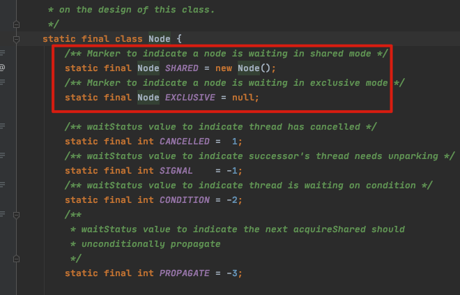

# 独占锁与共享锁

- 独占锁: 也叫互斥锁.每次只允许一个线程持有该锁,ReentrantLock 为独占锁的实现
- 共享锁: 允许多个线程同时获取该锁,并发访问共享资源,ReentrantReadWriteLock中的读锁为共享锁的实现

## 原理简述

`ReentrantReadWriteLock` 锁内部的加锁和解锁的操作最终都会调用内部类 Sync 提供的方法, Sync 对象通过继承 AQS (Abstract Queued Synchronizer) 进行实现

AQS 内部类 Node 定义了两个变量

- SHARED  
- EXCLUSIVE 

标记了锁获取的方式

