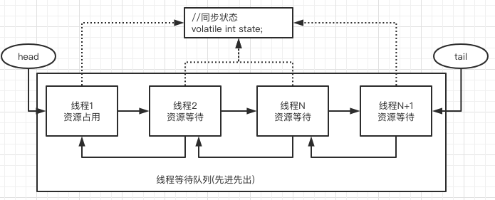
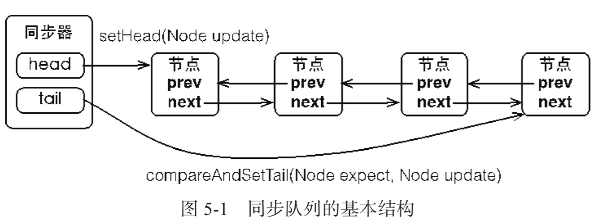
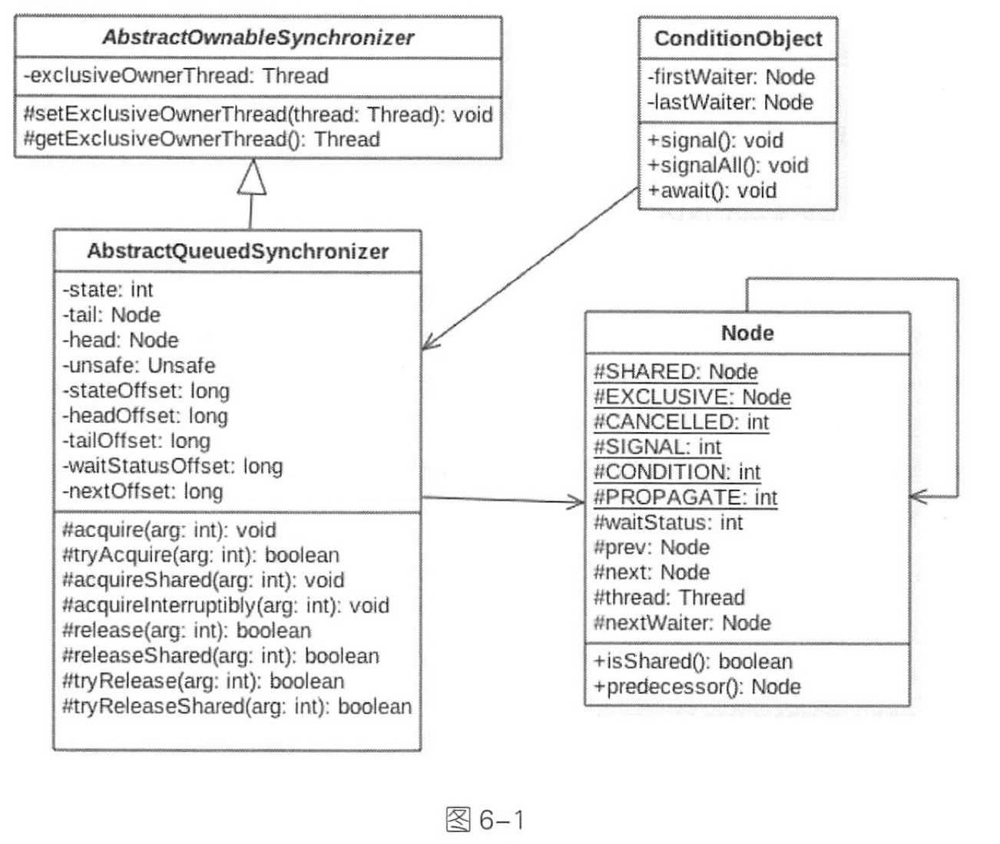

# 080-队列同步器AQS

[TOC]

## 一言蔽之

AQS `AbstractQueuedSynchronizer` 

实际上就是一个 FIFO 的双向队列, 其内部维护了head 和 tail 节点 来指向队首和队尾元素, 

- AQS中维护了volatile 修饰的 int 类型 state存储状态信息 , 通过 CAS 算法管理这个值
  - 如果获取到了**共享资源锁**,可以在当前线程中使用该共享资源
  - 如果获取不到,则将该线程放入线程等待队列,等待下一次资源调度

## 图示



## 同步器工作的简单流程




- 当一个线程成功的获取到同步状态(或者锁),那么其他线程就无法获取到,这个时候他们会被构建成node放到同步队列的尾端

- 加入队列的过程必须要保证线程安全,所以使用了一个基于 CAS 的设置尾结点的方法

```java
/**
  * CAS tail field. Used only by enq.
  */
private final boolean compareAndSetTail(Node expect, Node update) {
  return unsafe.compareAndSwapObject(this, tailOffset, expect, update);
}
```


当首节点释放同步状态时,将会唤醒后继节点,后继节点将会在获取同步状态成功后将自己设置为首节点


由于只有一个线程能够成功获取到同步状态,所以设置头节点的方法不需要使用 CAS 来保证,它只需要将首节点设置成原节点的后继节点并断开原首页节点的 next 引用即可

## 类图



AQS 是一个FIFO 的双向队列,器内部通过节点 head 和 tail 记录队首和队尾元素, 队列的元素类型为 Node 

- **Node**节点的 thread 就是线程
- **SHARED** 用来标记 **获取共享资源时被阻塞挂起的后放入AQS 队列的线程**
- **EXCLUSIVE** 用来标记 **获取独占资源时被挂起后放入 AQS 队列的线程**
- **waitStatus** 记录当前线程的等待状态
  - **CANCELLED** 线程被取消了
  - **SINGAL** 线程被唤醒了
  - **CONDITION** 线程在条件队列里面等待
  - **PROPAGATE** 释放共享资源时需要通知其他节点
- prev 代表前驱节点
- next 代表后续节点

## AQS队列同步器的接口与示例

 [082-AQS-队列同步器的接口与示例.md](082-AQS-队列同步器的接口与示例.md) 

## AQS中State在不同并发工具中的不同作用

 [086-AQS-state状态详解.md](086-AQS-state状态详解.md)

## AQS中Node节点详解

 [087-AQS-Node节点详解.md](087-AQS-Node节点详解.md) 

## AQS独占锁和共享锁详解

 [081-AQS-独占锁和共享锁详解.md](081-AQS-独占锁和共享锁详解.md) 

## AQS独占锁的获取和释放锁的过程

 [081-AQS-独占方式下获取和释放资源的流程.md](081-AQS-独占方式下获取和释放资源的流程.md) 

## AQS共享锁的获取和释放过程

 [082-AQS-共享方式下获取和释放资源的流程.md](082-AQS-共享方式下获取和释放资源的流程.md)

## AQS中的ConditionObject条件变量

[084-AQS-ConditionObject的作用.md](084-AQS-ConditionObject的作用.md) 