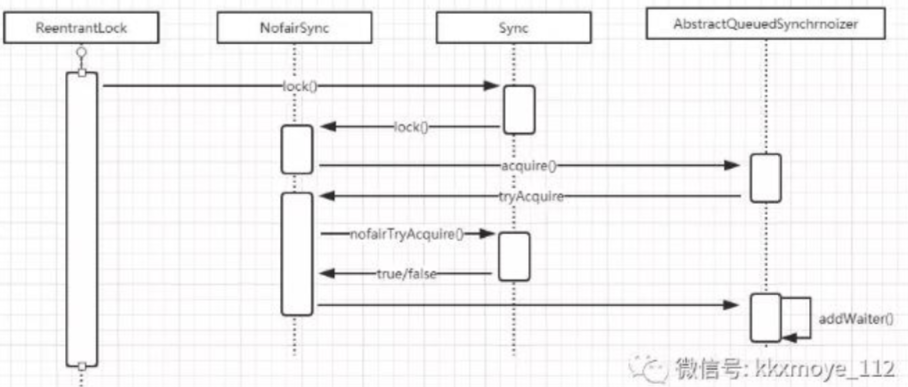
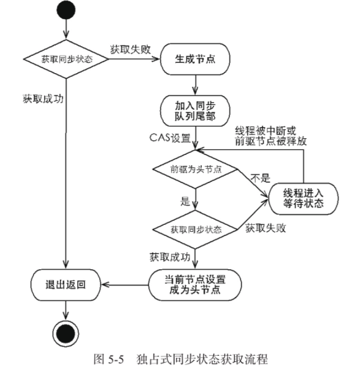

# AQS独占方式下获取和释放资源的流程

## 目录

------

[TOC]

## 独占式方式获取的基本流程



**使用独占式获取资源是与具体的线程绑定的**

也就是说如果一个线程获取到了资源,就会标记是这个线程获取到了, 其他线程再想尝试操作 state 就会发现当前资源不是自己持有的,就会获取失败后阻塞

> 比如独占锁 ReentrantLock 的实现,当一个线程获取到了 ReentrantLock 的锁后, 在 AQS 内部 首先会使用 CAS 操作把 state 状态值从 0 变为 1  , 然后设置当前锁的持有者为当前线程, 当该线程再次获取锁时发现它就是锁的持有者, 则会把状态从 1 变为 2 , 也就是设置可重入次数 ,而当另外一个线程获取锁是发现自己并不是该锁的持有者 就会被放入 AQS 阻塞队列后挂起

- 获取失败就生成节点放到尾部并进入并使用`LockSupport.park(this)`方法挂起自己
- 释放锁会从后往前遍历队列找到下一个状态<0 的节点并使用`LockSupport.unpark(thread)`释放他



## 获取源码分析

- 当线程调用 `acquire(int arg) `方法获取独占锁时,会首先使用 `tryAcquire`方法尝试获取资源, 具体是设置状态变量 state 的值

  - 成功则返回
  - 失败则将当前线层封装为一个类型为 `Node.EXCLUSIVE` 的Node 节点插入到 AQS 队列的尾部 ,并调用 `LockSupport.park(this)`方法挂起自己

```java
public final void acquire(int arg) {
 if (!tryAcquire(arg) &&
     acquireQueued(addWaiter(Node.EXCLUSIVE), arg))
     selfInterrupt();
}
```


#### ReentrantLock `acquire`分为公平锁和公平锁

>  [051-公平锁与非公平锁.md](051-公平锁与非公平锁.md) 

#### 获取失败后入队流程

```java
//实际上创建节点加入尾部    
private Node addWaiter(Node mode) {
    //把当前线程封装到 Node 节点中
        Node node = new Node(Thread.currentThread(), mode);
        // Try the fast path of enq; backup to full enq on failure
        //将前节点设置为尾部
        Node pred = tail;
        if (pred != null) {
            node.prev = pred;
            if (compareAndSetTail(pred, node)) {//确保节点能够被线程安全的添加            
            //替换尾部节点
                pred.next = node;
                return node;
            }
        }
        //入列,但是尾部节点为空
        enq(node);
        return node;
    }
/* 通过死循环确保节点的正确添加,在死循环中只有通过 CAS 将节点设置成为尾结点以后,当前线程才能从该方法返回,否则当前线程会不断尝试设置;实际上 enq 方法将并发添加节点的请求通过 CAS 变得串行化了 */
    private Node enq(final Node node) {
        for (;;) {//自旋
            Node t = tail;
          //获取到尾节点,如果尾节点为空,说明队列里没有 Node
            if (t == null) { // Must initialize
                if (compareAndSetHead(new Node()))//设置头
                //设置头节点为尾结点
                    tail = head;
            } else {
              //如果存在尾结点,说明有节点,这个时候塞到尾巴
                node.prev = t;
                if (compareAndSetTail(t, node)) {
									//compareAndSetTail 方法确保节点能够被线程安全的添加             
                    t.next = node;
                    return t;
                }
            }
        }
    }
```

然后设置节点的状态 ,节点进入同步队列后,**进入自旋过程**,每个节点都在自省地观察,当条件满足,获取到了同步状态,就可以从这个自旋过程中退出,否则依旧自旋(并会阻塞节点的线程)

```java
    final boolean acquireQueued(final Node node, int arg) {
        boolean failed = true;
        try {
            boolean interrupted = false;
            for (;;) {
              //进入自旋死循环
                final Node p = node.predecessor();//获取形参节点的前驱
                if (p == head && tryAcquire(arg)) {
                  //如果前驱节点是 head 且可以获取到同步状态,
                    setHead(node);
                    p.next = null; // help GC
                    failed = false;
                    return interrupted;
                }
              //判断是否需要将线程置为等待状态
                if (shouldParkAfterFailedAcquire(p, node) &&
                    parkAndCheckInterrupt())
                    interrupted = true;
            }
        } finally {
            if (failed)
                cancelAcquire(node);
        }
    }
```

`acquireQueued`方法中,当前线程在死循环中尝试获取同步状态,而只有前驱节点是头节点才能够尝试获取同步状态,为什么?

- 头结点是成功获取到同步状态的节点, 头节点的线程释放了同步状态之后,将会唤醒器后继节点,后继节点的线程被唤醒后需要检查自己的前驱节点是否是头节点
- 维护同步队列的 FIFO 原则,该方法中,节点自旋获取同步状态,下图


- 非头点节点的前驱节点出队或者被中断 导致从等待状态返回
- 检查自己的前驱节点是否是头结点,如果是,则尝试获取同步状态

>  可以看到节点和节点之间是在循环检查的过程中基本不互相通信,而是简单地判断自己的前驱是否是头节点
>
>  - 保证释放规则符合 FIFO
>  - 保证过早通知(过早通知是指前驱节点不是头节点的线程由于终端被唤醒)的处理

## 释放源码分析

- 当一个线程调用 `release(int arg)` 方法的时候,会尝试使用 子类 的 `tryRelease`方法释放资源
- 调用` LockSupport.unPark(thread)`方法激活 AQS 队列里面被阻塞的一个线
- 被激活的线程则使用 tryAcquire 尝试, 看当前状态变量 state 的值是否能够满足自己的需要
  - 满足则该线程被激活,继续往下执行
  - 否则放入 AQS 队列并挂起

```java
//`release 方法`可以释放同步状态,释放同步状态后,会唤醒其后继节点(进而使后继节点重新尝试获取同步状态)    
public final boolean release(int arg) {
        if (tryRelease(arg)) {//调用子类的方法尝试获取锁
            Node h = head;
            if (h != null && h.waitStatus != 0)//如果头节点部位切头结点不是初始状态
                unparkSuccessor(h);//释放后续节点
            return true;
        }
        return false;
    }
```

实际上具体的`tryRelease`方法在不同的实现类中表示的含义是不同的

#### ReentrantLock : 重写`tryRelease`方法

> 其他工具都是使用的共享锁的模式,所以没有实现类

通过使用 CAS 算法查看当前状态是否为 0 , 如果为 0 则使用 CAS 设置为 1 , 并设置当前持有者为当前线程

- 当 status 为 0 的时候代表锁空闲 
- 当 status 为 1 的时候代表锁被占用

实现代码如下

```java
protected final boolean tryRelease(int releases) {
    int c = getState() - releases; // 减去重入次数
    if (Thread.currentThread() != getExclusiveOwnerThread())
        throw new IllegalMonitorStateException();
    boolean free = false;
    if (c == 0) {
        free = true;//如果为 0 代表锁是空闲状态
        setExclusiveOwnerThread(null);//设置拥有者为 null
    }
    setState(c);//设置 Staste 状态,如果大于 0证明还是锁占用状态
    return free;
}
```

#### 释放后续操作

```java
    private void unparkSuccessor(Node node) {
        int ws = node.waitStatus;//获取当前节点的等待状态
        if (ws < 0) //  如果小于0 则有可能为 SIGNAL/CONDITION/PROPAGATE ,统一设置为 0
            compareAndSetWaitStatus(node, ws, 0);
        Node s = node.next;//获取后续节点
        if (s == null || s.waitStatus > 0) {
          //如果没有后续节点
            s = null;
            for (Node t = tail; t != null && t != node; t = t.prev)
              //从后遍历队列,因为入队
                if (t.waitStatus <= 0)
                  //找到后续能用的后续节点
                    s = t;
        }
        if (s != null)
          //释放能用的后续节点,这里的 s 一定是头节点下一个能唤醒的节点
            LockSupport.unpark(s.thread);//使用工具类唤处于等待状态的线程
    }
```

##### 为什么从后往前遍历

```java
node.prev = pred;   //step1
if (compareAndSetTail(pred, node))   // step2
     pred.next = node;  // step3
```

假设我们此时有个Node正在入队，执行完step2，还未执行step3，如果unparkSuccessor采用从head往后遍历的话，此时是找不到这个新插入的Node的；但如果是采用从后往前遍历，则不会出现这个问题。

## 总结

在获取同步状态时,同步器维护一个同步队列,

- 获取状态失败的线程都会被加入到队列中并在队列中进行自旋,使用`shouldParkAfterFailedAcquire`判断是否需要`park`,然后调用`parkAndCheckInterrupt`进行 `park`
- 移出队列(或者停止自旋)的条件是前驱节点为头节点且成功获取了同步状态
- 在释放同步状态时,同步器调用 `tryRealease(int arg)` 方法释放同步状态,然后唤醒后续节点
- 设置 head 节点不需要用 CAS，原因是设置 head 节点是由获得锁的线程来完成 的，而同步锁只能由一个线程获得，所以不需要 CAS 保证，只需要把 head 节点,设置为原首节点的后继节点，并且断开原 head 节点的 next 引用即可

