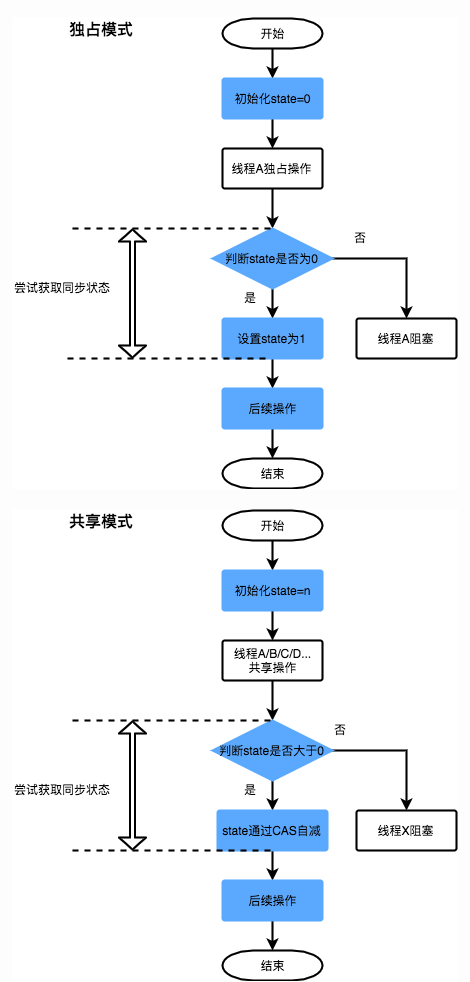

# 086-AQS-state状态详解

[TOC]

## 一言蔽之

AQS中维护了一个名为state的字段，意为同步状态，是由Volatile修饰的，用于展示当前临界资源的获锁情况。

- 在不同的工具类中,它的值是不同的含义

## 获取State的流程图



## 源码

```java
// java.util.concurrent.locks.AbstractQueuedSynchronizer
private volatile int state;
```

下面提供了几个访问这个字段的方法：

| 方法名                                                       | 描述                 |
| :----------------------------------------------------------- | :------------------- |
| protected final int getState()                               | 获取State的值        |
| protected final void setState(int newState)                  | 设置State的值        |
| protected final boolean compareAndSetState(int expect, int update) | 使用CAS方式更新State |

这几个方法都是Final修饰的，说明子类中无法重写它们。我们可以通过修改State字段表示的同步状态来实现多线程的独占模式和共享模式（加锁过程）。

## state在不同的工具类中的含义

#### 在普通的**ReentrantLock**中的含义

state 是 AQS 中的一个属性，它在不同的实现中所表达的含义不一样，对于重入锁的实现来说，表示一个同步状态。它有两个含义的表示

- 当 state=0 时，表示无锁状态

- 当 state>0 时，表示已经有线程获得了锁，也就是 state=1，但是因为 ReentrantLock 允许重入，所以同一个线程多次获得同步锁的时候，state 会递增， 比如重入 5 次，那么 state=5。而在释放锁的时候，同样需要释放 5 次直到 state=0 其他线程才有资格获得锁

也就是说

当调用`tryAcquire()` 获取该锁后,`ReentrantLock` 中的` state  + 1 `这个时候,该线程就独占了 ReentrantLock,此时其他线程`tryAcquire()`获取锁是均会失败,直到该线程释放锁之后,state 再次设置为 0, 其他线程才有机会获取该锁

#### 其他工具类中的含义

- 对于[ReentrantLock](050-ReentrantLock.md) 的实现来说, state  可以用来表示当前线程的重入次数
- 对于 [ReentrantReadWriteLock](041-读写锁ReentrantReadWriteLock.md) 读写锁来说, 
  - state 的高 16 为标识读状态,也就是**获取读锁**的次数
  - state 的 低 16 位 标识**获取到写锁**的可重入次数
- 对于  Semaphore 来说, state 标识当前可用的信号的个数
- 对于  CountdownLatch  来说, state 标识计数器当前的值

## 拓展

-  [081-AQS-独占方式下获取和释放资源的流程.md](081-AQS-独占方式下获取和释放资源的流程.md) 
-  [082-AQS-共享方式下获取和释放资源的流程.md](082-AQS-共享方式下获取和释放资源的流程.md) 