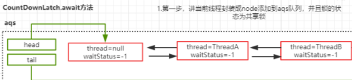
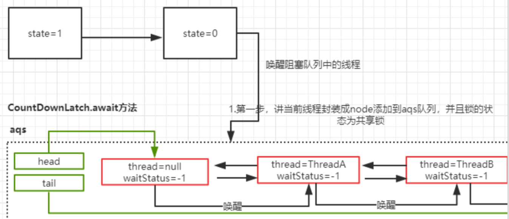

# 01-CountDownLatch-等待多线程完成的CountDownLatch

[TOC]

`CountDownLatch` 的构造函数接收一个 int 类型的参数作为计数器,你要等待 n个线程完成,就写 n,当然 n也可以是一个线程的 n 个执行步骤

- 当我们调用 `CountDownLatch` 的 `countDown` 方法的时候, n 就会减一

countdownlatch 是一个同步工具类，它允许一个或多个线程一直等待，直到其他线程的操作执行完毕再执行。从命 名可以解读到 countdown 是倒数的意思，类似于我们倒计 时的概念。

`countdownlatch` 提供了两个方法，一个是 `countDown`， 一个是 await， countdownlatch 初始化的时候需要传入一个整数，在这个整数倒数到 0 之前，调用了 await 方法的 程序都必须要等待，然后通过 countDown 来倒数。

```java
/**
 * <p>
 * A test for {@link java.util.concurrent.CountDownLatch}
 * </p>
 *
 * @author EricChen 2020/04/05 16:59
 */
public class CountDownLatchTest {

    public static void main(String[] args) throws InterruptedException {
        CountDownLatch countDownLatch = new CountDownLatch(3);

        new Thread(() -> {
            System.out.println("Thread:" + Thread.currentThread().getName());
            countDownLatch.countDown();
        }).start();
        new Thread(() -> {
            System.out.println("Thread:" + Thread.currentThread().getName());
            countDownLatch.countDown();
        }).start();
        new Thread(() -> {
            System.out.println("Thread:" + Thread.currentThread().getName());
            countDownLatch.countDown();
        }).start();
        countDownLatch.await();//所有线程执行完成后才会执行 WAITING 状态
    }
}
```

对于 CountDownLatch，我们仅仅需要关心两个方法，

- 一 个是 countDown() 方法

  > countDown() 方法每次调用都会将 state 减 1，直到 state 的值为 0;

- 一个是 await() 方法

  > await 是一个阻塞方法，当 state 减 为 0 的时候，await 方法才会返回。await 可以被多个线 程调用，大家在这个时候脑子里要有个图:所有调用了 await 方法的线程阻塞在 AQS 的阻塞队列中，等待条件 满足(state == 0)，将线程从队列中一个个唤醒过来。

## 源码分析

### await

```javascript
public void await() throws InterruptedException {
    sync.acquireSharedInterruptibly(1);
}
```

可以看到 await 也是使用了内部定义 AQS实现类的方式 , 在 `CountDownLatch` 内 部写了一个 Sync 并且继承了 AQS 这个抽象类重写了 AQS 中的共享锁方法

```java
private static final class Sync extends AbstractQueuedSynchronizer {
    private static final long serialVersionUID = 4982264981922014374L;

    Sync(int count) {
        setState(count);
    }

    int getCount() {
        return getState();
    }

    protected int tryAcquireShared(int acquires) {
        return (getState() == 0) ? 1 : -1;
    }

    protected boolean tryReleaseShared(int releases) {
        // Decrement count; signal when transition to zero
        for (;;) {
            int c = getState();
            if (c == 0)
                return false;
            int nextc = c-1;
            if (compareAndSetState(c, nextc))
                return nextc == 0;
        }
    }
}
```

值得注意的是

- `acquireSharedInterruptibly`方法 使用的是共享锁机制,因为 `CountDownLatch` 中使用了**共享锁机制**,因为`CountDownLatch`并不需要实现互斥的作用

```java
public final void acquireSharedInterruptibly(int arg)
    throws InterruptedException {
    if (Thread.interrupted())
        throw new InterruptedException();
    //
    if (tryAcquireShared(arg) < 0)
        //如果 state 不等于 0 获取共享锁
        doAcquireSharedInterruptibly(arg);///进入AQS 队列
}
```

`tryAcquireShared`获取了一个计数器的状态

```java
        protected int tryAcquireShared(int acquires) {
            return (getState() == 0) ? 1 : -1;  // State 标识的是
        }
```

加入这个时候有 3 个线程调用了 await 方法，由于这个时 候 state 的值还不为 0，所以这三个线程都会加入到 AQS 队列中。并且三个线程都处于阻塞状态

由于线程被 await 方法阻塞了，所以只有等到 countdown 方法使得 state=0 的时候才会被唤醒

doAcquireSharedInterruptibly

#### 将当前线程添加到 AQS 队列

```java
    /**
     * Acquires in shared interruptible mode.
     * @param arg the acquire argument
     */
    private void doAcquireSharedInterruptibly(int arg)
        throws InterruptedException {
      //SHARED 说明是共享锁的模式
        final Node node = addWaiter(Node.SHARED);
        boolean failed = true;
        try {
            for (;;) {
              //获取 node 节点的前一个节点
                final Node p = node.predecessor();
                if (p == head) {
                  //尝试获取共享锁
                    int r = tryAcquireShared(arg);
                    if (r >= 0) {
                      //设置头并传播
                        setHeadAndPropagate(node, r);
                        p.next = null; // help GC
                        failed = false;
                        return;
                    }
                }
              //是不是要 park
                if (shouldParkAfterFailedAcquire(p, node) &&
                    parkAndCheckInterrupt())
                    throw new InterruptedException();
            }
        } finally {
            if (failed)
                cancelAcquire(node);
        }
    }
```


1. `addWaiter `设置为 shared 模式。
2. `tryAcquire` 和` tryAcquireShared` 的返回值不同，因此会多出一个判断过程
3. 在判断前驱节点是头节点后 ，调用了`setHeadAndPropagate `方法，而不是简单的更新一下头节点。




### CountDownLatch.countDown

1. 只有当` state` 减为 0 的时候，`tryReleaseShared `才返回 true, 否则只是简单的 `state = state - 1`
2. 如果 `state=0`, 则调用 `doReleaseShared `唤醒处于 await 状态下的线程

```java
public void countDown() {
  sync.releaseShared(1);
}
```

调用 AQS 中的` releaseShared` 方法

```java
public final boolean releaseShared(int arg) {
  if (tryReleaseShared(arg)) {
    doReleaseShared();
    return true;
  }
  return false;
}
```

countDownLatch 内的释放

```java
//只有 计数器为 0 的时候 才能够 relase
protected boolean tryReleaseShared(int releases) {
  // Decrement count; signal when transition to zero
  for (;;) {
    int c = getState();
    if (c == 0)
      return false;
    //countdown 直接减一
    int nextc = c-1;
    //设置 State
    if (compareAndSetState(c, nextc))
      return nextc == 0;
  }
}
```

#### doAcquireSharedInterruptibly

一旦 ThreadA 被唤醒，代码又会继续回到 doAcquireSharedInterruptibly 中来执行。如果当前 state 满足=0 的条件，则会执行 setHeadAndPropagate 方法

共享锁的释放和独占锁的释放有一定的差别，前面唤醒锁的逻辑和独占锁是一样，先判断头结点是不是 SIGNAL 状态，如果是，则修改为0，并且唤醒头结点的,下一个节点

```java
//PROPAGATE: 标识为 PROPAGATE 状态的节 点，是共享锁模式下的节点状态，处于这个状态下的节点，会对线程的唤醒进行传播  
private void doReleaseShared() {

        for (;;) {
            Node h = head;
            if (h != null && h != tail) {
                int ws = h.waitStatus;
                if (ws == Node.SIGNAL) {
                  //// 这个 CAS 失败的场景是:执行到这里的时候，刚好有一个节点入队，入队会将这个 ws 设置为 -1
                    if (!compareAndSetWaitStatus(h, Node.SIGNAL, 0))
                        continue;            // loop to recheck cases
                    unparkSuccessor(h);
                }
    // 如果到这里的时候，前面唤醒的线程已经占领了 head，那么再循环
  // 通过检查头节点是否改变了，如果改变了就继续循环
                else if (ws == 0 &&
                         !compareAndSetWaitStatus(h, 0, Node.PROPAGATE))
                    continue;                // loop on failed CAS
            }
            if (h == head)                   // loop if head changed
                break;
        }
    }
```

#### setHeadAndPropagate 这里的传播实际上就是连续唤醒

这个方法的主要作用是把被唤醒的节点，设置成 head 节 点。然后继续唤醒队列中的其他线程。 由于现在队列中有 3 个线程处于阻塞状态，一旦 ThreadA 被唤醒，并且设置为 head 之后，会继续唤醒后续的 ThreadB

