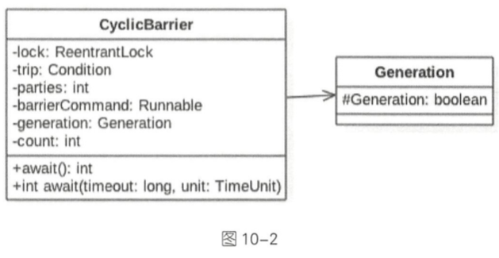

# CyclicBarrier 内存屏障

[TOC]

## 为什么要有CyclicBarrier

我们都知道， CountDownLatch 在解决多线程同步方面相对于调用线程的 join 方法已经有了不少优化

但是 CountDownLatch 计数器是一次性的也就是等到计数器值变为 0 后，再调用` CountDownLatch` 的 await 和 `countdown `方法都会立刻返回,这就起不到线程同步的效果了 。所以为了满足计数器可以重置的需要，JDK 开发组提供了CyclicBarrier 类，它的作用是：

- 让一组线程全部达到一个状态后再全部同时执行
- 当所有等待线程全部执行完毕，重置 CyclicBarrier 后可以被重用

> 使用 ReentrantLock 和 Condition 实现的

> 到齐才能吃

## 使用场景

当存在需要所有的子任务都完成时，才执行主任务，这个 时候就可以选择使用 `CyclicBarrier`

## 注意点


- 对于指定计数值 parties，若由于某种原因，没有足够的 线程调用 CyclicBarrier 的 await，则所有调用 await 的线程 都会被阻塞;
- 同样的 `CyclicBarrier `也可以调用 `await(timeout, unit)`， 设置超时时间，在设定时间内，如果没有足够线程到达， 则解除阻塞状态，继续工作;
- 通过 reset 重置计数，会使得进入 await 的线程出现 `BrokenBarrierException`;
- 如 果 采 用 是 `CyclicBarrier(int parties, Runnable barrierAction)` 构造方法，执行 barrierAction 操作的是最 后一个到达的线程

### 使用

CyclicBarrier 相比 CountDownLatch 来说，要简单很多， 源码实现是基于 ReentrantLock 和 Condition 的组合使 用。看如下示意图，CyclicBarrier 和 CountDownLatch 是 不是很像，只是 CyclicBarrier 可以有不止一个栅栏，因为 它的栅栏(Barrier)可以重复使用(Cyclic)

```java
public class CyclicBarrierTest {
    static CyclicBarrier cyclicBarrier = new CyclicBarrier(2);

    public static void main(String[] args) throws Exception{
        new Thread(()-> {
            try {
                cyclicBarrier.await();
            } catch (InterruptedException e) {
                e.printStackTrace();
            } catch (BrokenBarrierException e) {
                e.printStackTrace();
            }
            System.out.println(1);
        }).start();

        cyclicBarrier.await();
        System.out.println(2);
    }
}
```

输出有一定的随机性

有可能是1,2 也有可能是 2,1

这是因为主线程和子线程的调度是有CPU决定的,两个线程都有可能先执行,所以会产生两种输出,第一种可能输出如下

```java
public class CyclicBarrierTest2 {
    static CyclicBarrier cyclicBarrier = new CyclicBarrier(2, new A());
    //达到屏障后,优先执行 A

    public static void main(String[] args) throws Exception {
        new Thread(() -> {
            try {
                cyclicBarrier.await();
            } catch (InterruptedException e) {
                e.printStackTrace();
            } catch (BrokenBarrierException e) {
                e.printStackTrace();
            }
            System.out.println(1);
        }).start();
        try {
            cyclicBarrier.await();
        } catch (Exception e) {

        }
        System.out.println(2);
    }

    static class A implements Runnable {

        @Override
        public void run() {
            System.out.println(3);
        }
    }
}
```


```java
public class CyclicBarrierTest3 {

    static CyclicBarrier c = new CyclicBarrier(2);

    public static void main(String[] args) throws InterruptedException, BrokenBarrierException {
        Thread thread = new Thread(new Runnable() {

            @Override
            public void run() {
                try {
                    c.await();
                } catch (Exception e) {
                }
            }
        });
        thread.start();
        thread.interrupt();
        try {
            c.await();
        } catch (BrokenBarrierException e) {
            System.out.println(c.isBroken());//当线程被interrupt 的时候,会抛出异常
        }
    }
}
```

## `CyclicBarrier` 和 `CountDownLatch` 的区别

- `CyclicBarrier` 功能更多, 可以 reset
- 可以获得` getNumberWaiting` 获取阻塞的线程数量, `isBroken` 可以获取线程是否中断

## 源码

`CyclicBarrier` 相比 `CountDownLatch` 来说，要简单很多， 源码实现是基于`ReentrantLock`和 Condition 的组合使 用

只是 `CyclicBarrier` 可以有不止一个栅栏，因为它的栅栏(Barrier)可以重复使用(Cyclic)



CyclicBanier基于独占锁实现， 本质底层还是基于 AQS 的。

- `parties` 用来记录线程个数，这里表示多少线程调用 await后，所有线程才会冲破屏障继续往下运行。
- `count`一开始等于 parties， 每当有线程调用 `await`方法就递减 1， 当 `count`为 0时就 表示所有线程都到了屏障点

- **当 `count` 计数器值变为 0 后 ， 会将 `parties` 的值赋给 `count,` 从而进行复用**

#### 构造函数

```java
    public CyclicBarrier(int parties, Runnable barrierAction) {
        if (parties <= 0) throw new IllegalArgumentException();
        this.parties = parties;
        this.count = parties;
        this.barrierCommand = barrierAction;
    }
```

还有一 个 变量 ba1TierCommand 也 通 过构造 函数传递 ，这 是一 个 任务，这个任务的执行时机 是当所有线程都到达屏障点后。使用 lock 首先保 证 了更新计数器 count 的原子性。另外使用 lock的条件变量 trip支持线程间使用 await和 signal操作进行同步。
最后，在变量 generation 内部有一个变量 broken，其用来记录当前屏障是否被打破。 

>  注意 ， 这里 的 broken 并没有被声 明为 volatile 的， 因为是在锁 内使用变量 ， 所 以不需要声明。

#### public int await()

当前线程调用 CyclicBarrier的该方法时会被阻塞， 直到满足下面条件之一才会返回:

- `parties`个线程都调用了`await`方法.也就是线程都到了屏障点
- 其他线程调用了当前线程的`interrupt`方法中断了当前线程,则当前线程会抛出 `InterruptedException`异常而返回
- 与当前凭证点关联的 Generation 对象的 broken 标志被标记为 true 时,会抛出`BrokenBarrierException`而返回

```java
    public int await() throws InterruptedException, BrokenBarrierException {
        try {
            return dowait(false, 0L);
        } catch (TimeoutException toe) {
            throw new Error(toe); // cannot happen
        }
    }
```

#### dowait

当一个线程调用了 dowait方法后，首先会获取独占锁 lock，如果创建 CycleBarrier 时传递的参数为 10，那么后面 9 个调用钱程会被阻塞。 

然后当前获取到锁的线程会对计数器 count进行递减操作，递减后 count=index=9，

因为`index != 0`所以当前线程会执行代码 ④

```java
   private int dowait(boolean timed, long nanos)
        throws InterruptedException, BrokenBarrierException,
               TimeoutException {
        final ReentrantLock lock = this.lock;
        lock.lock();
        try {
           	...
            //① 如果 index == 0 则说明所有线程都到了屏障点， 此时执行初始化时传递的任务
            int index = --count;
            if (index == 0) {  // tripped
                boolean ranAction = false;
                try {
                    final Runnable command = barrierCommand;
                    // ② 执行任务
                    if (command != null)
                        command.run();
                    ranAction = true;
                    // ③ 激活其他因调用 await 方法而被阻塞的线程， 并重置 CyclicBarrier
                    nextGeneration();
                    //返回
                    return 0;
                } finally {
                    if (!ranAction)
                        breakBarrier();
                }
            }
			// ④ 如果 index !=0 
            // loop until tripped, broken, interrupted, or timed out
            for (;;) {
                try {
                    // ⑤ 没有设置超时时间
                    if (!timed)
                        trip.await();
                    // ⑥ 设置了超时时间
                    else if (nanos > 0L)
                        nanos = trip.awaitNanos(nanos);
                } catch (InterruptedException ie) {
					...
                }

			...
            }
        } finally {
            lock.unlock();
        }
    }
```

await 方法的执行主干：

当一个线程调用 await 方法 ， 首先会获取独占锁 lock ， 如果创建CycleBarrier 的时候传递的是10 ， 那么后面9 个调用线程会被阻塞, 当前获取到锁的线程会对计数器 count 进行递减操作 ， 递减后 count = index = 9 ， count 就是还剩余的次数

- 因为 index ！=0 所以当前代码会执行代码 ④
- 当前线程会被加入到条件变量trip 的条件阻塞队列中， 当前线程会被挂起并释放获取的 lock 锁
- 直到最后线程执行，index == 0  , 如果在 CyclicBarrier 创建的时候传递了任务，则在其他线程被唤醒前先执行任务，然后唤醒 其他9个线程