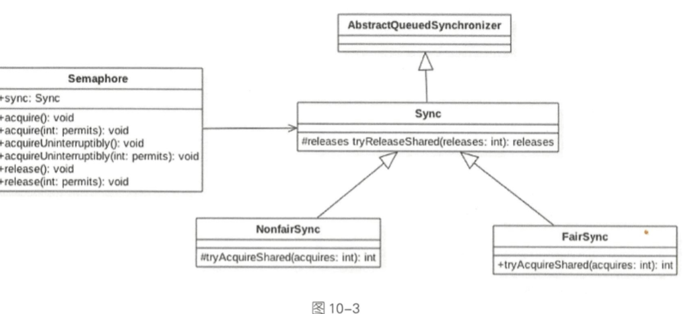

# Semaphore

[TOC]

## 信号量

- 支持 公平策略和非公平策略
- 限流 permits 令牌限流

Semaphore 是信号量 ， 也是Java中的一个同步器， 与 CountDownLatch 和 CycleBarrier 不同的是， 它的内部的计数器是递增的， 并且一开始初始化 Semaphore 时可以指定一个初始值， 但是并不需要知道需要同步的个数， 而是在需要同步的地方，调用 acquire 方法时指定需要同步的个数

> semaphore 也就是我们常说的信号灯，semaphore 可以控制同时访问的线程个数，通过 acquire 获取一个许可，如 果没有就等待，通过 release 释放一个许可。有点类似限流 的作用。叫信号灯的原因也和他的用处有关，比如某商场 就 5 个停车位，每个停车位只能停一辆车，如果这个时候来了 10 辆车，必须要等前面有空的车位才能进入。

## 使用实例

```java
public class SemaphoreTest {
    public static void main(String[] args) {
        Semaphore semaphore = new Semaphore(3);
        for (int i = 0; i < 10; i++) {
            new Car(i, semaphore).start();
        }
    }

    static class Car extends Thread {

        private int num;
        private Semaphore semaphore;

        public Car(int num, Semaphore semaphore) {
            this.num = num;
            this.semaphore = semaphore;
        }


        @Override
        public void run() {
            try {
                semaphore.acquire();//获取一个令牌(类似于停车卡)
                System.out.println("num:" + num + " ,got a parking space");
                TimeUnit.SECONDS.sleep(5);
                System.out.println("num" + num + " ,release a parking space");
                semaphore.release();//释放令牌(类似于停车卡)
            } catch (InterruptedException e) {
                e.printStackTrace();
            }
        }
    }
}

```

### Semaphore 源码分析

创建 Semaphore 实例的时候，需要一个参数 permits， 

```java
    public Semaphore(int permits) {
        sync = new NonfairSync(permits);
    }
```

这个基本上可以确定是设置给 AQS 的 state 的，

然后每 个线程调用 acquire 的时候，执行` state = state - 1`，release 的时候执行` state = state + 1`，当然，acquire 的 时候，如果 state=0，说明没有资源了，需要等待其他线程 release。

**Semaphore 分公平策略和非公平策略**

### NofairSync

通过对比发现公平和非公平的区别就在于是否多了一个 `hasQueuedPredecessors` 的判断

```java
static final class NonfairSync extends Sync {
  private static final long serialVersionUID = -2694183684443567898L;

  NonfairSync(int permits) {
    super(permits);
  }

  protected int tryAcquireShared(int acquires) {
    return nonfairTryAcquireShared(acquires);
  }
}
```

我们可以看到 Sync 中的 公平锁 的获取

```java
protected int tryAcquireShared(int acquires) {
  for (;;) {
    //队列是是否有前驱节点,如果有需要等待
    if (hasQueuedPredecessors())
      return -1;
    int available = getState();
    int remaining = available - acquires;
    if (remaining < 0 ||
        compareAndSetState(available, remaining))
      return remaining;
  }
}
```

非公平锁获取

```java
final int nonfairTryAcquireShared(int acquires) {
  for (;;) {
    //不判断是否有先驱节点
    int available = getState();
    int remaining = available - acquires;
    if (remaining < 0 ||
        compareAndSetState(available, remaining))
      return remaining;
  }
}
```

## acquire

```java
public void acquire(int permits) throws InterruptedException {
  if (permits < 0) throw new IllegalArgumentException();
  sync.acquireSharedInterruptibly(permits);
}

public final void acquireSharedInterruptibly(int arg)
  throws InterruptedException {
  if (Thread.interrupted())
    throw new InterruptedException();
  if (tryAcquireShared(arg) < 0)
    doAcquireSharedInterruptibly(arg);
}
```

### release

```java
protected final boolean tryReleaseShared(int releases) {
  for (;;) {
    int current = getState();
    //加
    int next = current + releases;
    if (next < current) // overflow
      throw new Error("Maximum permit count exceeded");
    if (compareAndSetState(current, next))
      return true;
  }
}
```

### 值得注意的是

Semaphore 对锁的申请和释放和 ReentrantLock 类似,通过 acquire 方法和 release 方法来获取和释放许可信号资源,

`Semaphore.acquire` 方法默认和 `ReentrentLock.lockInterruptibly` 方法效果一样,为可响应中断锁,也就是说在等待许可信号资源的过程中可以被` Thread.interrupt `方法中断而取消对许可信号的申请

## 使用场景

- 对象池,资源池的构建, 比如静态全局对象池,数据库连接池等等
- 我们可以创建一个计数器为 1 的 `Semaphore`.将其作为一种互斥锁的机制(二元信号量,表示两种互斥的状态),同一时间只有一个线程可以获取该锁

## 原理



由该类图可知， Semaphore 还是使用AQS 实现的， Sync 是 AQS的一个实现类 ，有公平和非公平两种实现方式，用来指定获取信号量时是否采用公平策略

- Semaphore 默认采用非公平策略，如果需要使用公平策略 则 可以使用 带两个 参数 的构造函数来构造 Semaphore 对象；

- permits被赋给了 AQS 的 state状态变量，这里 AQS 的 state值也 表示当前持有的信号量个数 。

#### void acquire()方法

```java
public final void acquireSharedInterruptibly(int arg) throws InterruptedException {
  // ① 如果线程被中断,则抛出中断异常
  if (Thread.interrupted())
    throw new InterruptedException();
  //否则调用 Sync 子类方法尝试获取,这里根据构造函数确定使用公平策略
  if (tryAcquireShared(arg) < 0)
    //如果获取是吧加入 AQS 队列
    doAcquireSharedInterruptibly(arg);
}
```

由如上代码可知， acquire() 在内部调用了 Sync 的 `acquireSharedlnterruptibly` 方法，后 者会对中断进行响应(如果当前线程被中断， 则 抛出中断异常) 。尝 试获取信号 量 资源的 AQS 的方法 tryAcquireShared 是 由 Sync 的子 类实 现的，所以这 里分 别从两 方 面来讨论 。 先讨论非公平策略 NonfairSync类的 tryAcquireShared方法

```java
protected int tryAcquireShared(int acquires) {
  return nonfairTryAcquireShared(acquires);
}
final int nonfairTryAcquireShared(int acquires) {
  for (;;) {
    //获取当前信号量
    int available = getState();
    //计算当前剩余值
    int remaining = available - acquires;
    //如果当前剩余值小于 0 或者 CAS设置成功则返回
    if (remaining < 0 ||
        compareAndSetState(available, remaining))
      return remaining;
  }
}
```

如上代码先获取 当前信号量值  (available)，然后减去需要获取的值( acquires)， 得到 剩余的信号量个数(remaining)

- 如果剩余值小于 0则说明当前信号量个数满足不了需求， 那么直接返回负数 ，这时当前线程会被放入 AQS 的阻塞 队列而被挂起 。 

- 如果剩余值大于 o, 则使用 CAS操作设置当前信号量值为剩余值，然后返回剩余值。

**由于 NonFairSync 是 非公平获取的，也就是说先调用 aquire 方法获取信号量的线程不一定比后来者先获取到信号量。**

 考虑下面场景，如果线程 A 先调用了 aquire ( )方法获取信号量，但是当前信号量个数为 0， 那么线程 A 会被放入 AQS 的阻塞队列 。 

过一 段时间后线程 C调用了 release ()方法释放了一个信号量，如果当前没有其他线程获取信号量， 那么线程 A就会被激活，然后获取该信号量， 但是假如线程 C释放信号量后，线 程 C调用了 aquire方法，那么线程 C就会和线程 A去竞争这个信号量资源。 

- 如果采用非公平策略，由 `nonfairTryAcquireShared` 的代码可知，线程 C 完全可以在线程 A 被激活前， 或者激活后先于线程 A 获取到 该信号量 ，也就是在这种模式下阻塞线程和当前请求的线程是竞争关系，而不遵循先来先得的策略。

下面看公平性的 FairSync类是如何保证公平性 的。

```java
protected int tryAcquireShared(int acquires) {
  for (;;) {
    if (hasQueuedPredecessors())
      return -1;
    int available = getState();
    int remaining = available - acquires;
    if (remaining < 0 ||
        compareAndSetState(available, remaining))
      return remaining;
  }
}
}
```

可见公平性还是靠 `hasQueuedPredecessors` 这个函数来保证的 。

```java
public final boolean hasQueuedPredecessors() {
  // The correctness of this depends on head being initialized
  // before tail and on head.next being accurate if the current
  // thread is first in queue.
  Node t = tail; // Read fields in reverse initialization order
  Node h = head;
  Node s;
  return h != t &&
    // 如果后续没有节点， 或者下一个节点的线程不是当前线程，则存在前驱节点
    ((s = h.next) == null || s.thread != Thread.currentThread());
}
```


 略是看当前线程节点的前驱节点是否也在等待获取该资源，如果是 则 自己放弃获取的权限， 然后当前线程会被放入 AQS 阻塞队列，否则就去获取。

#### void Release()方法

该方法的作用是把当前 Semaphore对象的信号量值增加 l，如果当前有线程因为调用 aquire方法被阻塞而被放入了 AQS 的阻塞队列，则会根据公平策略选择一个信号量个数 能被满足的线程进行激活， 激活的线程会尝试获取刚增加的信号量，下面看代码实现。

```java
protected final boolean tryReleaseShared(int releases) {
  for (;;) {
    //(4)获取信号量
    int current = getState();
    //(5)信号量+1
    int next = current + releases;
    if (next < current) // overflow 移除
      throw new Error("Maximum permit count exceeded");
    //使用 CAS 保证鞥新信号量值的原子性
    if (compareAndSetState(current, next))
      return true;
  }
}
```


由代码 release()->sync.releaseShared(1)可知， release方法每次只会对信号量值增加 1, 

- tryReleaseShared 方法是无限循环，使用 CAS 保证了 release 方法对信号量递增1的原子性 操作。
- tryReleaseShared方法增加信号量值成功后会执行代码 (3)，即调用 AQS 的方法来 激活因为调用 aquire方法而被阻塞的线程。