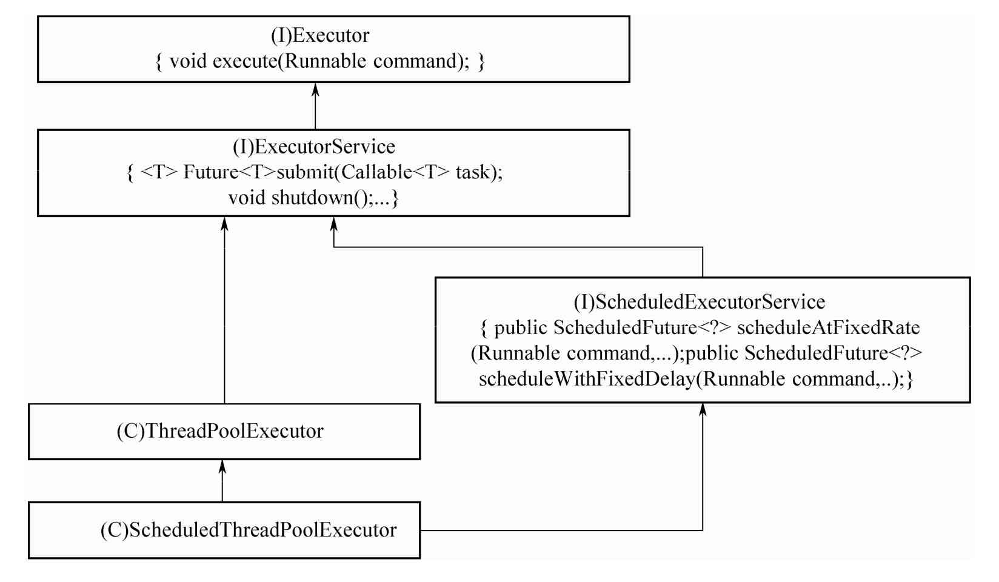
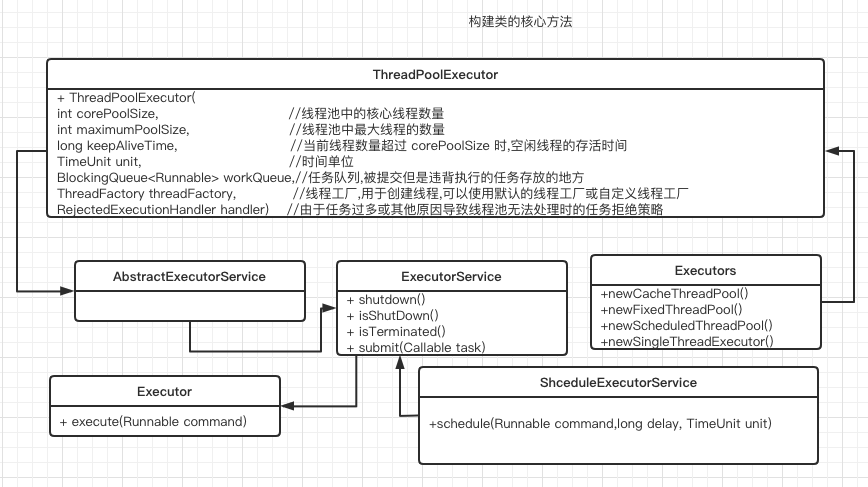

# 线程池的实现原理分析

## 目录

[TOC]

----

## 线程池的类继承体系

#### 两个核心类

- [ThreadPoolExecutor](040-ThreadPoolExecutor-源码分析.md) 用于执行任务
- [ScheduledThreadPoolExecutor ](041-ScheduledThreadPoolExecutor-源码分析.md)  用于执行某个任务,也可以周期性地执行任务

## 线程池的核心组件

- 线程池管理器: 用于创建并管理线程池
- 工作线程 :  线程池中执行具体任务的线程
- 任务接口 : 用于定义工作线程的调度和执行策略,只有线程实现了该接口,线程中的任务才能够被线程池调度
- 任务队列: 存放待处理的任务,新的任务将会不断被加入队列中,执行完成的任务将被从队列中移除

Java中的线程池是通过 Executor 框架实现的, 在该框架中用到了

- `Executor `
- `Executors`
- `ExecutorService`
- `ThreadPoolExecutor `
- `Callable` 
- `Future`
- `FutureTask`

##### 

| 序号 | 参数                                | 说明                                                         |
| ---- | ----------------------------------- | ------------------------------------------------------------ |
| 1    | corePoolSize                        | 线程池中核心线程的数量                                       |
| 2    | maximumPoolSize                     | 线程池中最大线程的数量                                       |
| 3    | keepAliveTime                       | 当前线程数量超过 corePoolSize 时,空闲线程的存活时间          |
| 4    | TimeUnit                            | 时间单位                                                     |
| 5    | `BlockingQueue<Runnable> workQueue` | 任务队列,被提交但是违背执行的任务存放的地方                  |
| 6    | ThreadFactory threadFactory         | 线程工厂,用于创建线程,可以使用默认的线程工厂或自定义线程工厂 |
| 7    | RejectedExecutionHandler            | 由于任务过多或其他原因导致线程池无法处理时的任务拒绝策略     |

## 工作流程

 [021-线程池的工作流程.md](021-线程池的工作流程.md) 

