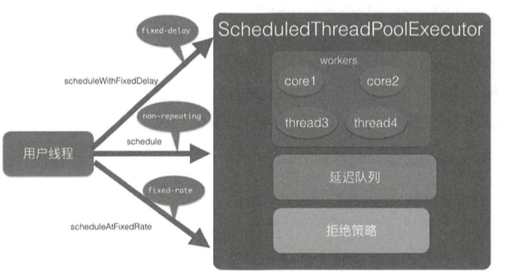

# 041-ScheduledThreadPoolExecutor-源码分析

[TOC]

> 指定一定延迟时间后或者定时进行任务调度执行的线程池



## 任务分为三种

- 一次性执行任务 , 执行完成之后就结束了
- fixed-delay 任务保证了同一个任务在多次执行之间间隔固定时间
- fixed-rate 任务保证按照固定固定评论执行, 任务类型使用 period 的值来区分

ScheduledThreadPoolExecutor 继承了 ThreadPoolExecutor 并实现了 ScheduledExecutorService 接口,

线程池队列是 DelayedWorkQueue , 其和 DelayedQueue类似, 是一个延迟队列

ScheduledFutureTask 是具有返回值的任务,继承自 FutureTask , FutureTask 的内部有一个变量 state 用来表示任务的状态, 当刚创建时是 NEW

```java
public class FutureTask<V> implements RunnableFuture<V> {

    private volatile int state;
    private static final int NEW          = 0;   // 初始状态
    private static final int COMPLETING   = 1;   // 执行中状态
    private static final int NORMAL       = 2;   //正常运行结束状态
    private static final int EXCEPTIONAL  = 3;   //运行中异常
    private static final int CANCELLED    = 4;   // 任务被取消
    private static final int INTERRUPTING = 5;   // 任务正在被中断
    private static final int INTERRUPTED  = 6;   //任务已经被中断
}
```

可能的任务转换状态路径为

```java
NEW -> COMPLETING -> NORMAL
初始状态 -> 执行中状态 -> 正常运行结束状态
```

```java
NEW -> COMPLETING -> EXCEPTIONAL
初始状态 -> 执行中状态 -> 运行中异常
```

```java
NEW -> CANCELLED
初始状态 -> 任务被取消
```

```java
NEW -> INTERRUPTING -> INTERRUPTED
初始状态 -> 任务正在被中断 -> INTERRUPTED
```

## ScheduledFutureTask

```java
private class ScheduledFutureTask<V>
  extends FutureTask<V> implements RunnableScheduledFuture<V> {

  /** Sequence number to break ties FIFO */
  private final long sequenceNumber;

  /** The time the task is enabled to execute in nanoTime units */
  private long time;

  /**
   * Period 用来表示任务的类型
   */
  private final long period;

  /** The actual task to be re-enqueued by reExecutePeriodic */
  RunnableScheduledFuture<V> outerTask = this;

  /**
    * Index into delay queue, to support faster cancellation.
    */
  int heapIndex;
```

period 用来表示任务的类型

- period = 0 , 则表示一次性执行任务执行完毕就结束了
- period  为负数 , 说明当前任务为 fixed-delay 任务, 是固定延迟的定时可重复执行任务
- period 为正数 ,说明当前任务时 fixed-rate 任务, 是固定频率下的定时可重复任务

```java
// 使用改造后的 Delayqueue    
public ScheduledThreadPoolExecutor(int corePoolSize) {
  // 调用父类 ThreadPoolExecutor 的构造函数
  super(corePoolSize, Integer.MAX_VALUE, 0, NANOSECONDS,
        new DelayedWorkQueue());
}

public ThreadPoolExecutor(int corePoolSize,
                          int maximumPoolSize,
                          long keepAliveTime,
                          TimeUnit unit,
                          BlockingQueue<Runnable> workQueue) {
  this(corePoolSize, maximumPoolSize, keepAliveTime, unit, workQueue,
       Executors.defaultThreadFactory(), defaultHandler);
}
```

## 原理剖析

- [schedule(Runnable command,long delay,TimeUnit unit);](#schedule(Runnable command,long delay,TimeUnit unit);)  提交一个延迟执行的任务
- [scheduleWithFixedDelay(Runnable command,long initialDelay, long delay, TimeUnit unit);](#scheduleWithFixedDelay(Runnable command,long initialDelay, long delay, TimeUnit unit);)
- [scheduleAtFixedRate(Runnable command, long initialDelay, long period, TimeUnit unit);](#scheduleAtFixedRate(Runnable command, long initialDelay, long period, TimeUnit unit);)

#### schedule(Runnable command,long delay,TimeUnit unit);

提交一个延迟执行的任务,任务从提交时间开始算起,延迟单位为 unit 的 delay 时间后开始执行, 提交的任务不是周期性任务 ,任务只会执行一次

#### scheduleWithFixedDelay(Runnable command,long initialDelay, long delay, TimeUnit unit);

当任务执行完毕后,让其在延迟固定时间后再次运行(fixed-delay 任务) , 任务会一直重复执行直到任务

- 运行抛出异常
- 被取消了
- 关闭了线程池

其中 initialDelay 标识提交任务后延迟多少时间开始执行任务command, delay 标识当任务执行完毕之后延长多长时间后再次运行 command 任务, unit 是 initialDelay 和 delay的时间单位

#### scheduleAtFixedRate(Runnable command, long initialDelay, long period, TimeUnit unit);


