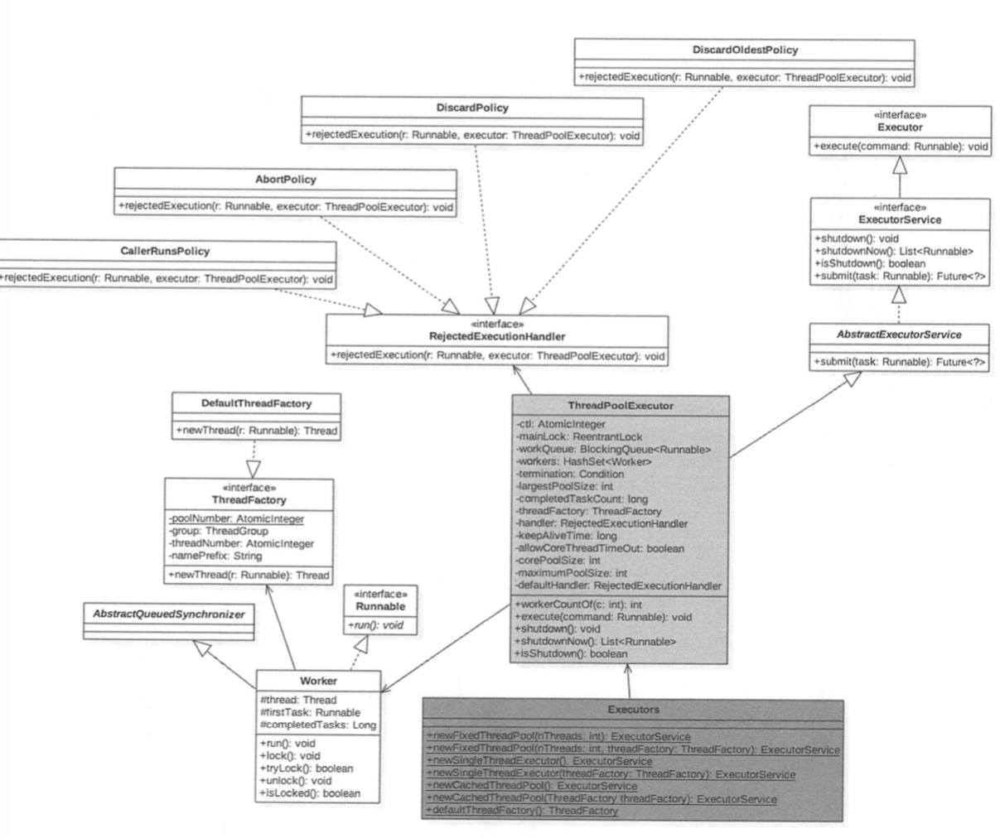

# 010-ThreadPoolExecutor

[TOC]

## 简介

ThreadPoolExecutor继承了AbstractExecutorService , 

- 成员变量 ctl 是一个 Integer 的原子变量, 用来记录线程池 状态和线程池中的线程个数, 类似于 ReentrantReadWriteLock 使用一个变量保存两种信息

## 类图



## 图中的重点

我们从图中可以看到,线程池大体可以分为

- `RejectedExecutionHandler`以及其实现类 : 代表的是拒绝策略
- `ThreadFactory` 以及其实现类 : 用于创建线程
- `ThreadPoolExecutor` 为代表的 线程池执行器,相当于接口层,对外提供方法

## 位图

很明显我们可以看出 ThreadPoolExecutor 继承了 AbstratExecutorService , 成员变量 ctl 是一个 Integer 的原子变量,记录线程池状态和线程个数

这一点的设计思想和 [ReentrantReadWriteLock](../07-线程中的锁/041-读写锁ReentrantReadWriteLock.md) 一致, 它是使用高 16 位记录, 低16 位记录

- 高16 位表示获取到读锁的次数
- 低16 位 表示获取到写锁的线程的可重入次数

```java
// 高3 位 用来表示线程池状态 , 低 29 位用来标识线程个数
// 默认情况下是 RUNNING 状态 ,线程个数为0
private final AtomicInteger ctl = new AtomicInteger(ctlOf(RUNNING, 0));
// 线程个数掩码位数, 并不是所有平台的类型都为32 位的,所以准确的说, 是具体平台下 Interger 的二进制位数-3 后的剩余位数锁标识的树才是线程的个数
private static final int COUNT_BITS = Integer.SIZE - 3;
//线程最大个数(低 29 位) 00 0111111111 1111111111 1111111111
private static final int CAPACITY   = (1 << COUNT_BITS) - 1;

// runState is stored in the high-order bits
//高三位为 111 111111111 1111111111 1111111111
private static final int RUNNING    = -1 << COUNT_BITS;
//高三位为 000 111111111 1111111111 1111111111
private static final int SHUTDOWN   =  0 << COUNT_BITS;
//高三位为 001 111111111 1111111111 1111111111
private static final int STOP       =  1 << COUNT_BITS;
//高三位为 010 111111111 1111111111 1111111111
private static final int TIDYING    =  2 << COUNT_BITS;
//高三位为 011 111111111 1111111111 1111111111
private static final int TERMINATED =  3 << COUNT_BITS;

// Packing and unpacking ctl
// 获取高 3 位
private static int runStateOf(int c)     { return c & ~CAPACITY; }
// 获取 29 位 线程个数
private static int workerCountOf(int c)  { return c & CAPACITY; }
// 计算 ctl 新值(线程状态与线程个数)
private static int ctlOf(int rs, int wc) { return rs | wc; }
```

## 线程池状态

- RUNNING : 接受新任务并且处理阻塞队列的任务
- SHUTDOWN : 拒绝新任务但是处理阻塞队列里的任务
- TIDYING : 所有任务都执行完 (包含阻塞队列里面的任务) 后当前线程活动线程数为 0, 将要调用 terminated 方法
- TERMINATED: 终止状态 ,terminated 方法调用完按成之后的状态

### 线程池状态转化

- RUNING -> SHUTDOWN : 显示调用 shutdown() 方法, 或者隐式调用了 finalize()  方法里面的 showdown();
- STOP -> TIDYING : 当线程池为空
- TIDYING -> TERMINATED : 当 terminated()  hook 方法执行完成时

## 线程池参数如下

- corePoolSize : 线程池核心线程个数
- workQueue : 用于保存等待执行的任务的阻塞队列, 比如
  - 基于数组的有界 ArrayBlockingQueue 
  - 基于链表的无界 LinkedBlockingQueue
  - 最多只有一个元素的同步队列 SynchronousQueue 
  - 优先级队列 PriorityBlockingQueue
- maximunPoolSize : 线程池最大线程数量
- ThreadFactory : 创建线程工厂
- RejectedExecutionHandler : 饱和策略, 当队列满并且线程个数达到 maxmunPoolSize 后采取的策略, 比如 
  - AbortPolicy 抛出异常
  - CallerRunsPolicy 使用调用者所在线程来运行任务 ,
  - DiscardOldestPolicy 调用 poll 丢弃一个任务,执行当前任务
  - DiscardPolicy 默默丢弃, 不抛出异常
- keepAliveTime 存活时间, 如果当前线程池中的线程数量比核心线程数量多,并且是闲置状态,则这些限制的线程能存活的最大时间
- TimeUnit : 存活时间的单位

## 工厂方法

 [025-线程池的使用.md](025-线程池的使用.md) 

## 源码分析

 [040-ThreadPoolExecutor-源码分析.md](040-ThreadPoolExecutor-源码分析.md) 