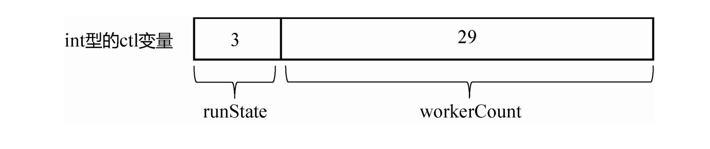
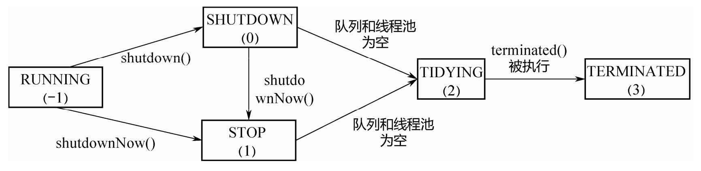

# 040-ThreadPoolExecutor-源码分析

## 目录

[TOC]

## 简介

ThreadPoolExecutor 只是 Executors 工具类的一部分 ,线程池巧妙地使用一个 Integer 类型的原子变量来记录线程池状态和线程池中的线程个数,通过线程池状态来控制任务的执行,每个 Worker 线程可以处理多个任务,线程池通过现成的复用减少线程创建和销毁的开销

## ctl的作用

在线程池中，ctl贯穿在线程池的整个生命周期中ctl

```java
private final AtomicInteger ctl = new AtomicInteger(ctlOf(RUNNING,0));
```

它是一个原子类，主要作用是用来保存线程数量和线程池的状态。ctl是一个 int 数值是 32 个 bit 位

- 高 3 位来保存运行状态
- 低 29 位来保存线程数量



## 线程池中的五种状态

| CODE       | 值   | 解释                                                         |
| ---------- | ---- | ------------------------------------------------------------ |
| RUNNING    | -1   | 接受新任务并且处理阻塞队列里的任务                           |
| SHUTDOWN   | 0    | 拒绝新任务但是处理阻塞队列里的任务                           |
| STOP       | 1    | 拒绝新任务并且抛弃阻塞队列里的任务,同时会中断正在处理的任务  |
| TIDYING    | 2    | 所有的任务都执行完(包含阻塞队列里面的任务)后当前线程地活动数为0,将要调用terminated() |
| TERMINATED | 3    | 终止状态 , terminated()方法执行完成之后的状态                |



从上图中可以看出

| 转换代码                  | 解释                                                         |
| ------------------------- | ------------------------------------------------------------ |
| RUNNING  ---> SHUTDOWN    | 调用shutdown方法,或者隐式调用了finalized()方法里面的shutdown方法 |
| RUNNING/SHUTDOWN --->STOP | 调用shotdownNow()方法                                        |
| SHUTDOWN ---> TIDYING     | 当线程池和任务队列都为空时                                   |
| STOP ---> TIDYING         | 当线程池为空时                                               |
| TIDYING --->TERMINATED    | 当 terminated() hook方法执行完成时                           |

## 源码

```java
//高3位用来表示线程池状态, 低 29位用来表示线程个数    
//默认是RUNNING状态 ,线程个数为0
private final AtomicInteger ctl = new AtomicInteger(ctlOf(RUNNING, 0));
//线程个数的掩码位数,并不是所有的平台的int类型都是32位,所以准确地说,是具体平台下Integer的二进制位数-3的剩余位数所表示的数才是线程的个数
private static final int COUNT_BITS = Integer.SIZE - 3;
//最大线程个数(低29位) 000 1111 11111 11111 11111 11111
private static final int CAPACITY   = (1 << COUNT_BITS) - 1;
//高三位是111,    111 0000 00000 00000 00000 00000
private static final int RUNNING    = -1 << COUNT_BITS;
//高3位是000
private static final int SHUTDOWN   =  0 << COUNT_BITS;
//高3位是001
private static final int STOP       =  1 << COUNT_BITS;
//高3位是010
private static final int TIDYING    =  2 << COUNT_BITS;
//高3位是011
private static final int TERMINATED =  3 << COUNT_BITS;
```

## 有三个快捷函数

```java
//获取高3位(运行状态)
private static int runStateOf(int c)     { return c & ~CAPACITY; }
//获取低29位(线程个数)
private static int workerCountOf(int c)  { return c & CAPACITY; }
//计算ctl新值(线程状态与线程个数)
private static int ctlOf(int rs, int wc) { return rs | wc; }
```

