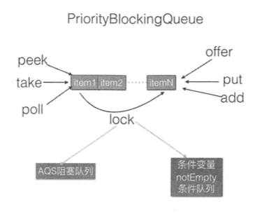
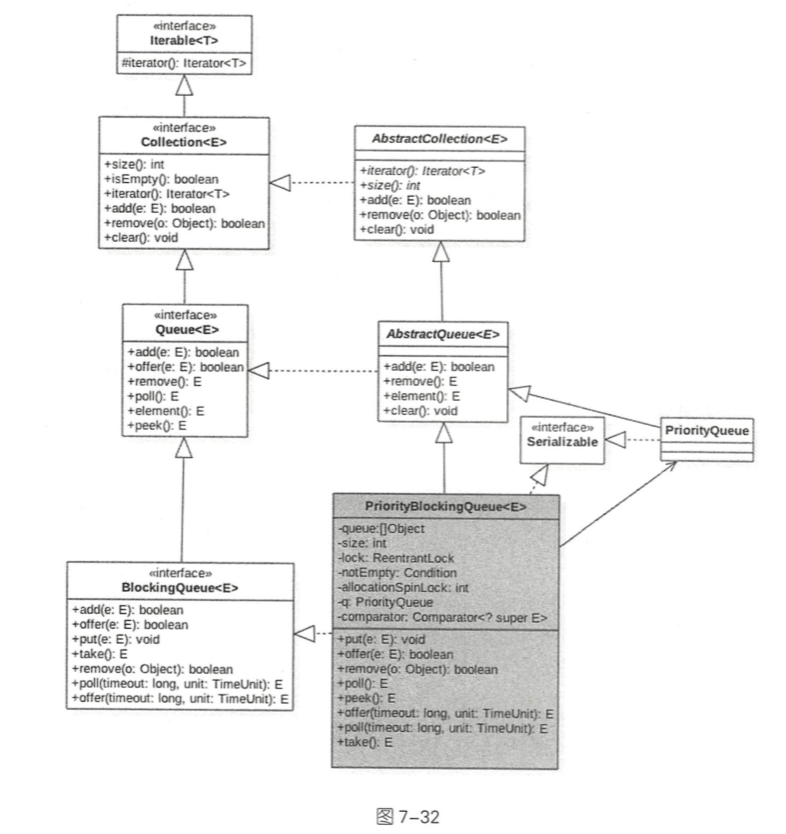

# 043-PriorityBlockingQueue

---

[TOC]

## PriorityBlockingQueue是什么

PriorityBlockingQueue 是带**优先级**的无界阻塞队列,每次出队都返回**优先级最高**或者**最低**的元素.

其内部是使用**平衡二叉树堆**实现的, 所以直接遍历队列元素保证有序, 从而实现了按照优先级从小到大出队列

默认使用对象的 compareTo 方法提供比较规则, 如果你需要自定义比较规则 则可以自定义 comparators 

## 特点

PriorityBlockingQueue 队列在内部使用二叉树堆维护元素优先级, 使用数组作为元素存储的**数据结构**,这个数组是可扩容的,

- 如果 **当前元素个数 > = 最大容量** 时, 会通过 CAS 算法扩容
- 出队时始终保证出队的元素时堆树的根节点,而不是在队列里面停留时间最长的元素

- 使用 元素 compareTo 方法提供默认的元素优先级比较规则,用户可以自定义优先级比较规则



## 内部原理简介

PriorityBlockingQueue 类似于 ArrayBlockingQueue, 在内部使用一个**独占锁**来控制同时只有一个线程可以入队和出队的操作

- PriorityBlockingQueue 使用一个 notEmpty 条件变量而没有使用 notFull 
- 这是因为它是无界的,执行 put 操作永远不会出于 await 状态, 所以也不需要被唤醒
- PriorityBlockingQueue 的 take 方法是阻塞方法,并且是可能被中断的,当需要存放有优先级的元素时该队列比较有用

##  类图



从类图中我们可以看到

- PriorityBlockingQueue 内部有一个数组 queue , 用来存放队列元素
- size 用来存放队列元素的个数
- allocationSpinLock 是一个自旋锁, 使用 CAS 保证同时只有一个线程可以扩容 ,状态 为 0 或者 1 
  - 0 代表没有扩容
  - 1 标识正在扩容

PriorityBlockingQueue 是一个优先级队列, 所以有一个比较器 comparator 用来比较元素的大小

- lock 独占锁对象用来控制同时只能有一个线程可以进行 出队,入队操作

- notEmpty 是一个条件变量, 用来实现 take 方法阻塞模式

  > 这里没有notFull 是因为put 的操作是非阻塞的(PriorityBlockingQueue 是一个无界数组)

## 构造函数

```java
public PriorityBlockingQueue(int initialCapacity,
                             Comparator<? super E> comparator) {
    if (initialCapacity < 1)
        throw new IllegalArgumentException();
    this.lock = new ReentrantLock();
    this.notEmpty = lock.newCondition();
    this.comparator = comparator;
    this.queue = new Object[initialCapacity];
}
```

默认的构造函数

```java
//可以看到默认的初始化大小为 11
private static final int DEFAULT_INITIAL_CAPACITY = 11;

public PriorityBlockingQueue() {
  this(DEFAULT_INITIAL_CAPACITY, null);
}
```

我们可以看到,初始化容量默认是 11 , 比较器为 null ,也就是说默认使用元素的 compareTo 方法, 这意味着队列必须实现了 Comparable 接口

## 元素操作

- [offer](#offer)
- [扩容](#扩容)
- [poll](#poll)
- [put](#put)
- [take](#take)
- [size](#size)

#### offer 操作

offer 操作的作用是在队列中插入一个元素,由于是无界队列,所以永远返回 true :

```java
public boolean offer(E e) {
    if (e == null)
        throw new NullPointerException();
  // 获取独占锁
    final ReentrantLock lock = this.lock;
    lock.lock();
    int n, cap;
    Object[] array;
  // ① 如果当前元素个数 >= 队列容量,则扩容
    while ((n = size) >= (cap = (array = queue).length))
        tryGrow(array, cap);
    try {
        Comparator<? super E> cmp = comparator;
      //② 默认比较器为 null
        if (cmp == null)
            siftUpComparable(n, e, array);
        else
          //③ 自定义比较器
            siftUpUsingComparator(n, e, array, cmp);
      	// ⑨ 将队列的元素增加 1 , 并且激活 notEmpty 的条件队列里的一个阻塞线程  
      size = n + 1;
      // 激活因为调用 take() 方法而被阻塞的线程
        notEmpty.signal();
    } finally {
      //释放独占锁
        lock.unlock();
    }
    return true;
}
```

## 扩容

扩容和在内部建堆

```java
    private void tryGrow(Object[] array, int oldCap) {
      //释放获取的锁
        lock.unlock(); // must release and then re-acquire main lock
        Object[] newArray = null;
      //④ CAS 成功则扩容
        if (allocationSpinLock == 0 &&
            UNSAFE.compareAndSwapInt(this, allocationSpinLockOffset,0, 1)) {
            try {
              // oldCap < 64 则扩容, 执行 oldcap +2 , 否则扩容 50% , 并且最大为 MAX_ARRAY_SIZE
                int newCap = oldCap + ((oldCap < 64) ?
                                       (oldCap + 2) : // grow faster if small
                                       (oldCap >> 1));
                if (newCap - MAX_ARRAY_SIZE > 0) {    // possible overflow
                    int minCap = oldCap + 1;
                    if (minCap < 0 || minCap > MAX_ARRAY_SIZE)
                        throw new OutOfMemoryError();
                    newCap = MAX_ARRAY_SIZE;
                }
                if (newCap > oldCap && queue == array)
                    newArray = new Object[newCap];
            } finally {
                allocationSpinLock = 0;
            }
        }
      //⑤ 第一个线程 CAS 成功后,第二个线程会进入这段代码,然后第二个线程让出 CPU, 尽量让第一个线程获取锁,但是这得不到保证
        if (newArray == null) // back off if another thread is allocating
            Thread.yield();
        lock.lock();
        if (newArray != null && queue == array) {
            queue = newArray;
            System.arraycopy(array, 0, newArray, 0, oldCap);
        }
    }
```

#### 为啥扩容之前要先释放锁?

扩容期间一直持有锁,但是扩容时需要花时间的,如果扩容时还占用锁那么其他线程在这个时候是不能进行出队和入队操作的,这就大大降低了并发性

#### 为什么 CAS 控制只有一个线程可以扩容?

使用 CAS 控制只有一个线程可以进行扩容并且在扩容前释放锁,这样其他线程可以进行入队和出队操作

spinlock 锁使用 CAS 控制只有一个线程可以进行扩容, CAS 失败的线程会调用 yield 方法让出 CPU, 目的是让扩容线程扩容后优先调用 **lock.lock** 重新获取锁,但是这得不到保证

有可能 yield 的线程在扩容完成前已经退出,并执行代码 ⑥ 获取了锁, 这个时候获取到锁的线程发现 newArray 为 null 就会执行代码① 

> 入队以后整理

#### poll

poll 操作的作用是获取队列内部堆树的根节点元素，如果队列为空 ，则 返回 null。

未整理 ,并发编程之美

#### put

put操作内部调用的是 offer操作，由于是无界队列，所以不需要阻塞。

```java
    public void put(E e) {
        offer(e); // never need to block
    }
```

#### take

take 操作的作用是获取队列内部堆树的根节点元素 ，如果队列为空则阻塞

```java
  public E take() throws InterruptedException {
    //获取锁,可被中断
        final ReentrantLock lock = this.lock;
        lock.lockInterruptibly();
        E result;
        try {
          //如果队列为空则阻塞,把当前线程放入 notEmpty 等待
            while ( (result = dequeue()) == null)
                notEmpty.await(); //  阻塞当前线程
        } finally {
            lock.unlock();释放锁
        }
        return result;
    }
```

在如上代码中，首先通过 lock.locklnterruptibly() 获取独占锁 ，以这个方式获取的锁会对中断进行响应 。

- 然后调用 dequeue 方法返回堆树根节点元素，如果队列为空 ，则 返回 false。
- 然后当前线程调用 notEmpty.await()阻塞挂起自己 ，直到有线程调用了 offer()方法(在 offer方法内添加元素成功后会调用 notEmpty.signal 方法，

这会激活一个阻塞在 notEmpty 的条件队列里面的一个线程)。

另外，这里使用 while循环而不是 if语句是为了避免**虚假唤醒** 。

#### size

计算队列元素个数。 如下代码在返回 size前加了锁，以保证在调用 size()方法时不会 有其他线程进行入队和出队操作 。 另外，由于 size 变量没有被修饰为 volatie 的， 所以这 里加锁也保证了在多线程下 size变量的内存可见性。

```java
    public int size() {
        final ReentrantLock lock = this.lock;
        lock.lock();
        try {
            return size;
        } finally {
            lock.unlock();
        }
    }

```
