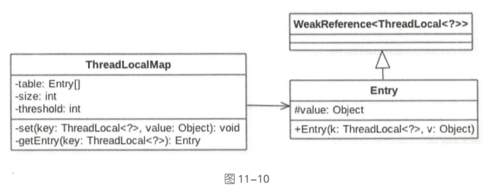

# 使用 ThreadLocal不当可能会导致内存泄漏

[TOC]

参考 : [01-ThreadLocal.md](../13-ThreadLocal/01-ThreadLocal.md) 

## 为什么会出现内存泄漏

我们知道，ThreadLocal是基于ThreadLocalMap实现的，

- 这个Map的Entry继承了WeakReference，而Entry对象中的key使用了WeakReference封装，也就是说Entry中的key是一个弱引用类型，而弱引用类型只能存活在下次GC之前。

如果一个线程调用ThreadLocal的set设置变量，当前ThreadLocalMap则新增一条记录，但发生一次垃圾回收，此时key值被回收，而value值依然存在内存中，由于当前线程一直存在，所以value值将一直被引用。.

这些被垃圾回收掉的key就存在一条引用链的关系一直存在：Thread --> ThreadLocalMap-->Entry-->Value，这条引用链会导致Entry不会回收，Value也不会回收，但Entry中的Key却已经被回收的情况，造成内存泄漏。

我们只需要在使用完该key值之后，通过remove方法remove掉，就可以防止内存泄漏了。

## 什么是内存泄漏

*内存泄漏*（Memory Leak）是指程序中己动态分配的堆内存由于某种原因程序未释放或无法释放，造成系统内存的浪费，导致程序运行速度减慢甚至系统崩溃等严重后果。

#### 为什么 ThreadLocal 使用不当会导致内存泄漏问题

ThreadLocal 实际是一个工具类, 操作的是 Thread 内部的 ThreadLocalMap 对象

```java
static class ThreadLocalMap {
  ...
  static class Entry extends WeakReference<ThreadLocal<?>> {
    Object value;
    Entry(ThreadLocal<?> k, Object v) {
      super(k);
      value = v;
    }
  }
}
```

- ThreadLocalMap 的 key 是 使用的 **ThreadLocal 对象的弱引用** 
- ThreadLocalMap 的 value 是 具体的调用 ThreadLocal 的 set 方法传递的值

当一个线程调用了 ThreadLocal 的 set 方法设置变量时, 当前线程的 ThreadLocalMap .

- 如果当前线程一直存在且没有调用 ThreadLocal 的 remove 方法, 并且这时候在其他地方还有对 ThreadLocal 的引用, 则当前线程的 ThreadLocalMap 变量不会被释放,就会造成内存泄漏

- 如果这个 ThreadLocal 变量没有其他强依赖,而当前线程还存在

  由于 key 是弱依赖,所以当前线程的 ThreadLocalMap 里面的 key 在 gc 时会被回收
  
  > 但是对应的 value 不会被回收,就导致了 这样的Entry 
  >
  > - key = null
  >- value != null

#### 对于线程池来说

线程池中的核心线程是一直存在的,如果不清理,线程池的核心线程的 threadLocals 变量会一直持有 **ThreadLocal** 变量

## 原理

ThreadLocal只是一个工具类,具体存放的变量是线程的 threadLocals 变量



threadLocals 是一个 ThreadLocalMap 类型的变量

```java
ThreadLocal.ThreadLocalMap threadLocals = null;
```

ThreadLocalMap 内部是一个 Entry 数组, Entry 继承自 WeakReference ,Entry 内部的 value 用来存放通过 ThreadLocal 的 set 方法传递的值

那么 ThreadLocal 对象本身存放到哪里了呢?

```java
//java.lang.ThreadLocal.ThreadLocalMap.Entry

static class Entry extends WeakReference<ThreadLocal<?>> {
 
  Object value;

  Entry(ThreadLocal<?> k, Object v) {
    super(k);
    value = v;
  }
}
```

这里的 super 实际上就是 WeakReference

```java
public WeakReference(T referent) {
  super(referent);
}   
Reference(T referent) {
  this(referent, null);
}   

Reference(T referent, ReferenceQueue<? super T> queue) {
  this.referent = referent;
  this.queue = (queue == null) ? ReferenceQueue.NULL : queue;
}
```

k 被传递给 WeakReference 的构造函数, 也就是说 ThreadLocalMap 里面的key 为 ThreadLocal 对象的弱引用,具体就是 referent 变量引用了 ThreadLocal 对象, value 为具体调用 Threadlocal 的 set 方法时传递的值

当一个线程调用 ThreadLocal 的 set 方法设置变量时, 当前线程的 ThreadLocalMap 里面就存放了一个记录,这个记录的 key 为 ThreadLocal 的弱引用, value 则为设置的值

**如果当前线程一直存在, 且没有调用 ThreadLocal 的 remove 方法,并且这时候其他地方还有对 ThreadLocal 的引用, 则当线程的 ThreadLocalMap 变量里面会存在对 ThreadLocal 变量的引用和对 value 对象的引用,他们是不会被释放的,所以会内存泄漏**

如果 ThreadLocal 变量没有其他强依赖, 

- 由于 ThreadLocalMap 里面的 key 是弱依赖,所以当前线程的 ThreadLocalMap 里面的 ThreadLocal 变量的弱引用会在 gc 会回收
- 但是 value 还是会造成内存泄漏, 就会变成 key 为 null, 但是 value 不会 null 的 entry

## remove

```java
private void remove(ThreadLocal<?> key) {
  // ① 计算当前 threadlocal 变量所在的 table 数组位置, 尝试使用快速定位方法
  Entry[] tab = table;
  int len = tab.length;
  int i = key.threadLocalHashCode & (len-1);
  //②使用循环是防止快速定位失效后,遍历 table 数组
  for (Entry e = tab[i];
       e != null;
       e = tab[i = nextIndex(i, len)]) {
    // ③ 找到
    if (e.get() == key) {
      //④ 找到则调用 WeakReference 的 clear 方法清除对 ThreadLocal 的弱引用
      e.clear();
      //⑤ 清理 key 为 null
      expungeStaleEntry(i);
      return;
    }
  }
}
```

- 代码 4 调用 Entry 的 clear 方法, 实际调用的是父类的 WeakReference 的 clear 方法的做有用是去掉对 ThreadLocal 的弱引用
- 代码⑥ 对掉 对 value 的引用, 到这里当前线程里面的当前 ThreadLocal 对象的信息被清理完毕了

```java
private int expungeStaleEntry(int staleSlot) {
  Entry[] tab = table;
  int len = tab.length;

  // expunge entry at staleSlot
  tab[staleSlot].value = null;
  tab[staleSlot] = null;
  size--;

  // Rehash until we encounter null
  Entry e;
  int i;
  for (i = nextIndex(staleSlot, len);
       (e = tab[i]) != null;
       i = nextIndex(i, len)) {
    ThreadLocal<?> k = e.get();
    // ⑦ 如果 key 为 null ,则去掉对 value 的引用
    if (k == null) {
      e.value = null;
      tab[i] = null;
      size--;
    } else {
      int h = k.threadLocalHashCode & (len - 1);
      if (h != i) {
        tab[i] = null;

        // Unlike Knuth 6.4 Algorithm R, we must scan until
        // null because multiple entries could have been stale.
        while (tab[h] != null)
          h = nextIndex(h, len);
        tab[h] = e;
      }
    }
  }
  return i;
}
```

代码 7 从当前元素的下表开始查看 table 数组里面是否有 key 为 null的其他元素,有则清理

循环退出的条件是遇到 table 里面有 null 的元素

所以这里知道 null 元素后面的 Entry 里面的 key 为 null 的元素不会被清理

```

```

