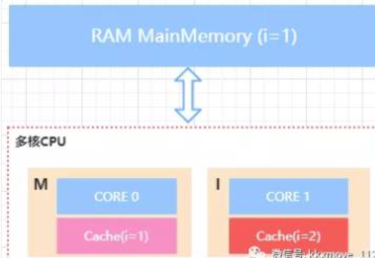
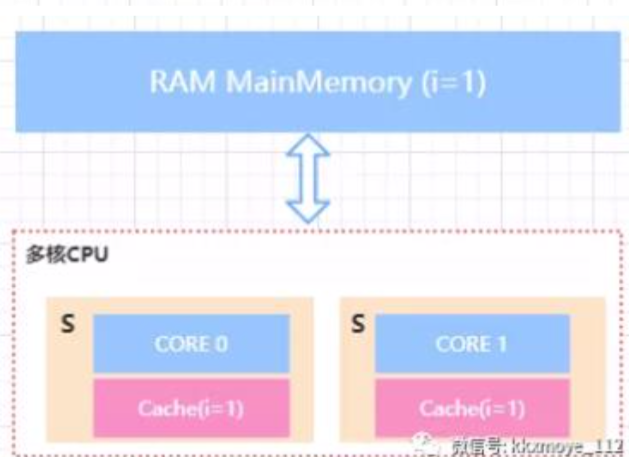
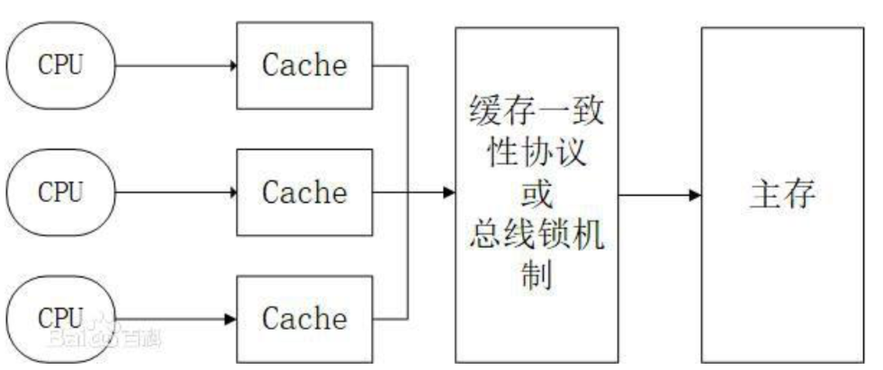

## volatile的定义
关键字volatile可以用来修饰字段（成员变量），就是告知程序任何对该变量的访问均需要从共享内存中获取，而对它的改变必须同步刷新回共享内存，它能保证所有线程对变量访问的可见性。

volatile 在多处理器开发中保证了共享变量的可见性,这意味着当一个线程在修改一个共享变量的时候,另外一个线程能够读到这个修改的值

| 术语       | 英文单词               | 描述                                                         |
| ---------- | ---------------------- | ------------------------------------------------------------ |
| 共享变量   |                        | 在多个线程之间能够被共享的变量被称为共享变量。共享变量包括所有的实例变量，静态变量和数组元素。他们都被存放在堆内存中，Volatile只作用于共享变量。 |
| 内存屏障   | Memory Barriers        | 是一组处理器指令，用于实现对内存操作的顺序限制。             |
| 缓冲行     | Cache line             | 缓存中可以分配的最小存储单位。处理器填写缓存线时会加载整个缓存线，需要使用多个主内存读周期。 |
| 原子操作   | Atomic operations      | 不可中断的一个或一系列操作。                                 |
| 缓存行填充 | cache line fill        | 当处理器识别到从内存中读取操作数是可缓存的，处理器读取整个缓存行到适当的缓存（L1，L2，L3的或所有） |
| 缓存命中   | cache hit              | 如果进行高速缓存行填充操作的内存位置仍然是下次处理器访问的地址时，处理器从缓存中读取操作数，而不是从内存。 |
| 写命中     | write hit              | 当处理器将操作数写回到一个内存缓存的区域时，它首先会检查这个缓存的内存地址是否在缓存行中，如果存在一个有效的缓存行，则处理器将这个操作数写回到缓存，而不是写回到内存，这个操作被称为写命中。 |
| 写缺失     | write misses the cache | 一个有效的缓存行被写入到不存在的内存区域。                   |

##可见性的本质

### 从硬件层面了解可见性的本质

一台计算机中最核心的组件是 CPU、内存以及 I/O 设备,在整个计算机发展历程中,除了 CPU、内存以及 I/O设备不断迭代更新发展历程中,除了 CPU、内存以及 I/O设备不断更新迭代来提升计算机处理性能之外,还有一个非常核心的矛盾点,就是第三者在处理速度删的差异:

- CPU 速度最快
- 内存
- IO 设备

为了解决这种处理速度上的差异,从硬件、操作系统、编译器等方面做了优化:

- CPU增加了高速缓存
- 操作系统增加了进程, 线程 通过 CPU 的时间片切换最大化提升 CPU的使用率
- 编译器指令优化,更合理地去利用好 CPU 的高速缓存

每一种优化都相应有问题

#### CPU 高速缓存

线程是CPU 调度的最小单位,线程设计的目的最终是 **充分利用计算机处理的效能** ,但是绝大多数的运算任务不能只依靠处理器"计算"就能完成处理器还需要与内 存交互，比如读取运算数据、存储运算结果，这个 I/O 操 作是很难消除的。而由于计算机的存储设备与处理器的运 算速度差距非常大，所以现代计算机系统都会增加一层读 写速度尽可能接近处理器运算速度的高速缓存来作为内存 和处理器之间的缓冲:将运算需要使用的数据复制到缓存 中，让运算能快速进行，当运算结束后再从缓存同步到内 存之中。

通过高速缓存的存储交互很好的解决了处理器与内存的速度矛盾，但是也为计算机系统带来了更高的复杂度，因为它引入了一个新的问题，缓存一致性。

#### 缓存一致性

首先，有了高速缓存的存在以后，每个 CPU 的处理过程是， 先将计算需要用到的数据缓存在 CPU 高速缓存中，在 CPU 进行计算时，直接从高速缓存中读取数据并且在计算完成 之后写入到缓存中。在整个运算过程完成后，再把缓存中 的数据同步到主内存。

由于在多 CPU 种，每个线程可能会运行在不同的 CPU 内， 并且每个线程拥有自己的高速缓存。同一份数据可能会被 缓存到多个 CPU 中，如果在不同 CPU 中运行的不同线程
看到同一份内存的缓存值不一样就会存在缓存不一致的问 题

为了解决缓存不一致的问题，在 CPU 层面做了很多事情， 主要提供了两种解决办法

1. 总线锁 
2. 缓存锁

#### 总线锁和缓存锁

总线锁，简单来说就是，在多 cpu 下，当其中一个处理器 要对共享内存进行操作的时候，在总线上发出一个 LOCK# 信号，这个信号使得其他处理器无法通过总线来访问到共 享内存中的数据，总线锁定把 CPU 和内存之间的通信锁住 了，这使得锁定期间，其他处理器不能操作其他内存地址 的数据，所以总线锁定的开销比较大，这种机制显然是不 合适的 如何优化呢?最好的方法就是控制锁的保护粒度，我们只 需要保证对于被多个 CPU 缓存的同一份数据是一致的就 行。所以引入了缓存锁，它核心机制是基于 缓存一致性协 议来实现的。

如何优化呢?最好的方法就是控制锁的保护粒度，我们只 需要保证对于被多个 CPU 缓存的同一份数据是一致的就 行。所以引入了缓存锁，它核心机制是基于缓存一致性协 议来实现的。

#### 缓存一致性协议

为了达到数据访问的一致，需要各个处理器在访问缓存时
遵循一些协议，在读写时根据协议来操作，常见的协议有 MSI，MESI，MOSI 等。最常见的就是 MESI 协议。接下来 给大家简单讲解一下 MESI

MESI 表示缓存行的四种状态，分别是

1. M (Modify) 表示共享数据只缓存在当前 CPU 缓存中， 并且是被修改状态，也就是缓存的数据和主内存中的数 据不一致
2. E (Exclusive) 表示缓存的独占状态，数据只缓存在当前 CPU 缓存中，并且没有被修改
3. S (Shared) 表示数据可能被多个 CPU 缓存，并且各个缓 存中的数据和主内存数据一致
4. I  (Invalid) 表示缓存已经失效

在 MESI 协议中，每个缓存的缓存控制器不仅知道自己的 读写操作，而且也监听(snoop)其它 Cache 的读写操作

##### 简单实例

假如在主内存中有一个 `MainMemory`存在变量 i = 1,此时 M 代表修改的状态 ,CORE 1 中的缓存输入 I 失效状态

下图中 CORE0 和 CORE1 属于缓存的独占状态

下图中 CORE0 和 CORE1 属于 S 分享状态 

对于 MESI 协议，从 CPU 读写角度来说会遵循以下原则: 

- CPU 读请求:缓存处于 M、E、S 状态都可以被读取，I 状 态 CPU 只能从主存中读取数据

- CPU 写请求:缓存处于 M、E 状态才可以被写。对于 S 状 态的写，需要将其他 CPU 中缓存行置为无效才可写

使用总线锁和缓存锁机制之后，CPU 对于内存的操作大概 可以抽象成下面这样的结构。从而达到缓存一致性效果

#### 总结可见性的本质

由于 CPU 高速缓存的出现使得 如果多个 cpu 同时缓存了 相同的共享数据时，可能存在可见性问题。也就是 CPU0 修 改了自己本地缓存的值对于 CPU1 不可见。不可见导致的 后果是 CPU1 后续在对该数据进行写入操作时，是使用的 脏数据。使得数据最终的结果不可预测。   

## MESI 优化带来的可见性问题

MESI 协议虽然可以实现缓存的一致性，但是也会存在一些 问题。
就是各个 CPU 缓存行的状态是通过消息传递来进行的。如 果 CPU0 要对一个在缓存中共享的变量进行写入，首先需 要发送一个`失效的消息`给到其他缓存了该数据的 CPU。并 且要等到他们的确认回执。CPU0 在这段时间内都会处于 阻塞状态。为了避免阻塞带来的资源浪费。在 cpu 中引入 了 **Store Bufferes**。

CPU0 只需要在写入共享数据时，直接把数据写入到 store bufferes 中，同时发送 invalidate 消息，然后继续去处理其 他指令。

当收到其他所有 CPU 发送了 invalidate acknowledge 消息 时，再将 store bufferes 中的数据数据存储至 cache line 中。最后再从缓存行同步到主内存。

但是这种优化存在两个问题
1. 数据什么时候提交是不确定的，因为需要等待其他 cpu
 给回复才会进行数据同步。这里其实是一个异步操作
2. 引入了 storebufferes 后，处理器会先尝试从 storebuffer 中读取值，如果 storebuffer 中有数据，则直接从 storebuffer 中读取，否则就再从缓存行中读取

### 内存屏障

内存屏障就是将 store bufferes 中的指令写入到内存，从 而使得其他访问同一共享内存的线程的可见性。
X86 的 memory barrier 指令包括 lfence(读屏障) sfence(写 屏障) mfence(全屏障)

- Store Memory Barrier(写屏障) 告诉处理器在写屏障之前 的所有已经存储在存储缓存(store bufferes)中的数据同步 到主内存，简单来说就是使得写屏障之前的指令的结果对 屏障之后的读或者写是可见的
- Load Memory Barrier(读屏障) 处理器在读屏障之后的读 操作,都在读屏障之后执行。配合写屏障，使得写屏障之前 的内存更新对于读屏障之后的读操作是可见的
- Full Memory Barrier(全屏障) 确保屏障前的内存读写操作 的结果提交到内存之后，再执行屏障后的读写操作

## Volatile 如何保证可见性?

准编程汇编后实际上会对变量添加 lock 执行

实际操作:

- 将当前处理器缓存的行的数据写回到系统内存
- 这个回写 的操做会使在其他 CPU 里的缓存了该内存地址的数据无效

## volatile关键字的作用

[好文章参考](https://www.cnblogs.com/chengxiao/p/6528109.html)

Java提供了一种轻量级同步机制：volatile变量。

1. volatile变量确保变量的更新以一种可预见的方式告知其他线程
2. 当一个域被声明为volatile类型后，编译器在运行时会监视这个变量：它是共享的。
3. volatile变量不会和其他内存操作一起被重排序。
4. volatile变量不会缓存在寄存器或者缓存在对其他处理器隐藏的地方。

所以，读取一个volatile变量,总会返回某一个线程所写入的最新值。

## 特性
Java虚拟机有自己的内存模型（Java Memory Model，JMM），JMM可以屏蔽掉各种硬件和操作系统的内存访问差异，以实现让java程序在各种平台下都能达到一致的内存访问效果。

　　JMM决定一个线程对共享变量的写入何时对另一个线程可见，JMM定义了线程和主内存之间的抽象关系：共享变量存储在主内存(Main Memory)中，每个线程都有一个私有的本地内存（Local Memory），本地内存保存了被该线程使用到的主内存的副本拷贝，线程对变量的所有操作都必须在工作内存中进行，而不能直接读写主内存中的变量。

  

volatile具备两种特性，第一就是保证共享变量对所有线程的可见性。将一个共享变量声明为volatile后，会有以下效应：

1. 当写一个volatile变量时，JMM会把该线程对应的本地内存中的变量强制刷新到主内存中去；
1. 这个写会操作会导致其他线程中的缓存无效。

## 为什么叫它轻量级的同步机制呢

1. 访问volatile变量的操作不会加锁
2. 不会引起执行线程的阻塞

## 什么时候使用它

只有当volatile变量能够简化实现和同步策略的验证时，才使用它们。

当验证正确性必须推断可见性问题时，应该避免使用volatile变量。

正确使用volatile变量的方式包括：

1. 用于确保它们所引用的对象状态的可见性。
2. 用于标识重要的生命周期事件（比如初始化或者关闭）的发生。

场景：

1. 写入变量时并不依赖变量的当前值，或者能够确保只有单一的线程修改变量的值。
2. 变量不需要与其他的状态变量共同参与不变约束
3. 访问变量时，没有其他原因，需要加锁

## 总结

volatile变量对可见性的影响所产生的价值，远远超过变量本身：线程A像volatile变量写入值，随后线程B读取该变量，所有A执行写操作前可见的变量的值，在B读取了volatile变量后，成为对B的可见的。

从内存可见性的角度看：

1. **写入volatile变量就像是退出同步块**
2. **读取volatile变量就像是进入同步块**

但是依赖volatile变量来控制状态可见性的代码，比使用锁的代码更脆弱，更难以理解。

**加锁可以保证可见性和原子性，volatile只能保证可见性。**