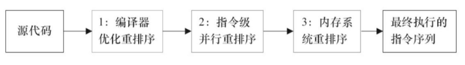
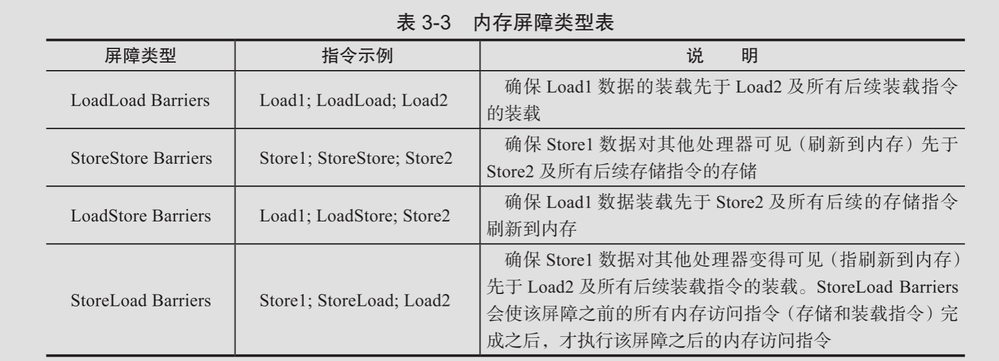

# 重排序

在执行程序时,为了提高性能, 编译器和持利器常常会对指令进行重排序,分三种类型:

- 编译器优化的重排序

- 指令级并行的重排序

- 内存系统的重排序

#### 编译器优化的重排序

编译器在不改变单线程程序语义的前提下,可以重新安排语句的执行顺序

编译器的重排序，JMM 提供了禁止特定类型的编译器重排序,处理器重排序，JMM 会要求编译器生成指令时，会插入内存屏障来禁止处理器重排序

#### 指令级并行的重排序

现代处理器采用了指令级并行技术(Instruction-Level Parallelism, ILP) 来讲多条指令重叠执行,如果不存在数据依赖性,处理器可以改变语句对应机器指令的执行顺序

#### 内存系统的重排序

由于处理器使用缓存和读/写缓存区,这使得加载和存储操作看上去可能是在乱序执行

#### 重排序的顺序

2 和 3 属于处理器重排序。这些重排序可能会导致可见性问题。

## 内存屏障

为了保证内存可见性,Java编译器在生成指令序列的适当位置会插入内存屏障指令来禁止特定类型的处理器重排序

值得注意的是`StroreStore Barriers`是一个全能型的屏障,它同事具有其他 3 个屏障的效果,执行这个屏障的开销也很昂贵,因为当前处理器通常吧写缓冲区中的数据全部刷新到内存中取