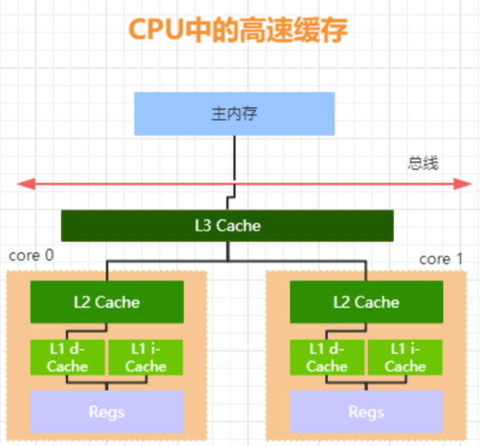
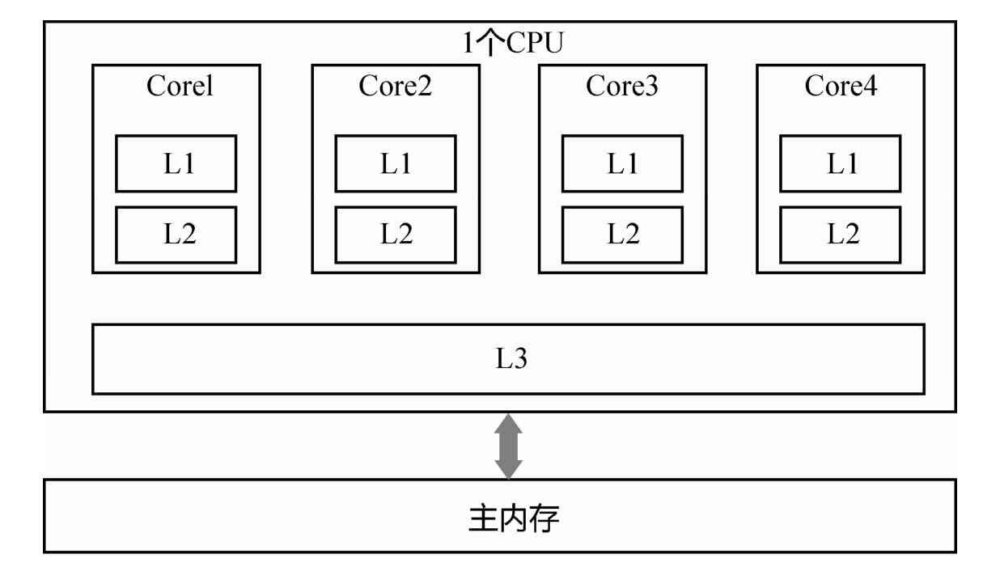

# 内存可见性

## 目录

- [可见性的本质](#可见性的本质)
- [缓存一致性问题](#缓存一致性问题)

- [缓存锁](#缓存锁)
- [总线锁](#总线锁)

- [为什么会存在内存可见性问题](#为什么会存在内存可见性问题)

---

## 可见性的本质

结论: 

> 由于 CPU 高速缓存的出现使得 如果多个 cpu 同时缓存了 相同的共享数据时，可能存在可见性问题。也就是 CPU0 修 改了自己本地缓存的值对于 CPU1 不可见。不可见导致的 后果是 CPU1 后续在对该数据进行写入操作时，是使用的 脏数据。使得数据最终的结果不可预测。   

一台计算机中最核心的组件是 CPU、内存以及 I/O 设备 , 一个非常核心的矛盾点就是

**CPU、内存以及 I/O 设备处理速度之间的差异**

为了解决这种处理速度上的差异,从硬件、操作系统、编译器等方面做了优化

| 优化层面     | 优化点                                                       |
| ------------ | ------------------------------------------------------------ |
| 硬件层面     | CPU增加了L1,L2,L3高速缓存                                    |
| 操作系统层面 | 操作系统增加了进程, 线程 通过 CPU 的时间片切换最大化提升 CPU的使用率 |
| 编译器层面   | 编译器指令优化,更合理地去利用好 CPU 的高速缓存               |

其中,**CPU高速缓存** 的加入,出现了**缓存一致性问题**

## 缓存一致性问题

要解释清楚这个问题，就涉及现代CPU的架构。

上图为x86架构下CPU缓存的布局，即

- 一个CPU 4核下，L1、L2、L3三级缓存与主内存的布局。

- 每个核上面有L1、L2缓存，L3缓存为所有核共用。

由于在多 CPU 中，每个线程可能会运行在不同的 CPU 内， 并且每个线程拥有自己的高速缓存。同一份数据可能会被缓存到多个 CPU 中，如果在不同 CPU 中运行的不同线程 , 看到同一份内存的缓存值不一样就会存在缓存不一致的问题

为了解决缓存一致性问题,引入了两种解决办法

- 总线锁 

- 缓存锁

## 总线锁

总线锁，简单来说就是，在多 cpu 下，当其中一个处理器 要对共享内存进行操作的时候**，在总线上发出一个 LOCK# 信号**，这个信号使得其他处理器无法通过总线来访问到共享内存中的数据，总线锁定把 CPU 和内存之间的通信锁住了，这使得锁定期间，其他处理器不能操作其他内存地址 的数据，所以总线锁定的开销比较大，这种机制显然是不合适的 如何优化呢?

最好的方法就是控制锁的保护粒度，我们只需要保证对于被多个 CPU 缓存的同一份数据是一致的就行。所以引入了缓存锁，它核心机制是基于 **缓存一致性协议** 来实现的。

## 缓存锁

 [022-缓存一致性协议MESI.md](022-缓存一致性协议MESI.md) 

## 基于MESI的优化

例如，在计算单元和L1之间加了Store Buffer、Load Buffer（还有其他各种Buffer）

L1、L2、L3和主内存之间是同步的，有缓存一致性协议的保证，但是Store Buffer、Load Buffer和L1之间却是异步的。也就是说，往内存中写入一个变量，这个变量会保存在Store Buffer里面，稍后才异步地写入L1中，同时同步写入主内存中。

注意，这里只是简要画了x86的CPU缓存体系，还没有进一步讨论SMP架构和NUMA的区别，还有其他CPU架构体系，例如PowerPC、MIPS、ARM等