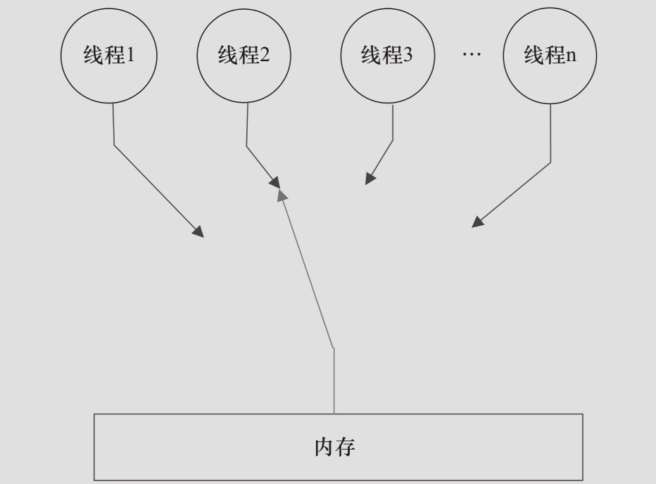

# 顺序一致性

## 一句话定义

顺序一致性内存模型模型是一个理论参考模型,在设计的时候,**处理器的内存模型和编程语言的内存模型都会以顺序一致性内存模型作为参考**

## 数据竞争和顺序一致性

数据竞争定义:

- 在一个线程中写一个变量
- 在另一个线程中读同一个变量
- 而且写和读没有通过同步来排序

JMM 对正确同步的多线程程序的内存一致性做出保证

- 如果程序是正确同步的,程序的执行将具有一致性(Sequentially Consistent) ,确保程序的执行结果和改程序在顺序一致性内存模型中的执行结果一致

## 顺序一致性内存模型

计算机科学家理想化的理论参考模型,它为程序员提供了极强的内存可见性保证

- 一个线程的所有操作必须按照程序的顺序来执行
- 不管程序是否同步,所有的线程都只能看到一个单一的操作执行顺序
- 每个操作都必须原子执行且立刻对所有的线程可见

JMM 没有这个保证.未同步程序在 JMM 中不但整体的执行顺序是无序的,而且所有的线程看到的操作执行顺序也可能不一致

在概念上,顺序一致性模型有一个单一的全局内存,这个内存通过一个左右摆动的开关可以连接到任意一个线程,同时每个线程必须按照程序的顺序来执行读写操作

- 在任意时间点,最多只能有一个线程连接到内存

## 同步程序的执行顺序一致性效果

JMM 在具体实现上的基本方针为:

在不改变(正确同步的)程序执行结构的前提下,尽可能地为编译器和吹起的优化打开方便之门