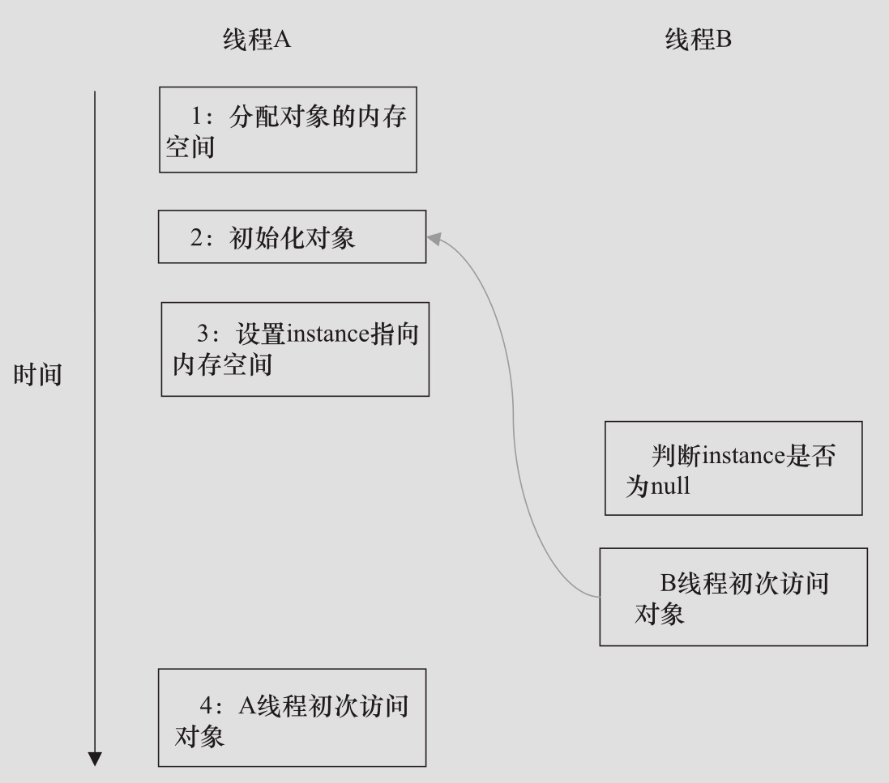

# 双重检查锁定和延迟初始化

双检锁是单例常用的模式,但是如下写法会有问题

```java
public class DoubleCheckedLocking { //1
    private static Instance instance; //2

    public static Instance getInstance() { //3
        if (instance == null) { //4:第一次检查
            synchronized (DoubleCheckedLocking.class) { //5:加锁
                if (instance == null) //6:第二次检查
                    instance = new Instance(); //7:问题的根源出在这里
            } //8
        } //9
        return instance; //10
    } //11

    static class Instance {
    }
}

```

原因是重排序的问题

#### 安全的使用方式



方案的本质是通过禁止 2 和 3 的重排序,确保线程安全

```java
public class DoubleCheckedLocking { //1
    private volatile static Instance instance; //2

    public static Instance getInstance() { //3
        if (instance == null) { //4:第一次检查
            synchronized (DoubleCheckedLocking.class) { //5:加锁
                if (instance == null) //6:第二次检查
                    instance = new Instance(); //7:问题的根源出在这里
            } //8
        } //9
        return instance; //10
    } //11

    static class Instance {
    }
}


```

## 使用内部类使用

```java
public class InstanceFactory {
    private static class InstanceHolder {
        public static Instance instance = new Instance();
    }

    public static Instance getInstance() {
        return InstanceHolder.instance; //这里将导致InstanceHolder类被初始化
    }

    static class Instance {
    }
}

```

 [04-singleton-pattern.md](../../../01-design-patterns/02-creational-patterns/04-singleton-pattern.md) 