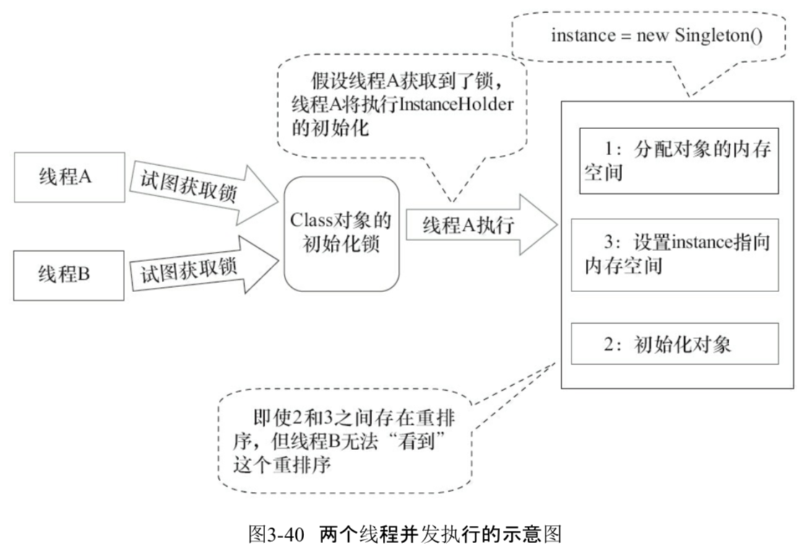

# 双重检查锁定和延迟初始化

在开发中,有时候我们要延迟初始化来降低初始化类和创建对象的开销

双重检查锁定时常见的延迟初始化技术

双检锁是单例常用的模式,但是如下写法会有问题

```java
public class DoubleCheckedLocking { //1
    private static Instance instance; //2

    public static Instance getInstance() { //3
        if (instance == null) { //4:第一次检查
            synchronized (DoubleCheckedLocking.class) { //5:加锁
                if (instance == null) //6:第二次检查
                    instance = new Instance(); //7:问题的根源出在这里
            } //8
        } //9
        return instance; //10
    } //11

    static class Instance {
    }
}

```

原因是重排序的问题

## 问题的根源

当程序运行到第七步的时候

```
instance = new Instance(); //7:问题的根源出在这里
```

创建了一个对象,这一行代码可以分解为如下的 3 行伪代码

```java
memory = allocate(); //1 分配对象的内存空间
ctroInstance(memory); //2 初始化对象
// 注意, 此时对象还没有被初始化完
instance = memory ; //3设置 instance 变量指向刚分配的地址
```

这三个操作并不是一个原子操作

2 和 3 由于没有直接的引用关系,可以被重排序,这样线程 B 有可能看到一个没有被初始化的对象

| 时间 | 线程 A                          | 线程 B                                                      |
| :--- | ------------------------------- | ----------------------------------------------------------- |
| 1    | A1:分配对象的内存空间           |                                                             |
| 2    | A3:设置 instance 指向的内存空间 |                                                             |
| 3    |                                 | B1 判断instance 是否为空                                    |
| 4    | A2 初始化对象                   | B2 由于判断 instance 是空,线程 B 将访问 instance 引用的对象 |
| 5    | A4 访问 instance 访问的对象     |                                                             |

图示


#### 解决办法

- 禁止 2 和 3 重排序 - 基于 volatile 的解决办法
- 允许 2 和 3 重排序,但是不允许其他线程看到 - 基于类初始化的解决方案

## 基于 volatile 的解决办法

加了 volatile 后,相当于禁止了 2 和 3 之间的重排序

```java
public class DoubleCheckedLocking { //1
    private volatile static Instance instance; //2

    public static Instance getInstance() { //3
        if (instance == null) { //4:第一次检查
            synchronized (DoubleCheckedLocking.class) { //5:加锁
                if (instance == null) //6:第二次检查
                    instance = new Instance(); //7:问题的根源出在这里
            } //8
        } //9
        return instance; //10
    } //11

    static class Instance {
    }
}


```

## 基于类初始化的解决方案

JVM在类的初始化阶段,即在 Class 被加载后,且被线程使用之前,会执行类的初始化,在执行类的初始化之前,JVM 会去获取一个锁,这个锁可以同步多个线程对同一个类的初始化

基于这个特性:



 

```java
public class InstanceFactory {
    private static class InstanceHolder {
        public static Instance instance = new Instance();
    }

    public static Instance getInstance() {
        return InstanceHolder.instance; //这里将导致InstanceHolder类被初始化
    }

    static class Instance {
    }
}

```

 [04-singleton-pattern.md](../../../01-design-patterns/02-creational-patterns/04-singleton-pattern.md) 

允许初始化对象(步骤2)和设置 intance 指向内存空间(步骤 3)重排序,但不允许非构造线程(这里指的是线程 2)看到这个重排序

