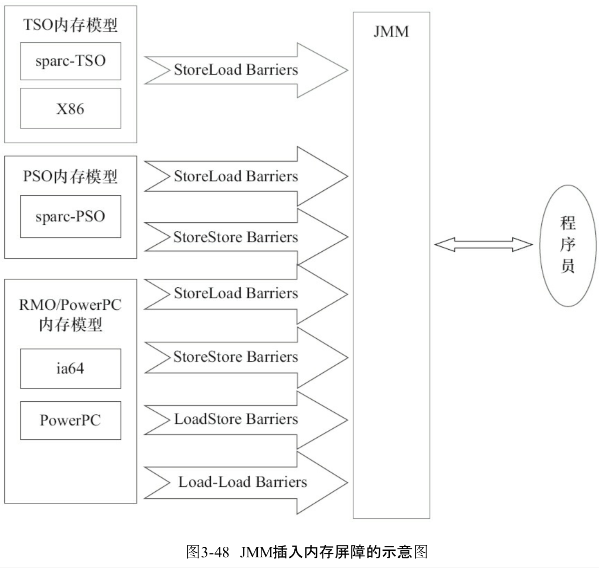
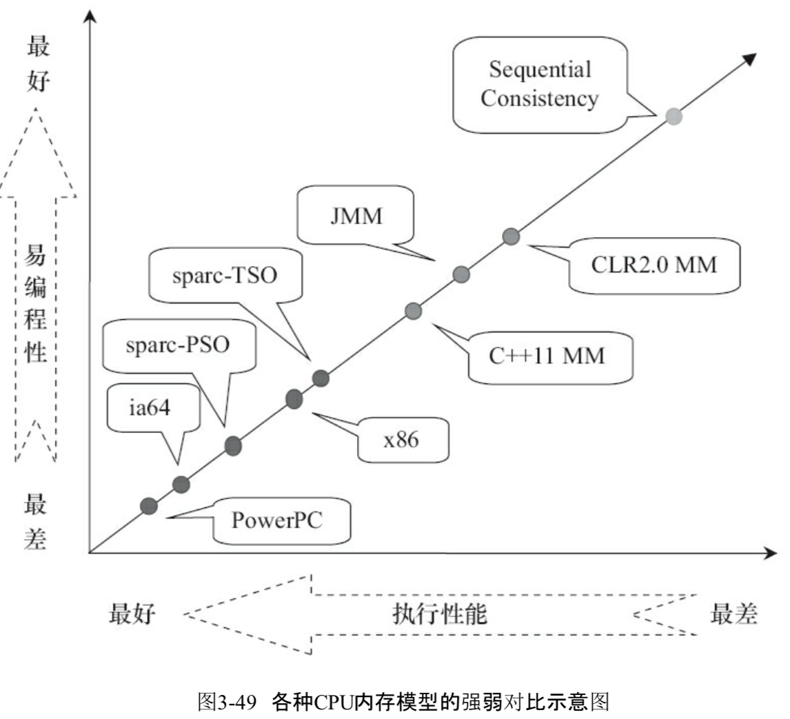
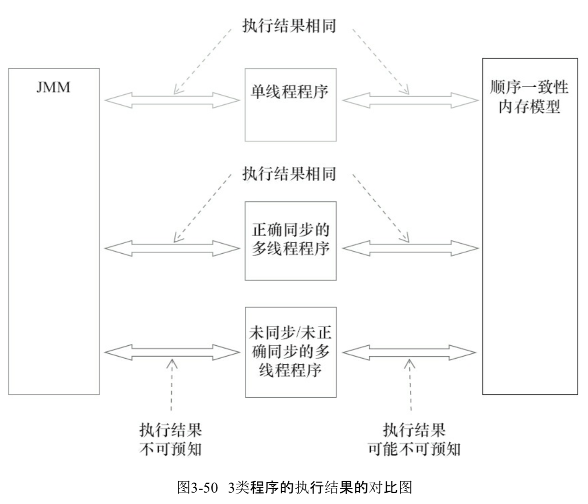

#Java 内存模型综述

- 顺序一致性模型
- JMM 内存可见性保证

#### 顺序一致性模型

顺序一致性模型是一个理论参考模型,JMM 和处理器内存模型在设计的时候通常会以顺序一致性模型内存模型作为参考

> 在设计时,JMM 和处理器内存模型会对顺序一致性模型做一些放松,为什么放松呢,因为如果完全按照顺序一致性模型来实现处理器和 JMM ,那么很多处理器和编译器优化都要被禁止,这对执行性能将会有很大的影响

根据对不同类型读/写操作组合的执行顺序的放松，可以把常见处理器的内存模型划分为下面几种类型：

1. 放松程序中写-读操作的顺序，由此产生了total store ordering内存模型（简称为TSO）。
2. 在前面1的基础上，继续放松程序中写-写操作的顺序，由此产生了partial store order 内存模型（简称为PSO）。
3. 在前面1和2的基础上，继续放松程序中读-写和读-读操作的顺序，由此产生了relaxed memory order内存模型（简称为RMO）和PowerPC内存模型。

注意，这里处理器对读/写操作的放松，是以两个操作之间不存在数据依赖性为前提的（因为处理器要遵守as-if-serial语义，处理器不会对存在数据依赖性的两个内存操作做重排序）。 

下面的表格展示了常见处理器内存模型的细节特征：

| 内存模型名称 | 对应的处理器 | Store-Load 重排序 | Store-Store重排序 | Load-Load 和Load-Store重排序 | 可以更早读取到其它处理器的写 | 可以更早读取到当前处理器的写 |
| ------------ | ------------ | ----------------- | ----------------- | ---------------------------- | ---------------------------- | ---------------------------- |
| TSO          | sparc-TSOX64 | Y                 |                   |                              |                              | Y                            |
| PSO          | sparc-PSO    | Y                 | Y                 |                              |                              | Y                            |
| RMO          | ia64         | Y                 | Y                 | Y                            |                              | Y                            |
| PowerPC      | PowerPC      | Y                 | Y                 | Y                            | Y                            | Y                            |

在这个表格中，我们可以看到所有处理器内存模型都允许写-读重排序，原因在第一章以说明过：它们都使用了写缓存区，写缓存区可能导致写-读操作重排序。同时，我们可以看到这些处理器内存模型都允许更早读到当前处理器的写，原因同样是因为写缓存区：由于写缓存区仅对当前处理器可见，这个特性导致当前处理器可以比其他处理器先看到临时保存在自己的写缓存区中的写。

上面表格中的各种处理器内存模型，从上到下，模型由强变弱。越是追求性能的处理器，内存模型设计的会越弱。因为这些处理器希望内存模型对它们的束缚越少越好，这样它们就可以做尽可能多的优化来提高性能。

由于常见的处理器内存模型比JMM要弱，java编译器在生成字节码时，会在执行指令序列的适当位置插入内存屏障来限制处理器的重排序。同时，由于各种处理器内存模型的强弱并不相同，为了在不同的处理器平台向程序员展示一个一致的内存模型，JMM在不同的处理器中需要插入的内存屏障的数量和种类也不相同。下图展示了JMM在不同处理器内存模型中需要插入的内存屏障的示意图：

如上图所示，JMM屏蔽了不同处理器内存模型的差异，它在不同的处理器平台之上为java程序员呈现了一个一致的内存模型。

## JMM，处理器内存模型与顺序一致性内存模型之间的关系

JMM是一个语言级的内存模型，处理器内存模型是硬件级的内存模型，顺序一致性内存模型是一个理论参考模型。下面是语言内存模型，处理器内存模型和顺序一致性内存模型的强弱对比示意图：

从上图我们可以看出：常见的4种处理器内存模型比常用的3中语言内存模型要弱，处理器内存模型和语言内存模型都比顺序一致性内存模型要弱。同处理器内存模型一样，越是追求执行性能的语言，内存模型设计的会越弱。

## JSR-133 对旧内存模型的修补

JSR-133 对 JDK5 之前的旧内存模型的修补主要有两个：

- 增强 volatile 的内存语义。旧内存模型允许 volatile 变量与普通变量重排序。JSR-133 严格限制 volatile 变量与普通变量的重排序，使 volatile 的写 - 读和锁的释放 - 获取具有相同的内存语义。

- 增强 final 的内存语义。在旧内存模型中，多次读取同一个 final 变量的值可能会不相同。为此，JSR-133 为 final 增加了两个重排序规则。现在，final 具有了初始化安全性。

  > 1、在构造函数内对一个 final 域的写入，与随后把这个被构造对象的引用赋值给一个引用变量，这两个操作之间不能重排序。
  > 2、初次读一个包含 final 域的对象的引用，与随后初次读这个 final 域，这两个操作之间不能重排序。
  >
  >  [06-final域的内存语义.md](06-final域的内存语义.md) 

