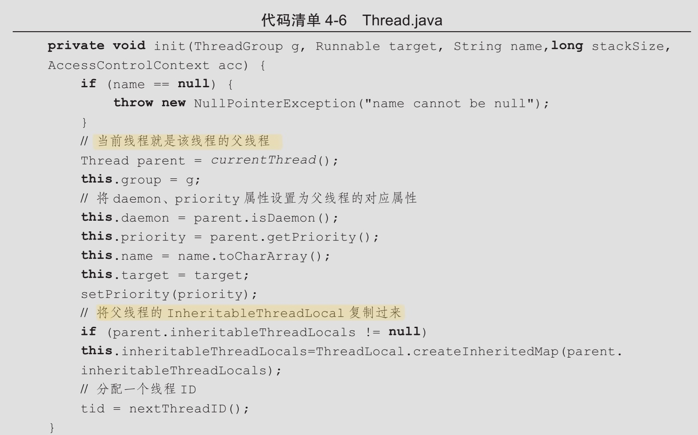

# 启动和终止线程

## 构造线程

我们可以看到Thread 的源码



- 一个新构造的线程对象是由其 父线程来进行空间分配的
- 子线程集成了父线程是否为 Deamon , 优先级 和加载资源的 `contextClassLoader`以及可继承的` ThreadLocal`
- 分配了一个唯一的ID 给子线程

## 启动线程

调用`start()`方法启动线程

即:

当前线程(父线程) 同步告诉 Java 虚拟机,只要线程规划期空闲,应立即启动调用 start() 方法的线程

## 理解中断

- **中断可以理解为线程的一个标志位属性,它表示一个运行中的线程是否被其他线程进行了中断操作。**

- 中断好比其他线程对该线程打了招呼,调用`interrupt()`方法对其进行中断操作
- 线程通过检查自身是否被中断来进行响应:
  - `Thread.interrupted()`
  - `isInterrupted()`
- 抛出`InterruptedException`时,Java虚拟机会先将该线程的中断标志位清除,然后抛出,此时调用`isInterrupted()`方法将会返回 false

#### 代码实例

- 线程的 `sleep()` 会抛出 `InterruptedException`并将中断标志位清除

```java
 public static void main(String[] args) throws InterruptedException {
        // sleepThread不停的尝试睡眠
        Thread sleepThread = new Thread(new SleepRunner(), "SleepThread");
        sleepThread.setDaemon(true);
        // busyThread不停的运行
        Thread busyThread = new Thread(new BusyRunner(), "BusyThread");
        busyThread.setDaemon(true);
        sleepThread.start();
        busyThread.start();
        // 休眠5秒，让sleepThread和busyThread充分运行
        TimeUnit.SECONDS.sleep(5);
        sleepThread.interrupt();
        busyThread.interrupt();
        System.out.println("SleepThread interrupted is " + sleepThread.isInterrupted());
        System.out.println("BusyThread interrupted is " + busyThread.isInterrupted());
        // 防止sleepThread和busyThread立刻退出
        TimeUnit.SECONDS.sleep(2);
    }


    static class SleepRunner implements Runnable {

        @Override
        public void run() {
            while (true) {
                SleepUtils.second(10);//当尝试 sleep 的时候会抛出 InterruptedException
            }
        }
    }

    static class BusyRunner implements Runnable {

        @Override
        public void run() {
            while (true) {

            }
        }
    }
```

## 过期的 suspend()方法,resume ()方法和 stop 方法

不建议使用的原因:

- ` suspend()`方法调用时 , 线程不会释放已经占有的资源(例如锁), 而是占有着资源进入睡眠状态,容易死锁
- `stop()`方法终结了一个线程时不会保证线程的资源正常地释放,通常是没有给与线程完成资源释放的机会

## 正确地中断程序

使用`Thread.currentThread().isInterrupted()`判断

```
public class Shutdown {
    public static void main(String[] args) throws Exception {
        Runner one = new Runner();
        Thread countThread = new Thread(one, "CountThread");
        countThread.start();
        // 睡眠1秒，main线程对CountThread进行中断，使CountThread能够感知中断而结束
        TimeUnit.SECONDS.sleep(1);
        countThread.interrupt();
        Runner two = new Runner();
        countThread = new Thread(two, "CountThread");
        countThread.start();
        // 睡眠1秒，main线程对Runner two进行取消，使CountThread能够感知on为false而结束
        TimeUnit.SECONDS.sleep(1);
        two.cancel();
    }

    private static class Runner implements Runnable {
        private long             i;

        private volatile boolean on = true;

        @Override
        public void run() {
            while (on && !Thread.currentThread().isInterrupted()) {
                i++;
            }
            System.out.println("Count i = " + i);
        }

        public void cancel() {
            on = false;
        }
    }
}

```

