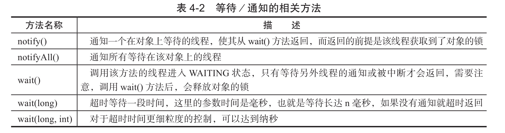
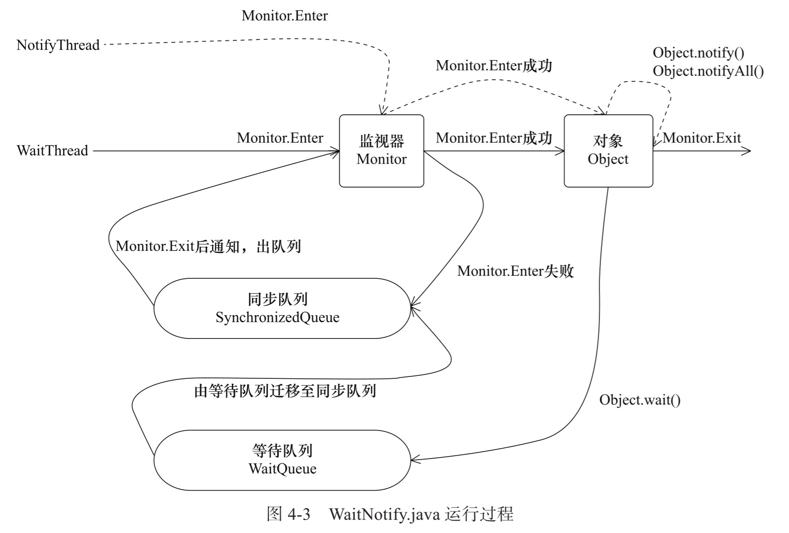

# 线程之间的通讯

## Sychronized

 [02-synchronized的实现原理与应用.md](../04-Java并发机制的底层实现原理/02-synchronized的实现原理与应用.md) 

## Volatile

 [01-volatile的应用.md](../04-Java并发机制的底层实现原理/01-volatile的应用.md) 

## 等待和通知机制



- 线程 A 调用了对象 O 的 wait 方法进入等待
- 线程 B 调用了对象 O 的 notify 或者 notifyAll 方法进行唤醒
- 线程 A 收到通知后会从对象 O 的 wait 方法返回,进而进行后续操作

```
public class WaitNotify {


    static boolean flag = true;
    static Object lock = new Object();

    public static void main(String[] args) throws Exception {
        Thread waitThread = new Thread(new Wait(), "WaitThread");
        waitThread.start();
        TimeUnit.SECONDS.sleep(1);

        Thread notifyThread = new Thread(new Notify(), "NotifyThread");
        notifyThread.start();
    }

    static class Wait implements Runnable {
        @Override
        public void run() {
            // 加锁，拥有lock的Monitor
            synchronized (lock) {
                // 当条件不满足时，继续wait，同时释放了lock的锁
                while (flag) {
                    try {
                        System.out.println(Thread.currentThread() + " flag is true. wait @ "
                                + new SimpleDateFormat("HH:mm:ss").format(new Date()));
                        lock.wait();
                    } catch (InterruptedException e) {
                    }
                }
                // 条件满足时，完成工作
                System.out.println(Thread.currentThread() + " flag is false. running @ "
                        + new SimpleDateFormat("HH:mm:ss").format(new Date()));
            }
        }
    }

    static class Notify implements Runnable {
        @Override
        public void run() {
            // 加锁，拥有lock的Monitor
            synchronized (lock) {
                // 获取lock的锁，然后进行通知，通知时不会释放lock的锁，
                // 直到当前线程释放了lock后，WaitThread才能从wait方法中返回
                System.out.println(Thread.currentThread() + " hold lock. notify @ " + new SimpleDateFormat("HH:mm:ss").format(new Date()));
                lock.notifyAll();
                flag = false;
                SleepUtils.second(5);
            }
            // 再次加锁
            synchronized (lock) {
                System.out.println(Thread.currentThread() + " hold lock again. sleep @ "
                        + new SimpleDateFormat("HH:mm:ss").format(new Date()));
                SleepUtils.second(5);
            }
        }
    }
}

```

输出

```
Thread[WaitThread,5,main] flag is true. wait @ 17:24:32
Thread[NotifyThread,5,main] hold lock. notify @ 17:24:33
Thread[NotifyThread,5,main] hold lock again. sleep @ 17:24:38
Thread[WaitThread,5,main] flag is false. running @ 17:24:43
```

#### 运行过程



- WaitThread 先获取对象所,然后调用对象的 wait 方法,从而放弃了锁并进入对象的等待队列 waitQueue 中
- 由于 WaitThread 释放了锁,NotfityThread 获取对象锁,调用了 notify 方法
- WaitThread 从 WaitQueue 移动到 SynchronizedQueue 中
- WaitThread 因为无法获取锁, 状态变成阻塞BLOCKED状态
- NotifyThread 释放了锁之后,WaitThread 再次获取到锁并从 wait 方法中返回继续执行

## Thread.join 方法

如果一个线程 A 执行了 thread.join 方法,含义是当前线程 A 等待 thread 线程终止后才从 thread.join 返回

其实意思就是先让thread 插队

```java
public class Join {
    public static void main(String[] args) throws Exception {
        Thread previous = Thread.currentThread();
        for (int i = 0; i < 10; i++) {
            // 每个线程拥有前一个线程的引用，需要等待前一个线程终止，才能从等待中返回
            Thread thread = new Thread(new Domino(previous), String.valueOf(i));
            thread.start();
            previous = thread;
        }

        TimeUnit.SECONDS.sleep(5);
        System.out.println(Thread.currentThread().getName() + " terminate.");
    }

    static class Domino implements Runnable {
        private Thread thread;

        public Domino(Thread thread) {
            this.thread = thread;
        }

        public void run() {
            try {
                thread.join();
            } catch (InterruptedException e) {
            }
            System.out.println(Thread.currentThread().getName() + " terminate.");
        }
    }
}
```

```
main terminate.
0 terminate.
1 terminate.
2 terminate.
3 terminate.
4 terminate.
5 terminate.
6 terminate.
7 terminate.
8 terminate.
9 terminate.
```

## ThreadLocal

流程变量,是一个以 ThreadLocal 对象为键,任意对象为值的存储结构. 这个结构被附带在线程上,也就是说一个线程可以根据一个 ThreadLocal 对象查询到绑定在这个线程上的值

```java
public class Profiler {
    // 第一次get()方法调用时会进行初始化（如果set方法没有调用），每个线程会调用一次
    private static final ThreadLocal<Long> TIME_THREADLOCAL = new ThreadLocal<Long>() {
        protected Long initialValue() {
            return System.currentTimeMillis();
        }
    };

    public static final void begin() {
        TIME_THREADLOCAL.set(System.currentTimeMillis());
    }

    public static final long end() {
        return System.currentTimeMillis() - TIME_THREADLOCAL.get();
    }

    public static void main(String[] args) throws Exception {
        Profiler.begin();
        TimeUnit.SECONDS.sleep(1);
        System.out.println("Cost: " + Profiler.end() + " mills");
    }
}
```

