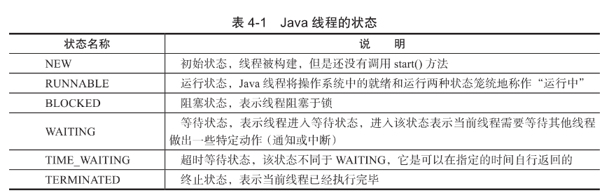

# 线程的生命周期

在给定的一个时刻，线程只能处于其中一个状态。





## 线程状态变迁


- 调用`start()`方法开始运行。
- 当前线程执行 `wait() `方法后，线程进入等待状态。
- 进入等待状态的线程需要依靠其他线程的通知才能够返回到运行状态。
- 超时等待状态相当于在等待状态的基础上增加了超时限制。
- 超时时间到达时将会返回到运行状态
- 当线程调用同步方法时，在没有获取锁的情况下，线程将会进入阻塞状态。
- 线程在执行Runnable 的 `run（）`方法之后将会进入到终止状态。

#### RUNNING 运行状态


- 在运行状态中,`running `状态和`ready`状态是等待系统调度的,有一个`yield()`方法,实际上是让出当前时间片,主动让出系统资源,主动到 `ready`
- 实际上`ready`状态不存在,方便理解,实际上就是 CPU 时间片的调度没有调度它的状态

#### BLOCKED 阻塞状态

- 只有在等待锁的情况下才有阻塞状态

## 代码实例

```java
/**
 * <p>
 * 6-3
 * </p>
 *
 * @author EricChen 2020/03/06 20:11
 */
public class ThreadState {

    private static Lock lock = new ReentrantLock();

    public static void main(String[] args) {
        new Thread(new TimeWaiting(), "TimeWaitingThread").start();
        new Thread(new Waiting(), "WaitingThread").start();
        // 使用两个Blocked线程，一个获取锁成功，另一个被阻塞
        new Thread(new Blocked(), "BlockedThread-1").start();
        new Thread(new Blocked(), "BlockedThread-2").start();
        new Thread(new Sync(), "SyncThread-1").start();
        new Thread(new Sync(), "SyncThread-2").start();
    }

    /**
     * 该线程不断的进行睡眠
     */
    static class TimeWaiting implements Runnable {
        @Override
        public void run() {
            while (true) {
                SleepUtils.second(100);
            }
        }
    }

    /**
     * 该线程在Waiting.class实例上等待
     */
    static class Waiting implements Runnable {
        @Override
        public void run() {
            while (true) {
                synchronized (Waiting.class) {
                    try {
                        Waiting.class.wait();
                    } catch (InterruptedException e) {
                        e.printStackTrace();
                    }
                }
            }
        }
    }

    /**
     * 该线程在Blocked.class实例上加锁后，不会释放该锁
     */
    static class Blocked implements Runnable {
        public void run() {
            synchronized (Blocked.class) {
                while (true) {
                    SleepUtils.second(100);
                }
            }
        }
    }

    static class Sync implements Runnable {

        @Override
        public void run() {
            lock.lock();
            try {
                SleepUtils.second(100);
            } finally {
                lock.unlock();
            }

        }

    }
}
```

jps 查看 pid

```
 jps
3856 
7539 Launcher
9973 Jps
9911 Launcher
9912 ThreadState
8635 KotlinCompileDaemon

```

#### jstack 查看线程

```
$ jstack 9912
2020-03-06 20:13:16

// 该线程在Blocked.class实例上加锁后，不会释放该锁 所以会阻塞
"BlockedThread-2" #15 prio=5 os_prio=31 tid=0x00007fa6ef894800 nid=0x5803 waiting for monitor entry [0x0000700010f7e000]
   java.lang.Thread.State: BLOCKED (on object monitor)
        at cn.eccto.study.java.concurrent.art.chapter04.ThreadState$Blocked.run(ThreadState.java:64)
        - waiting to lock <0x0000000715757790> (a java.lang.Class for cn.eccto.study.java.concurrent.art.chapter04.ThreadState$Blocked)
        at java.lang.Thread.run(Thread.java:748)

// 该线程在获取了 Blocked.class 的锁
"BlockedThread-1" #14 prio=5 os_prio=31 tid=0x00007fa6df007000 nid=0xa803 waiting on condition [0x0000700010e7b000]
   java.lang.Thread.State: TIMED_WAITING (sleeping)
        at java.lang.Thread.sleep(Native Method)
        at java.lang.Thread.sleep(Thread.java:340)
        at java.util.concurrent.TimeUnit.sleep(TimeUnit.java:386)
        at cn.eccto.study.java.concurrent.art.chapter04.SleepUtils.second(SleepUtils.java:11)
        at cn.eccto.study.java.concurrent.art.chapter04.ThreadState$Blocked.run(ThreadState.java:64)
        - locked <0x0000000715757790> (a java.lang.Class for cn.eccto.study.java.concurrent.art.chapter04.ThreadState$Blocked)
        at java.lang.Thread.run(Thread.java:748)

//该线程循环等待
"WaitingThread" #13 prio=5 os_prio=31 tid=0x00007fa6ef020800 nid=0x5703 in Object.wait() [0x0000700010d78000]
   java.lang.Thread.State: WAITING (on object monitor)
        at java.lang.Object.wait(Native Method)
        - waiting on <0x0000000715752270> (a java.lang.Class for cn.eccto.study.java.concurrent.art.chapter04.ThreadState$Waiting)
        at java.lang.Object.wait(Object.java:502)
        at cn.eccto.study.java.concurrent.art.chapter04.ThreadState$Waiting.run(ThreadState.java:48)
        - locked <0x0000000715752270> (a java.lang.Class for cn.eccto.study.java.concurrent.art.chapter04.ThreadState$Waiting)
        at java.lang.Thread.run(Thread.java:748)

//该线程是等待,但是有倒计时
"TimeWaitingThread" #12 prio=5 os_prio=31 tid=0x00007fa6ef883800 nid=0x5503 waiting on condition [0x0000700010c75000]
   java.lang.Thread.State: TIMED_WAITING (sleeping)
        at java.lang.Thread.sleep(Native Method)
        at java.lang.Thread.sleep(Thread.java:340)
        at java.util.concurrent.TimeUnit.sleep(TimeUnit.java:386)
        at cn.eccto.study.java.concurrent.art.chapter04.SleepUtils.second(SleepUtils.java:11)
        at cn.eccto.study.java.concurrent.art.chapter04.ThreadState$TimeWaiting.run(ThreadState.java:34)
        at java.lang.Thread.run(Thread.java:748)


```

