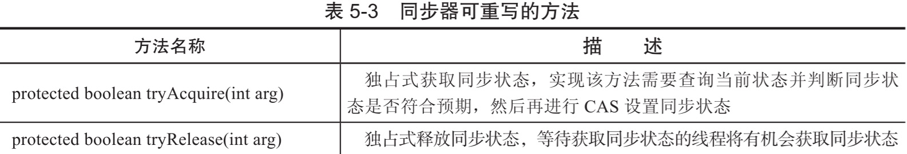
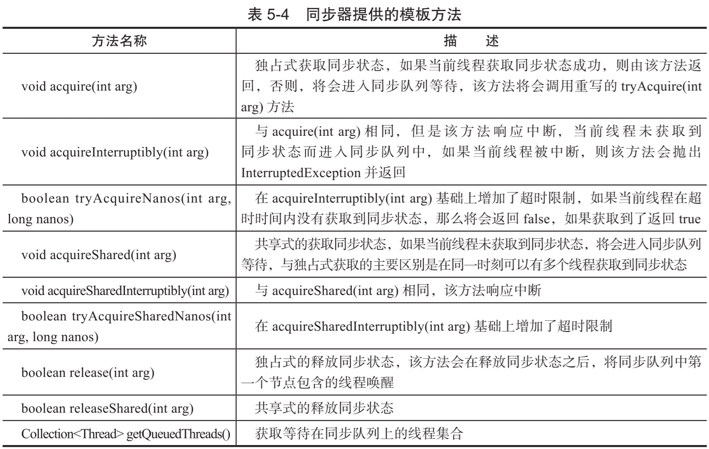
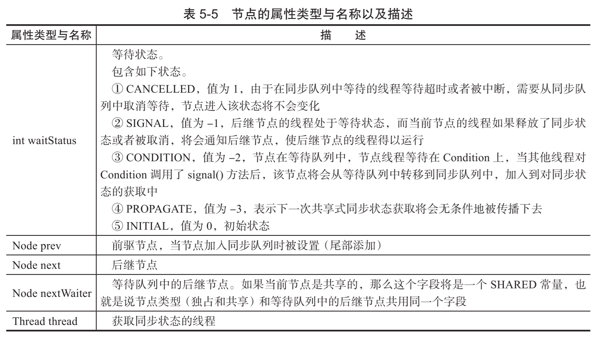
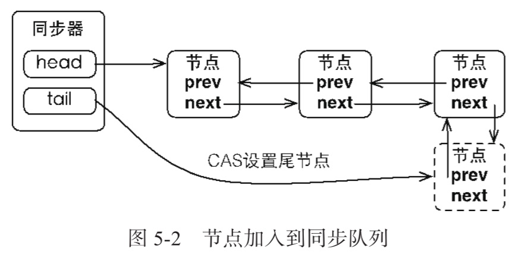
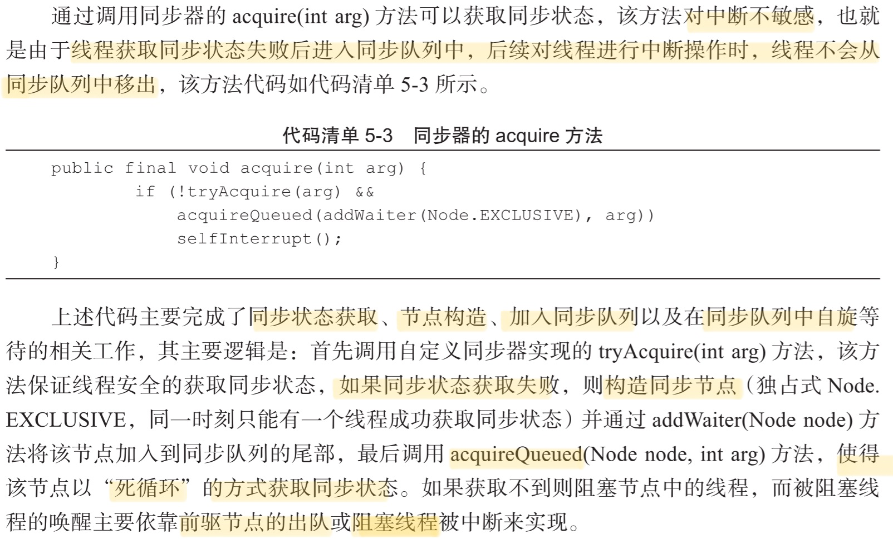
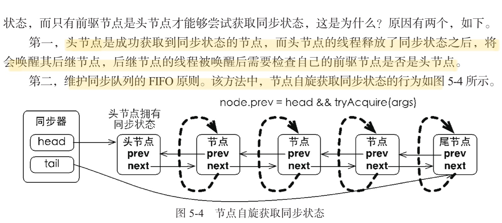
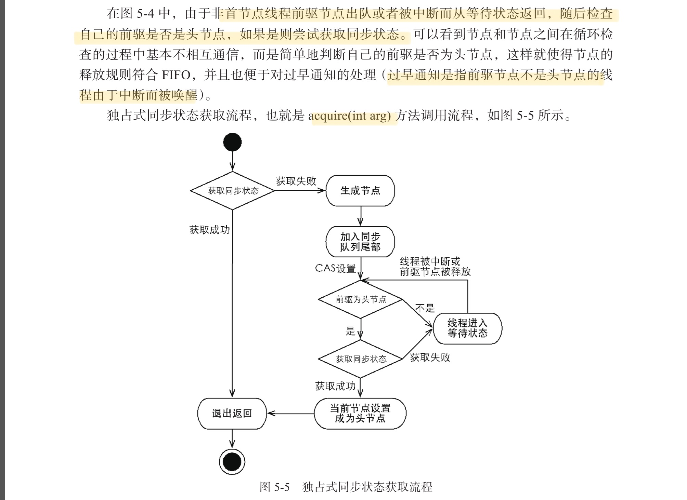
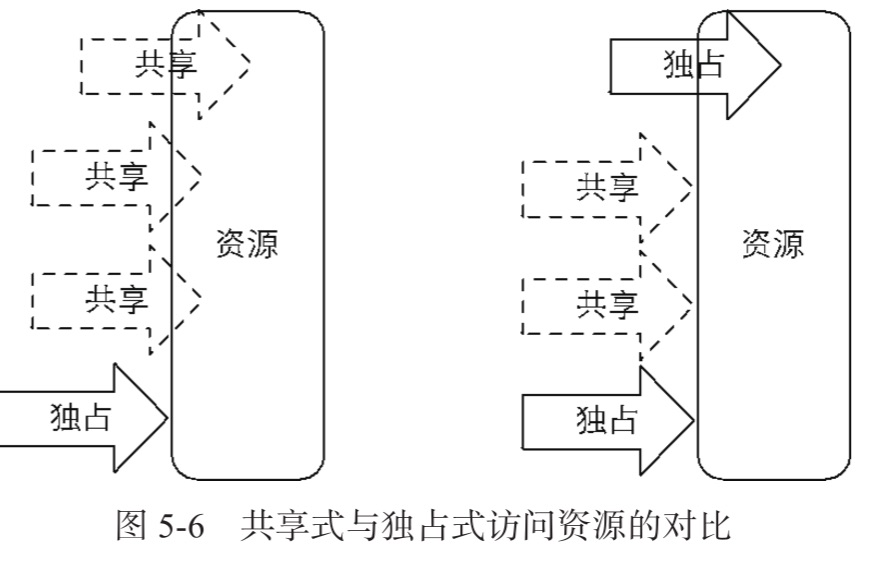

# 队列同步器

`AbstractQueuedSynchronizer` 

主要使用方式是通过继承

子类通过继承同步器并实现它的抽象方法来管理同步状态,锁和同步很好地隔离了使用者和实现者所关注的领域

## 是什么

用来构建锁或者其他同步组件的基础框架,

- 内置一个 FIFO 队列来完成获取线程的排队工作
- 使用一个 int 成员变量表示同步状态

```
/**
 * The synchronization state.
 */
private volatile int state;
```

它基本上能够实现大部分同步需求的基础,

## 核心定义

同步器是锁(也可以是任意同步组件)的关键, 在锁的实现中聚合同步器, 利用同步器实现锁的语义.

可以这样理解两者之间的关系:

- 锁是面向使用者的,它定义了使用者与锁交互的接口(比如可以允许两个线程并行访问), 隐藏了实现细节
- 同步器面向的是锁的实现者,它**简化了锁的实现方式,屏蔽了同步状态管理**,线程的排队,等待与唤醒等底层操作
- 锁和同步器很好的隔离了**使用者**和**实现者**所关注的领域
  - 简化了锁的实现方式
  - 屏蔽了同步状态管理
  - 线程的排队
  - 等待与唤醒等底层操作

## 同步器的主要使用方法

继承 ,子类通过继承同步器并实现它的抽象方法来管理同步状态,同步器提供三个方法获取和设置同步状态

- `getState()`获取状态
- `setState(int newState) `设置一个新的状态
- `compareAndSetState(int expect, int update)` CAS 操作状态,原子方法

子类推荐定义为自定义同步组件的静态内部类,同步器自身没有实现任何同步接口,它仅仅是定义了**若干同步状态获取和释放的方法**来提供自定义同步组件使用,这样就有了自由度

- 自定义同步器可以支持度展示地获取同步状态
- 自定义同步器也可以支持共享地获取同步状态

这样就可以实现不同类型的同步组件( `ReentrantLock` , `ReentrantReadWriteLock` , `CountDownLatch`)等等

## 队列同步器的接口与示例

同步器的设计是基于模板方法模式的,也就是说,使用者需要继承同步器并重写指定的方法,随后将同步器组合在自定义同步组件的实现中,并调用同步器提供的模板方法,而这写模板方法将会调用使用者重写的方法




实现自定义同步组件时,将会调用同步器提供的模板方法,这些(部分)模板方法:



基本上同步器的模板方法分为三类:

- 独占式获取与释放同步状态
- 共享式获取与释放同步状态
- 查询同步队列中的等待线程情况

## 一个独占锁的实例

独占锁是同一个时刻只能有一个线程获取到锁, 而其他获取锁的线程只能处于同步队列中等待, 只有获取锁的线程释放了锁, 后继的线程才能获取到锁

#### 声明静态内部类实现队列同步器

```java
/**
 * <p>
 * 自定义锁实现,用户使用 Mutex 的时候并不会直接和内部同步器的实现打交道,而是调用了</p>
 * </p>
 *
 * @author EricChen 2020/03/08 21:39
 */
public class Mutex {

    private final Sync sync = new Sync();

    public void lock() {
        sync.tryAcquire(1);
    }

    public boolean tryLock() {
        return sync.tryAcquire(1);
    }

    public void unlock() {
        sync.tryRelease(1);
    }

    public Condition newCondition() {
        return sync.newCondition();
    }

    public boolean isLock() {
        return sync.isHeldExclusively();
    }

    public boolean isQueuedThreads() {
        return sync.hasQueuedThreads();
    }

    public void lockInterruptibly() throws InterruptedException {
        sync.acquireInterruptibly(1);
    }

    public void tryLock(long timeout, TimeUnit timeUnit) throws InterruptedException {
        sync.tryAcquireNanos(1, timeUnit.toNanos(timeout));
    }


    /**
     * 集成同步器并重写指定的方法,随后将同步器组合在自定义的同步器组件中实现
     */
    static class Sync extends AbstractQueuedSynchronizer {

        /**
         * @return 是否独占
         */
        @Override
        protected boolean isHeldExclusively() {
            return getState() == 1;
        }

        /**
         * 当状态为 0 的时候获取锁
         *
         * @return 0
         */
        @Override
        protected boolean tryAcquire(int arg) {
            if (compareAndSetState(0, 1)) {
                setExclusiveOwnerThread(Thread.currentThread());
                return true;
            }
            return false;
        }

        @Override
        protected boolean tryRelease(int arg) {
            if (getState() == 0) {
                throw new IllegalArgumentException();
            }
            setExclusiveOwnerThread(null);
            setState(0);
            return true;
        }

        public Condition newCondition() {
            return new ConditionObject();
        }
    }
}

```

## 同步队列的实现分析

- 同步队列
- 独占式同步状态获取与释放
- 共享式同步状态状态获取与释放
- 超时获取同步状态

#### 同步队列

同步器内部维护了一个双向队列(FIFO) 来完成同步状态的管理

- 当前线程获取同步状态失败: 会将当前线程以及等待状态等信息构造成一个节点(Node)并加入同步队列,阻塞线程
- 当同步状态释放时,会把首节点中的线程唤醒,使其再次尝试获取同步状态

这里 Node 概念用来保存获取同步状态失败的线程引用,等待状态以及前驱和后继节点

#### Node节点的属性



#### 同步队列的基本结构图


当一个线程成功的获取到同步状态(或者锁),那么其他线程就无法获取到,这个时候他们会被构建成 node放到同步队列的尾端,加入队列的过程必须要保证线程安全,说以使用了一个基于 CAS 的设置尾结点的方法:	吧是参                                    

```java
    /**
     * CAS tail field. Used only by enq.
     */
    private final boolean compareAndSetTail(Node expect, Node update) {
        return unsafe.compareAndSwapObject(this, tailOffset, expect, update);
    }
```



当首节点释放同步状态时,将会唤醒后继节点,后继节点将会在获取同步状态成功后将自己设置为首节点


由于只有一个线程能够成功获取到同步状态,所以设置头节点的方法不需要使用 CAS 来保证,它只需要将首节点设置成原节点的后继节点并断开原首页节点的 next 引用即可

#### 独占式同步状态获取与释放



```java
    /**
     * Acquires in exclusive uninterruptible mode for thread already in
     * queue. Used by condition wait methods as well as acquire.
     *
     * @param node the node
     * @param arg the acquire argument
     * @return {@code true} if interrupted while waiting
     */
    final boolean acquireQueued(final Node node, int arg) {
        boolean failed = true;
        try {
            boolean interrupted = false;
            for (;;) { //自旋
                final Node p = node.predecessor();
                if (p == head && tryAcquire(arg)) {
                    setHead(node);
                    p.next = null; // help GC
                    failed = false;
                    return interrupted;
                }
                if (shouldParkAfterFailedAcquire(p, node) &&
                    parkAndCheckInterrupt())
                    interrupted = true;
            }
        } finally {
            if (failed)
                cancelAcquire(node);
        }
    }

```

##### 节点构造以及加入同步队列

```java
    /**
     * Inserts node into queue, initializing if necessary. See picture above.
     * @param node the node to insert
     * @return node's predecessor
     */
    private Node enq(final Node node) {
        for (;;) {//自旋
            Node t = tail;
            if (t == null) { // Must initialize
                if (compareAndSetHead(new Node()))
                //设置头节点为尾结点
                    tail = head;
            } else {
                node.prev = t;
                if (compareAndSetTail(t, node)) {
                    t.next = node;
                    return t;
                }
            }
        }
    }

    /**
     * Creates and enqueues node for current thread and given mode.
     *
     * @param mode Node.EXCLUSIVE for exclusive, Node.SHARED for shared
     * @return the new node
     */
    private Node addWaiter(Node mode) {
    //把当前线程封装到 Node 节点中
        Node node = new Node(Thread.currentThread(), mode);
        // Try the fast path of enq; backup to full enq on failure
        //将前节点设置为尾部
        Node pred = tail;
        if (pred != null) {
            node.prev = pred;
            if (compareAndSetTail(pred, node)) {
            //替换尾部节点
                pred.next = node;
                return node;
            }
        }
        //入列,但是尾部节点为空
        enq(node);
        return node;
    }

```

`compareAndSetTail`方法确保了尾部节点能够安全添加

节点进入同步队列后,**进入自旋过程**,每个节点都在自省地观察,当条件满足,获取到了同步状态,就可以从这个自旋过程中退出,否则依旧自旋(并会阻塞节点的线程)

```java
    /**
     * Acquires in exclusive uninterruptible mode for thread already in
     * queue. Used by condition wait methods as well as acquire.
     *
     * @param node the node
     * @param arg the acquire argument
     * @return {@code true} if interrupted while waiting
     */
    final boolean acquireQueued(final Node node, int arg) {
        boolean failed = true;
        try {
            boolean interrupted = false;
            for (;;) {
              //进入自旋死循环
                final Node p = node.predecessor();
                if (p == head && tryAcquire(arg)) {
                    setHead(node);
                    p.next = null; // help GC
                    failed = false;
                    return interrupted;
                }
              //判断是否需要将线程置为等待状态
                if (shouldParkAfterFailedAcquire(p, node) &&
                    parkAndCheckInterrupt())
                    interrupted = true;
            }
        } finally {
            if (failed)
                cancelAcquire(node);
        }
    }
```

`acquireQueued`方法陷入死循环,但是只有头节点才能获取同步状态,为什么呢





release 方法可以释放同步状态,释放同步状态后,会唤醒其后继节点(进而使后继节点重新尝试获取同步状态)

```java
    /**
     * Releases in exclusive mode.  Implemented by unblocking one or
     * more threads if {@link #tryRelease} returns true.
     * This method can be used to implement method {@link Lock#unlock}.
     *
     * @param arg the release argument.  This value is conveyed to
     *        {@link #tryRelease} but is otherwise uninterpreted and
     *        can represent anything you like.
     * @return the value returned from {@link #tryRelease}
     */
    public final boolean release(int arg) {
        if (tryRelease(arg)) {
            Node h = head;
            if (h != null && h.waitStatus != 0)
                unparkSuccessor(h);//唤醒后续节点
            return true;
        }
        return false;
    }

```

```java
    private void unparkSuccessor(Node node) {
        /*
         * If status is negative (i.e., possibly needing signal) try
         * to clear in anticipation of signalling.  It is OK if this
         * fails or if status is changed by waiting thread.
         */
        int ws = node.waitStatus;
        if (ws < 0)
            compareAndSetWaitStatus(node, ws, 0);

        /*
         * Thread to unpark is held in successor, which is normally
         * just the next node.  But if cancelled or apparently null,
         * traverse backwards from tail to find the actual
         * non-cancelled successor.
         */
        Node s = node.next;
        if (s == null || s.waitStatus > 0) {
            s = null;
            for (Node t = tail; t != null && t != node; t = t.prev)
                if (t.waitStatus <= 0)
                    s = t;
        }
        if (s != null)
            LockSupport.unpark(s.thread);//使用工具类唤处于等待状态的线程
    }
```

#### 总结

在获取同步状态时,同步器维护一个同步队列,

- 获取状态失败的线程都会被加入到队列中并在队列中进行自旋,使用`shouldParkAfterFailedAcquire`判断是否需要`park`,然后调用`parkAndCheckInterrupt`进行 `park`

- 移出队列(或者停止自旋)的条件是前驱节点为头节点且成功获取了同步状态

- 在释放同步状态时,同步器调用 `tryRealease(int arg)` 方法释放同步状态,然后唤醒后续节点

## 共享式同步状态获取与释放

共享式获取与独占式获取最主要的区别在于同一时刻能否有多个线程同时获取到同步状态.

以文件读写为例:

- 如果一个程序在对文件进行读操作,那么其他程序写被 **阻塞**, 读 允许
- 写操作要求对资源的独占式访问,而读操作可以是共享式访问



- 左半部分为共享式访问资源 **小册,大厅,可以被看**

- 又半部分是独占式访问资源,同一时刻其他访问均被访问 , **上大策,包房,不能被看**

