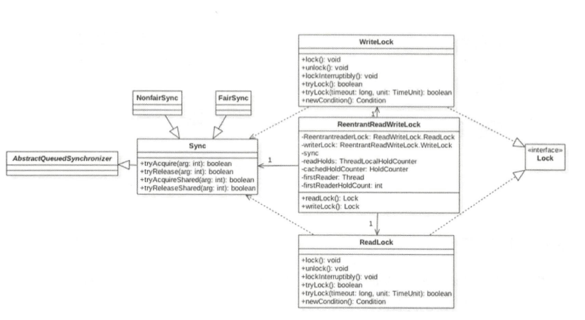

# 读写锁 ReentrantReadWriteLock

`ReentrantLock`是独占锁:

- 同一时刻值允许一个线程进行访问, 写的时候不允许读,读的时候不允许写

在读多写少的场景中，读写锁可以减少加锁和解锁的时间消耗:

- 写的时候不允许读
- 读的时候允许读

## 类图



读写锁内部维护了一个ReadLock 和一个WriteLock, 他们依赖Sync 实现具体的功能， Sync 继承AQS 队列， 提供了公平锁和非公平锁

## ReentrantReadWriteLock的特性

| 特性       | 说明                                                       |
| ---------- | ---------------------------------------------------------- |
| 公平性选择 | 支持公平锁和非公平锁,非公平锁的吞吐量由于公平锁            |
| 重入       | 支持重入,读锁支持重入获取读锁;写锁支持获取读锁和写锁       |
| 锁降级     | 循环获取写锁,获取读锁再释放写锁的次序,写锁能够降级成为读锁 |

## 常用方法

| 方法名称          | 描述                                                         |
| ----------------- | ------------------------------------------------------------ |
| readLock          | 获取读锁                                                     |
| writeLock         | 获取写锁                                                     |
| getReadLockCount  | 返回当前读锁被获取的次数; 该次数不等于获取读锁的线程数, 算上重入次数 |
| getReadHoldCount  | 获取当前线程获取读锁的次数                                   |
| isWriteLocked     | 判断写锁是否被获取                                           |
| getWriteHoldCount | 返回当前写锁被释放的次数                                     |

## 读写状态的设计

读写锁同样依赖自定义同步器AQS 来实现的,而读写状态就是器同步器的同步状态State 变量

- `ReentrantLock `中自定义同步器的同步状态, 是一个线程重复获取的次数,
- `ReentrantReadWriteLock` 在自定义同步器的同步状态上维护多个读线程和一个写线程状态

如果要在一个整型变量上维护多种状态,使用位图数据结构

- 高16 位表示获取到读锁的次数
- 低16 位 表示获取到写锁的线程的可重入次数

##### 值得注意的是

- 写状态等于 S&0x0000FFFF , 将高 16 位全部抹去
- 读状态等于 S >>> 16  无符号补 0 右移16位 , 当写操作增加 1时, 等于 S+1 ,当读状态增加 1 时,等于 S + (1 << 16)  也就是等于 S+0x0010000

```java
static final int SHARED_SHIFT   = 16;

//共享锁(读锁)状态
static final int SHARED_UNIT    = (1 << SHARED_SHIFT);
//共享锁线程最大个数 65535
static final int MAX_COUNT      = (1 << SHARED_SHIFT) - 1;
//排它锁(写锁)掩码,二进制 15 个 1 
static final int EXCLUSIVE_MASK = (1 << SHARED_SHIFT) - 1;

//返回读锁的线程数
static int sharedCount(int c)    { return c >>> SHARED_SHIFT; }
//返回写锁的可重入可数
static int exclusiveCount(int c) { return c & EXCLUSIVE_MASK; }

```

## 自定义 AQS 队列实现类

读写锁通过自定义 AQS 队列的实现类来尝试获取同步状态

- [写锁的获取和释放](#写锁的获取和释放)
  - [写锁获取](#写锁获取)
  - [写锁释放](#写锁释放)
- [读锁的获取和释放](#读锁的获取和释放)
  - [读锁获取](#读锁获取)
  - [读锁释放](#读锁释放)

#### 写锁获取

写锁尝试获取同步状态

```java
protected final boolean tryAcquire(int acquires) {
  Thread current = Thread.currentThread();
  int c = getState();
  int w = exclusiveCount(c);//计算写锁的重入次数
  //w !=0说明读锁或者写锁已经被线程获取
  if (c != 0) {
    // (Note: if c != 0 and w == 0 then shared count != 0)
    if (w == 0 || current != getExclusiveOwnerThread())
      return false;
    if (w + exclusiveCount(acquires) > MAX_COUNT)
      throw new Error("Maximum lock count exceeded");
    // Reentrant acquire
    setState(c + acquires);
    return true;
  }
  //writerShouldBlock 方法是公平锁和非公平锁的区别所在
  if (writerShouldBlock() || !compareAndSetState(c, c + acquires))
    return false;
  setExclusiveOwnerThread(current);
  return true;
}
```

##### writerShouldBlock : 是否直接阻塞

公平锁

```java
//如果有前驱则直接返回 false ,意思就是要排队
final boolean writerShouldBlock() {
  return hasQueuedPredecessors();//查看队列中是否有前驱节点
}
```

非公平锁

```java
//总是返回 false,说明上来直接抢占,说明抢占 CAS尝试获取写锁,获取成功则设置当前锁的持有者为当前线程并返回 false
final boolean writerShouldBlock() {
  return false; // writers can always barge
}
```

##### lockInterruptibly()

类似于 Lock 方法, 它的不同点在于.它会对中断进行响应,也就是当其他线程调用该线程的 interrupt()方法中断了当前线程,当前线程会抛出异常 InterruptedException 异常。

```java
public void lockInterruptibly() throws InterruptedException {
	sync.acquireSharedInterruptibly(1);

```

##### tryLock

尝试获取写锁

- 如果当前没有其他线程持有写锁或者读锁,则当前线程获取写锁会成功, 返回 true
- 如果当前已经有其他线程持有写锁或者读锁,直接返回 false
- 如果当前线程已经持有写锁,增加 AQS 后 16 位后直接返回 true

```java
//尝试获取锁
public boolean tryLock() {
  return sync.tryReadLock();
}
//获取读锁
final boolean tryWriteLock() {
  Thread current = Thread.currentThread();
  //状态
  int c = getState();
  if (c != 0) {
    int w = exclusiveCount(c);
    if (w == 0 || current != getExclusiveOwnerThread())
      return false;
    if (w == MAX_COUNT)
      throw new Error("Maximum lock count exceeded");
  }
  //直接 CAS 增加状态
  if (!compareAndSetState(c, c + 1))
    return false;
  setExclusiveOwnerThread(current);
  return true;
}
```

##### void unlock()

尝试释放锁

- 如果当前线程持有该锁,调用该方法会让该线程对线程持有的 AQS 状态值-1
  - 如果减去 1 后当前状态值为 0, 则当前线程会释放该锁,否则仅仅 -1
- 如果当前线层没有持有该锁则调用该方法会抛出`Illega!MonitorStateException`

```java
    public final boolean release(int arg) {
        if (tryRelease(arg)) {
            Node h = head;
            if (h != null && h.waitStatus != 0)
                unparkSuccessor(h);//唤醒后续节点
            return true;
        }
        return false;
    }

protected final boolean tryRelease(int releases) {
 //是否是当前线程持有的锁
  if (!isHeldExclusively())
    throw new IllegalMonitorStateException();
  //获取可重入数,这里没有考虑高 16 位,因为获取写锁时读锁状态肯定为 0
  int nextc = getState() - releases;//减去持有锁的状态
  boolean free = exclusiveCount(nextc) == 0;
  //如果写锁可重入值为 0则释放锁,否则只是简单的更新状态值
  if (free)//释放
    setExclusiveOwnerThread(null);
  setState(nextc);
  return free;
}
```

### 读锁的获取和释放

### 读锁获取

`ReentrantReadWriteLock`中的读锁是使用`ReadLock`来实现的。

- 如果当前没有其他线程持有写锁,则当前线层可以获取读锁,AQS高 16 位+1,返回
- 如果其他一个线程持有写锁， 则当前线程会被阻塞。

```java
    public final void acquireShared(int arg) {
      ///调用 ReentrantReadWriteLock中的 sync的 tryAcquireShared方法
        if (tryAcquireShared(arg) < 0)
         //如果没有获取到同步状态,则将当前节点加如 AQS队列
            doAcquireShared(arg);
    }
```

读锁的 lock 方法调用了 AQS 的 acquireShared 方法 ,在其内部调用了`ReentrantReadWriteLock`中的 sync 重写的`tryAcquireShared`方法

```java
protected final int tryAcquireShared(int unused) {
  Thread current = Thread.currentThread();
  //获取当前状态
  int c = getState();
  //判断是否写锁被占用;如果其他线程已经持有了写锁,直接返回-1
  if (exclusiveCount(c) != 0 &&
      getExclusiveOwnerThread() != current)
    return -1;
  //获取读锁计数
  int r = sharedCount(c);
  //尝试获取锁,多个读线程只有一个会成功,不成功的进入fullTryAcquireShared重试
  if (!readerShouldBlock() &&
      	r < MAX_COUNT &&
      compareAndSetState(c, c + SHARED_UNIT)) {//执行 AQS 将高 16 位+1
    if (r == 0) {
      //第一个线程获取读锁
      firstReader = current;
      firstReaderHoldCount = 1;
      //如果当前线层是第一个获取读锁的线程
    } else if (firstReader == current) {
      firstReaderHoldCount++;
    } else {
      //记录最后一个获取读锁的线层或者记录其他线程读锁的可重入数
      HoldCounter rh = cachedHoldCounter;
      if (rh == null || rh.tid != getThreadId(current))
        // cachedHoldCounter记录最后一个获取到读锁的线程和该线程获取读锁的可重入数
        // readHolds 记 录 了 当 前线程 获取读 锁的可 重 入数
        cachedHoldCounter = rh = readHolds.get();
      else if (rh.count == 0)
        readHolds.set(rh);
      rh.count++;
    }
    return 1;
  }
  //自旋获取
  return fullTryAcquireShared(current);
}
```

如果当前要获取读锁的线程己经持有了写锁， 则也可以获取读锁 。 

> 但是需要注意，当一个线程先获取了写锁，然后获取了读锁处理事情完毕后，要记得把读锁和写锁都释放掉， 不能只释放写锁 。

```java
final boolean readerShouldBlock() {
//判断队列里存在的第一个元素,是不是尝试在获取写锁,如果不是则判断当前获取读锁的线程是否达到了最大值
//最后执行 AQS 将高 16 位+1
  return apparentlyFirstQueuedIsExclusive();
}
```

```java
final boolean apparentlyFirstQueuedIsExclusive() {
        Node h, s;
        return (h = head) != null &&
            (s = h.next)  != null &&
            !s.isShared()         &&
            s.thread != null;
}
```

#### 读锁释放

```
public void unlock() {
	sync.releaseShared(1);
}
//
public final boolean releaseShared(int arg) {
	if (tryReleaseShared(arg)) {
		doReleaseShared();
		return true;
	}
	return false;
}
```

```java
protected final boolean tryReleaseShared(int unused) {
  Thread current = Thread.currentThread();
  if (firstReader == current) {
    // assert firstReaderHoldCount > 0;
    if (firstReaderHoldCount == 1)
      firstReader = null;
    else
      firstReaderHoldCount--;
  } else {
    HoldCounter rh = cachedHoldCounter;
    if (rh == null || rh.tid != getThreadId(current))
      rh = readHolds.get();
    int count = rh.count;
    if (count <= 1) {
      readHolds.remove();
      if (count <= 0)
        throw unmatchedUnlockException();
    }
    --rh.count;
  }
  //循环知道自己的读计数-1 ,CAS 更新成功
  for (;;) {
    int c = getState();//获取状态
    int nextc = c - SHARED_UNIT;//减去读计数单位
    if (compareAndSetState(c, nextc))//CAS更新状态
      return nextc == 0;
  }
}
```

## 实战

前面讲到的`ReentrantLock`保证了只有一个线程可以执行临界区代码：

```java
public class Counter {
    private final Lock lock = new ReentrantLock();
    private int[] counts = new int[10];

    public void inc(int index) {
        lock.lock();
        try {
            counts[index] += 1;
        } finally {
            lock.unlock();
        }
    }

    public int[] get() {
        lock.lock();
        try {
            return Arrays.copyOf(counts, counts.length);
        } finally {
            lock.unlock();
        }
    }
}
```

但是有些时候，这种保护有点过头。因为我们发现，任何时刻，只允许一个线程修改，也就是调用`inc()`方法是必须获取锁，但是，`get()`方法只读取数据，不修改数据，它实际上允许多个线程同时调用。

实际上我们想要的是：允许多个线程同时读，但只要有一个线程在写，其他线程就必须等待：

|      | 读     | 写     |
| :--- | :----- | ------ |
| 读   | 允许   | 不允许 |
| 写   | 不允许 | 不允许 |

使用`ReadWriteLock`可以解决这个问题，它保证：

- 只允许一个线程写入（其他线程既不能写入也不能读取）；
- 没有写入时，多个线程允许同时读（提高性能）。

用`ReadWriteLock`实现这个功能十分容易。我们需要创建一个`ReadWriteLock`实例，然后分别获取读锁和写锁;

```java
public class Counter {
    private final ReadWriteLock rwlock = new ReentrantReadWriteLock();
    private final Lock rlock = rwlock.readLock();
    private final Lock wlock = rwlock.writeLock();
    private int[] counts = new int[10];

    public void inc(int index) {
        wlock.lock(); // 加写锁
        try {
            counts[index] += 1;
        } finally {
            wlock.unlock(); // 释放写锁
        }
    }

    public int[] get() {
        rlock.lock(); // 加读锁
        try {
            return Arrays.copyOf(counts, counts.length);
        } finally {
            rlock.unlock(); // 释放读锁
        }
    }
```

把读写操作分别用读锁和写锁来加锁，在读取时，多个线程可以同时获得读锁，这样就大大提高了并发读的执行效率。

使用`ReadWriteLock`时，适用条件是同一个数据，有大量线程读取，但仅有少数线程修改。

例如，一个论坛的帖子，回复可以看做写入操作，它是不频繁的，但是，浏览可以看做读取操作，是非常频繁的，这种情况就可以使用`ReadWriteLock`。

使用`ReadWriteLock`可以提高读取效率：

- `ReadWriteLock`只允许一个线程写入；
- `ReadWriteLock`允许多个线程在没有写入时同时读取；
- `ReadWriteLock`适合读多写少的场景。

## 

```java
/**
 * <p>
 * Read Write 缓存
 * </p>
 *
 * @author EricChen 2020/03/26 21:57
 */
public class ReadWriteCache {
    private static Map<String, Object> map = new HashMap<>();
    private static ReadWriteLock readWriteLock = new ReentrantReadWriteLock();
    private static Lock readLock = readWriteLock.readLock();
    private static Lock writeLock = readWriteLock.writeLock();
    private static volatile boolean update = false;


    public static final Object get(String key) {
        readLock.lock();
        try {
            return map.get(key);
        } finally {
            readLock.unlock();
        }
    }


    public static final void set(String key, Object object) {
        writeLock.lock();
        try {
            map.put(key, object);
        } finally {
            writeLock.unlock();
        }
    }

    /**
     * 锁降级
     */
    public static void processData() {
        readLock.lock();
        if (!update) {
            //先释放读锁再降级
            readLock.unlock();
            //锁降级为写锁
            writeLock.lock();
            try {
                if (!update) {
                    update = true;
                }
                readLock.lock();
            } finally {
                writeLock.unlock();
            }
            //锁降级完成
        }

    }
```

