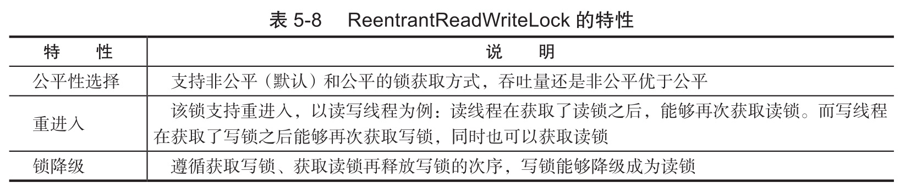
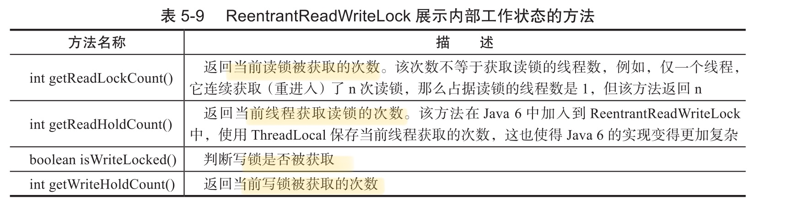

# 读写锁

之前说的锁都是排他锁:

- 同一时刻值允许一个线程进行访问, 写的时候不允许读,读的时候不允许写

读写锁:

- 写的时候不允许读
- 读的时候允许读


## 

## 接口

除了有两个基础的方法外,:

-  获取读锁 readLock
- 获取写锁 writeLock

还提供了一些接口




```
/**
 * <p>
 * Read Write 缓存
 * </p>
 *
 * @author EricChen 2020/03/26 21:57
 */
public class ReadWriteCache {
    private static Map<String, Object> map = new HashMap<>();
    private static ReadWriteLock readWriteLock = new ReentrantReadWriteLock();
    private static Lock readLock = readWriteLock.readLock();
    private static Lock writeLock = readWriteLock.writeLock();
    private static volatile boolean update = false;


    public static final Object get(String key) {
        readLock.lock();
        try {
            return map.get(key);
        } finally {
            readLock.unlock();
        }
    }


    public static final void set(String key, Object object) {
        writeLock.lock();
        try {
            map.put(key, object);
        } finally {
            writeLock.unlock();
        }
    }

    /**
     * 锁降级
     */
    public static void processData() {
        readLock.lock();
        if (!update) {
            //先释放读锁再降级
            readLock.unlock();
            //锁降级为写锁
            writeLock.lock();
            try {
                if (!update) {
                    update = true;
                }
                readLock.lock();
            } finally {
                writeLock.unlock();
            }
            //锁降级完成
        }

    }
```

