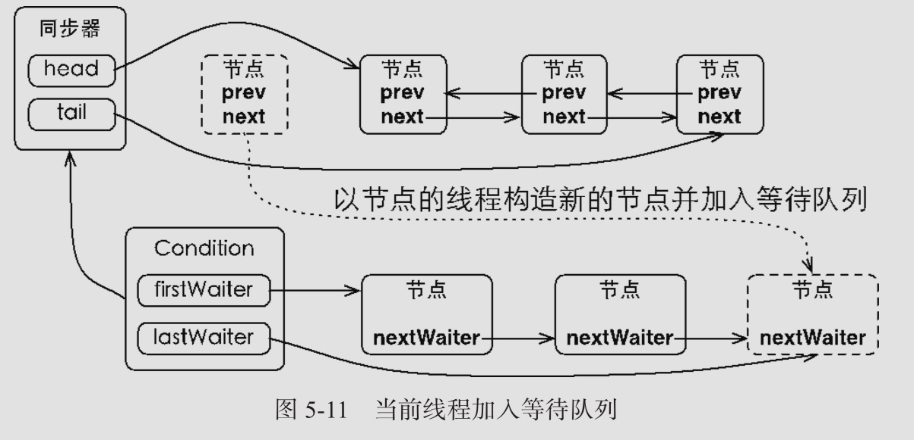

# 使用Condition

Condition 在 AQS 的基础上,额外添加了一个单向的**等待队列**,当调用 await 方法的时候,相当于AQS同步队列的首节点(获得了锁的节点),移动到 Condition 队列的等待队列中,

 当调用condition 对象的 signal 方法时, 会将等待时间最长的线程放入 AQS 队列的末尾

- 跟 Object 比较下 , 总体来说是更有灵活性,并且可以同时创建多个condition 队列 , 使用更加灵活
- 支持在等待的时候,忽略中断,支持等待超时退出

## 和 Object 的对比

任意一个 Java 对象,都有一组监视器方法

- Object.wait()
- Object.wait(long timeout)
- Object.notify()
- Object.notifyAll()

这些方法与 sychronized 关键字配合,可以实现等待/通知模式

Condition 也提供了类似 Object 的监视器方法:

- condtion.await()
- condtion.awaitUninterruptibly()
- condtion.awaitNanos
- condtion.awaitUntil(Date deadline)
- condtion.signal()
- condtion.signalAll()

但是使用方式和性能上还是有差异的

## Object 的监视器方法和 Condition 接口的对比

| 对比项                                              | Object Monitor Method           | Condition                                                    |
| --------------------------------------------------- | ------------------------------- | ------------------------------------------------------------ |
| 前置条件                                            | 获取对象的锁                    | 调用 Lock.lock()获取锁,</br>调用 Lock.newCondition()获取 Condition |
| 调用方式                                            | 直接调用 `Object.wait`          | `Condition.await()`                                          |
| 等待队列个数                                        | 一个                            | 多个                                                         |
| 当前线程释放锁并进入等待状态                        | 支持                            | 支持                                                         |
| 当前线程释放锁并进入等待状态,在等待状态中不响应中断 | 不支持                          | 支持`condtion.awaitUninterruptibly()`                        |
| 当前线程释放锁并进入等待状态到未来的某个时间        | 支持`Object.wait(long timeout)` | 支持`condtion.awaitNanos`                                    |
| 当前线程释放锁并进入等待状态将来的某个时间          | 不支持                          | 支持`condtion.awaitUntil(Date deadline)`                     |
| 唤醒等待队列中的全部线程                            | 支持`Object.notifyAll()`        | 支持`condtion.signalAll()`                                   |
| 唤醒等待队列中的一个线程                            | 支持`Object.notify()`           | 支持`condtion.signal()`                                      |

​	使用`ReentrantLock`比直接使用`synchronized`更安全，可以替代`synchronized`进行线程同步。

但是，`synchronized`可以配合`wait`和`notify`实现线程在条件不满足时等待，条件满足时唤醒，用`ReentrantLock`我们怎么编写`wait`和`notify`的功能呢？

答案是使用`Condition`对象来实现`wait`和`notify`的功能。

我们仍然以`TaskQueue`为例，把前面用`synchronized`实现的功能通过`ReentrantLock`和`Condition`来实现：

```java
class TaskQueue {
    private final Lock lock = new ReentrantLock();
    private final Condition condition = lock.newCondition();
    private Queue<String> queue = new LinkedList<>();

    public void addTask(String s) {
        lock.lock();
        try {
            queue.add(s);
            condition.signalAll();
        } finally {
            lock.unlock();
        }
    }

    public String getTask() {
        lock.lock();
        try {
            while (queue.isEmpty()) {
                condition.await();
            }
            return queue.remove();
        } finally {
            lock.unlock();
        }
    }
}
```

可见，使用`Condition`时，引用的`Condition`对象必须从`Lock`实例的`newCondition()`返回，这样才能获得一个绑定了`Lock`实例的`Condition`实例。

`Condition`提供的`await()`、`signal()`、`signalAll()`原理和`synchronized`锁对象的`wait()`、`notify()`、`notifyAll()`是一致的，并且其行为也是一样的：

- `await()`会释放当前锁，进入等待状态；
- `signal()`会唤醒某个等待线程；
- `signalAll()`会唤醒所有等待线程；
- 唤醒线程从`await()`返回后需要重新获得锁。

此外，和`tryLock()`类似，`await()`可以在等待指定时间后，如果还没有被其他线程通过`signal()`或`signalAll()`唤醒，可以自己醒来：

```java
if (condition.await(1, TimeUnit.SECOND)) {
    // 被其他线程唤醒
} else {
    // 指定时间内没有被其他线程唤醒
}
```

可见，使用`Condition`配合`Lock`，我们可以实现更灵活的线程同步。

- `Condition`可以替代`wait`和`notify`；
- `Condition`对象必须从`Lock`对象获取。


## Condition 和 对象锁的区别

- condition 支持多个队列, 对象监视器锁只支持一个
- condition 支持线程进入等待状态时,释放锁,不响应中断 , 对象锁不支持
- condition 支持线程进入等待状态时,释放锁,等待到某个时间点

#### 值得注意的是

- sychronized 对标的是 lock.lock();

- condtion.await 对标的是 object.wait()
- condtion.signal 对标的是 object.notify()

## Condition源码

### Condition.await 

调用这个方法的线程是成功获取到锁的线程,也就是AQS同步队列的首节点

1. 将当前线程构造成节点加入到 Condition 等待队列中
2. 释放当前线程的同步状态
3. 唤醒AQS同步队列中的锁的后继节点
4. 将当前线程设置为等待状态

#### Condition.await 流程图



#### Condition.await源码

```java
public final void await() throws InterruptedException {
  if (Thread.interrupted())
    throw new InterruptedException();
  //将线程组成一个新的Node
  Node node = addConditionWaiter();
  //释放锁,在进入队列等待的过程中,先释放掉锁,允许其他线程进入
  int savedState = fullyRelease(node);
  int interruptMode = 0;
  while (!isOnSyncQueue(node)) {//判断当前节点是不是在 AQS队列里面,signal 方法调用后会退出循环
    LockSupport.park(this);//阻塞,前面已经释放资源,park 方法本身不释放资源
    if ((interruptMode = checkInterruptWhileWaiting(node)) != 0)
      break;
  }
  if (acquireQueued(node, savedState) && interruptMode != THROW_IE)
    interruptMode = REINTERRUPT;
  if (node.nextWaiter != null) // clean up if cancelled
    unlinkCancelledWaiters();
  if (interruptMode != 0)
    reportInterruptAfterWait(interruptMode);
}
```

> addConditionWaiter  简单描述
>
> ```java
>         /**
>          * Adds a new waiter to wait queue.
>          * @return its new wait node
>          */
>         private Node addConditionWaiter() {
>             Node t = lastWaiter;
>             // If lastWaiter is cancelled, clean out.
>             if (t != null && t.waitStatus != Node.CONDITION) {
>                 unlinkCancelledWaiters();
>                 t = lastWaiter;
>             }
>             Node node = new Node(Thread.currentThread(), Node.CONDITION);
>             if (t == null)
>                 firstWaiter = node;//初始化,队尾即是对头
>             else
>                 t.nextWaiter = node;//组成链
>             lastWaiter = node;
>             return node;
>         }
> ```
>
> fullyRelease 完全释放锁,因为是重入锁的话,如果是 5 次,那么可能需要完全释放掉
>
> ```java
>     /**
>      * Invokes release with current state value; returns saved state.
>      * Cancels node and throws exception on failure.
>      * @param node the condition node for this wait
>      * @return previous sync state
>      */
>     final int fullyRelease(Node node) {
>         boolean failed = true;
>         try {
>             int savedState = getState();//拿到AQS重入次数
>             if (release(savedState)) {
>                 failed = false;
>                 return savedState;
>             } else {
>                 throw new IllegalMonitorStateException();
>             }
>         } finally {
>             if (failed)
>                 node.waitStatus = Node.CANCELLED;
>         }
>     }
>     public final boolean release(int arg) {
>         if (tryRelease(arg)) {//释放
>             Node h = head;
>             if (h != null && h.waitStatus != 0)
>                 unparkSuccessor(h);
>             return true;
>         }
>         return false;
>     }
> ```
>
> 

#### Conditon.notify

唤醒等待队列中等待时间最长的节点(首节点),加入同步队列

1. 获取到等待队列中的首节点,加入同步队列
2. 唤醒该节点,这个时候被唤醒的线程将会从 await()方法返回,此时该线程已经成功获取到了锁


#### 源码

```java
/**
 * Moves the longest-waiting thread, if one exists, from the
 * wait queue for this condition to the wait queue for the
 * owning lock.
 *
 * @throws IllegalMonitorStateException if {@link #isHeldExclusively}
 *         returns {@code false}
 */
public final void signal() {
    if (!isHeldExclusively())//当前线程必须获取了锁,前置条件
        throw new IllegalMonitorStateException();
    Node first = firstWaiter;//获取第一个等待队列节点
    if (first != null)
        doSignal(first); 
}
private void doSignal(Node first) {
  do {
    if ( (firstWaiter = first.nextWaiter) == null)
      lastWaiter = null;
    first.nextWaiter = null;
  } while (!transferForSignal(first) &&// 转移
           (first = firstWaiter) != null);
}
final boolean transferForSignal(Node node) {
  /*
  * If cannot change waitStatus, the node has been cancelled.
  */
  if (!compareAndSetWaitStatus(node, Node.CONDITION, 0))
    return false;

  /*
         * Splice onto queue and try to set waitStatus of predecessor to
         * indicate that thread is (probably) waiting. If cancelled or
         * attempt to set waitStatus fails, wake up to resync (in which
         * case the waitStatus can be transiently and harmlessly wrong).
         */
  Node p = enq(node);//等待队列的头节点安全地移动到同步队列
  int ws = p.waitStatus;
  if (ws > 0 || !compareAndSetWaitStatus(p, ws, Node.SIGNAL))
    LockSupport.unpark(node.thread);//唤醒线程
  return true;
}
```

#### Condition.signalAll

这个方法的话就是对等待对了中的每个节点都执行一个 signal 方法,从而让等待队列中的所有节点移动端奥通不队列