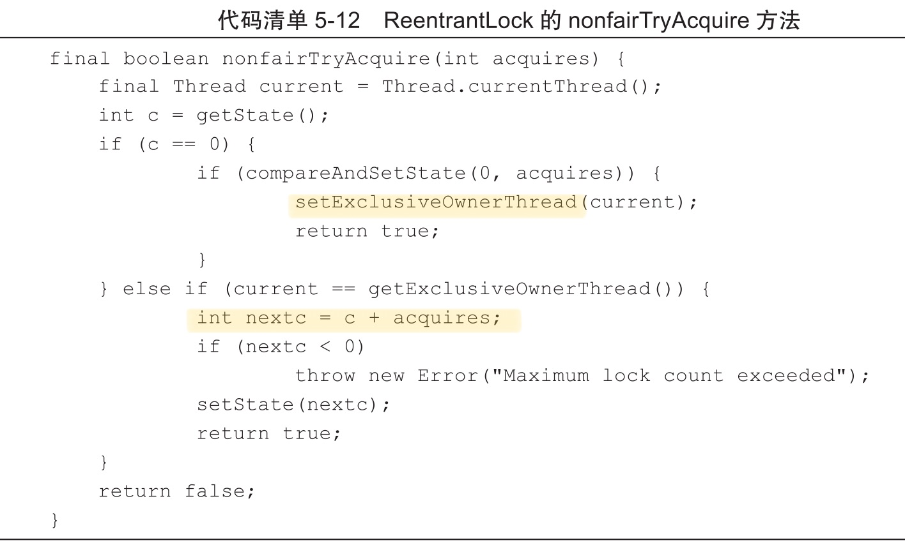

# 公平锁与非公平锁

ReentrantLock 支持公平锁与非公平锁,

- 公平锁指的是分配锁前检查是否有线程在排队等待获取该锁,优先将锁分配给排队时间最长的线程

- 非公平锁指的是在分配锁的时候,不考虑线程排队的情况,直接尝试获取锁,在获取不到锁再到队尾等待

公平锁需要在多核的情况下维护一个锁线程等待队列,基于该队列进行锁的分配,因此效率会比较低

Java中 `Synchronized`是非公平锁,`ReentrntLock`默认是 lock 方法采用的是非公平锁

## 使用

ReentrantLock 通过构造函数` ReentrantLock(boolean fair)` 传递不同的参数来定义不同类型的锁,默认的实现是非公平的,因为非公平锁虽然放弃了锁的公平性,但是执行效率高于公平锁

> 如果没有特殊要求,一般使用非公平锁

### 获取逻辑

- 通过判断当前线程是否为获取锁的线程来决定获取操作是否成功
  - 如果是获取锁的线程再次请求,则将同步状态值增加并返回 true 表示获取同步状态成功
  - 成功获取锁的线程再次获取锁,只是增加了同步状态值

#### 释放逻辑

- 如果该锁被获取了 n 次,那么前(n-1) 次 tryRealease(int realease) 方法必须返回 false, 而只有同步状态完全释放了,才能返回 true
- 该方法将同步状态是否为 0 作为最终释放的条件,将占有线程设置为 null, 并返回 true

## 公平锁与非公平锁比较

- 非公平锁效率比公平锁高,因为 **线程切换的损耗** ,吞吐量更大 ,因为释放的时候,刚释放的线程再一次获取同步状态的几率大
- 非公平锁在获取时直接使用 CAS 去获取锁, 公平锁要先对比是否队列中有其他在等待

