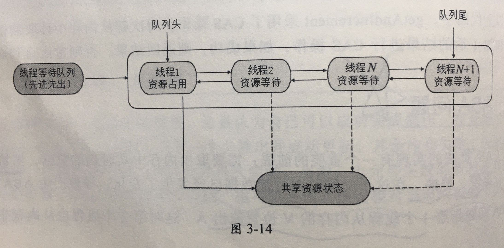

# 队列同步器AQS

## 是什么? 

> AQS `AbstractQueuedSynchronizer` 
>
> 是一个 FIFO 的双向队列, 其内部维护了head 和 tail 节点 来指向队首和队尾元素, AQS 中维护了volatile 修饰的 int 类型 state 存储 状态信息 , 通过 CAS 算法管理这个值
>
> - 如果获取到了共享资源锁,可以在当前线程中使用该共享资源
> - 如果获取不到,则将该线程放入线程等待队列,等待下一次资源调度




## QA

#### 说一说 AQS的原理

AQS 是抽象队列同步器, 一个抽象类, JUC 里很多并发工具底层都是依靠 AQS 来实现的

AQS里面维护了一个  FIFO 的双向队列,  队列中维护了一个 `volatile` 修饰的 state 变量 用于记录同步状态

> [state在不同的工具类中的含义是什么?](#state在不同的工具类中的含义是什么?)

- 当获取同步状态失败时, 线程会被包装成一个 Node 节点并加入到 AQS 队列中等待
- 当获取同步状态成功时, 说明线程已经成功获取到了锁

#### 说一说AQS 独占锁的获取和释放锁的过程

 [081-AQS-独占方式下获取和释放资源的流程.md](081-AQS-独占方式下获取和释放资源的流程.md) 

#### 说一说 AQS 共享锁的获取和释放过程

 [082-AQS-共享方式下获取和释放资源的流程.md](082-AQS-共享方式下获取和释放资源的流程.md) 

#### state在不同的工具类中的含义是什么?

- 对于 ReentrantLock 的实现来说, state  可以用来表示当前线程的重入次数
- 对于 ReentrantReadWriteLock 读写锁来说,
  - state 的高 16 为标识读状态,也就是获取读锁的次数
  - state 的 低 16 位 标识获取到写锁的可重入次数
- 对于  Semaphore 来说, state 标识当前可用的信号的个数
- 对于  CountdownLatch  来说, state 标识计数器当前的值

#### AQS 中的 ConditionObject 条件变量是做什么用的?

 [084-AQS-ConditionObject的作用.md](084-AQS-ConditionObject的作用.md) 

## 类图


AQS 是一个FIFO 的双向队列,器内部通过节点 head 和 tail 记录队首和队尾元素, 队列的元素类型为 Node 

- **Node**节点的 thread 就是线程
- **SHARED** 用来标记 **获取共享资源时被阻塞挂起的后放入 AQS 队列的线程**
- **EXCLUSIVE** 用来标记 **获取独占资源时被挂起后放入 AQS 队列的线程**

- **waitStatus** 记录当前线程的等待状态
  - **CANCELLED** 线程被取消了
  - **SINGAL** 线程被唤醒了
  - **CONDITION** 线程在条件队列里面等待
  - **PROPAGATE** 释放共享资源时需要通知其他节点

- prev 代表前驱节点

- next 代表后续节点

## 重要的概念

#### state:状态

> state 是 AQS 中的一个属性，它在不同的实现中所表达的含义不一样，对于重入 锁的实现来说，表示一个同步状态。它有两个含义的表示
> 1. 当 state=0 时，表示无锁状态
> 2. 当 state>0 时，表示已经有线程获得了锁，也就是 state=1，但是因为 ReentrantLock 允许重入，所以同一个线程多次获得同步锁的时候，state 会递增， 比如重入 5 次，那么 state=5。而在释放锁的时候，同样需要释放 5 次直到 state=0 其他线程才有资格获得锁

当调用`tryAcquire()` 获取该锁后,`ReentrantLock` 中的` state  + 1 `这个时候,该线程就断站了 ReentrantLock,此时其他线程`tryAcquire()`获取锁是均会失败,直到该线程释放锁之后,state 再次设置为 0, 其他线程才有机会获取该锁

该线程在释放锁之前可以重复获取此锁,没获取一次便会执行一次` state + 1`, 因此 `ReentrantLock`也属于重入锁

> - **对于ReentrantLock 的实现来说, state  可以用来表示当前线程的重入次数**
>
>   >  [050-ReentrantLock.md](050-ReentrantLock.md) 
>
> - **对于 ReentrantReadWriteLock 读写锁来说,**
>
>   >  [041-读写锁ReentrantReadWriteLock.md](041-读写锁ReentrantReadWriteLock.md) 
>
>   - state 的高 16 为标识读状态,也就是获取读锁的次数
>   - state 的 低 16 位 标识获取到写锁的可重入次数
>
> - **对于 `Semaphore` 来说, state 标识当前可用的信号的个数**
> - **对于` CountdownLatch` 来说, state 标识计数器当前的值**
>
> CountDownLatch 对 AQS 的共享方式实现为:
>
> - CountDownLatch 将任务分为 N 个子线程去执行,将 state 初始化为 N,N 与线程的可数一致,N 个线程是并行运行的
> - 每个子线程执行完成后都会 CountDown 一次, state 就会执行 CAS操作 -1 , 
> - 在所有子线程都执行完成 state =0 是就会 unpark 主线程,然后主线程会 await 返回,继续执行后续的操作

维护了一个 volatile int 类型的变量,用于表示当前的同步状态

volatile 不能保证操作的原子性,但是能保证当前变量 state 的可见性

state 访问分为三种

- `getState();`
- `setState();`
- `compareAndSetState();`

均是原子操作,其中`compareAndSetState` 依赖`Unsafe 的` compareAndSwapInt()`

```java
/**
 * The synchronization state.
 */
private volatile int state;
```

### AQS 共享资源的方式: 独占式和共享锁

AQS定义了两种资源共享方式: 独立式 **(Exclusive)** 和共享式 (Share)

- 独立式: 只有一个线程能够执行,具体的 Java 实现由 `ReentrentLock`

  > 具体的操作为
  >
  > - tryAcquire 独占获取
  > - tryRelease 独占释放

- 共享式: 多个线程可同时执行,具体的 Java 实现由 `Semaphore` 和 `CountDownLatch`

  > 具体的操作为
  >
  > - tryAcquireShared 共享获取
  > - tryReleaseShared 共享释放

**AQS 仅仅只是一个框架,定义了一个接口**,具体资源的获取,释放都交给自定义同步器去实现,不同的自定义同步器征用共享资源的方式也不同,自定义同步器在实现时只需要实现共享资源 state 的获取和释放方式即可,至于具体线程等待队列的维护,如获取资源失败入队,唤醒出队等,AQS已经在顶层实现好了,不需要具体的同步器再处理,需要实现的方法如下:

| 序号 | 方法名                      | 资源共享方式 | 说明                                                         |
| ---- | --------------------------- | ------------ | ------------------------------------------------------------ |
| 1    | `isHeldExclusively`         |              | 查询该线程是否正在独占资源,只有用到 condition 才需要去实现它 |
| 2    | `tryAcquire(int)`           | 独占方式     | 尝试获取资源,成功返回 true, 失败返回 false                   |
| 3    | `tryRelease(int arg)`       | 独占方式     | 尝试释放资源,成功返回 true, 失败返回 false                   |
| 4    | `tryAcquireShared(int arg)` | 共享方式     | 尝试获取资源,负数代表失败,0 代表成功,但是没有剩余可用资源;整数表示成功,且有剩余 |
| 5    | `tryReleaseShared(int arg)` | 共享方式     | 铲屎释放资源,如果释放资源后允许唤醒后续等待线程,返回 true.否则返回 false |

## 是什么

用来构建锁或者其他同步组件的基础框架,

- 内置一个 `FIFO` 队列来完成获取线程的排队工作
- 使用一个 `int` 成员变量表示同步状态

它基本上能够实现大部分同步需求的基础,

## 核心定义

同步器是锁(也可以是任意同步组件)的关键, 在锁的实现中聚合同步器, 利用同步器实现锁的语义.

可以这样理解两者之间的关系:

- 锁是面向使用者的,它定义了使用者与锁交互的接口(比如可以允许两个线程并行访问), 隐藏了实现细节
- 同步器面向的是锁的实现者,它**简化了锁的实现方式,屏蔽了同步状态管理**,**线程的排队**,**等待与唤醒**等底层操作
- 锁和同步器很好的隔离了**使用者**和**实现者**所关注的领域
  - 简化了锁的实现方式
  - 屏蔽了同步状态管理
  - 线程的排队
  - 等待与唤醒等底层操作

## 同步器的主要使用方法

继承 ,子类通过继承同步器并实现它的抽象方法来管理同步状态,同步器提供三个方法获取和设置同步状态

- `getState()`获取状态
- `setState(int newState) `设置一个新的状态
- `compareAndSetState(int expect, int update)` CAS 操作状态,原子方法

子类推荐定义为自定义同步组件的静态内部类,同步器自身没有实现任何同步接口,它仅仅是定义了**若干同步状态获取和释放的方法**来提供自定义同步组件使用,这样就有了自由度

- 自定义同步器可以支持度展示地获取同步状态
- 自定义同步器也可以支持共享地获取同步状态

这样就可以实现不同类型的同步组件( `ReentrantLock` , `ReentrantReadWriteLock` , `CountDownLatch`)等等

## 队列同步器的接口与示例

同步器的设计是基于模板方法模式的,也就是说,使用者需要继承同步器并重写指定的方法,随后将同步器组合在自定义同步组件的实现中,并调用同步器提供的模板方法,而这写模板方法将会调用使用者**重写**的方法

#### 抽象类中必要要重写的方法

\

从图中可以看到, ` ReentrantLock` 里的非公平锁 实际上会调用 具体的工具类的 `tryAcquire` 方法 , 如果获取失败会调用 addWaiter 方法将线程封装成 Node 加入同步队列尾部

| 方法名称                                      | 描述                                                         |
| --------------------------------------------- | ------------------------------------------------------------ |
| `protected boolean tryAcquire(int arg) `      | 独占式获取同步状态,实现该方法需要查询当前状态并判断同步状态是否符合预期,然后在进行 CAS 设置 |
| `protected int tryAcquireShared(int arg)`     | 共享式获取同步状态,返回大于等于 0 的值,表示获取成功,反之获取失败 |
| `protected boolean tryRelease(int arg)`       | 独占式释放同步状态,返回大于等于0的值,表示获取成功,反之获取失败 |
| `protected boolean tryReleaseShared(int arg)` | 共享式释放同步状态                                           |
| `protected boolean isHeldExclusively()`       | 当前同步器是否在独占模式下被线程占用,一般该方法表示是否被当前线程独占 |

#### 抽象类中写好的方法

实现自定义同步组件时,将会调用同步器提供的模板方法,这些(部分)模板方法:

| 方法名称                                                    | 描述                                                         |
| ----------------------------------------------------------- | ------------------------------------------------------------ |
| `void acquire(int arg)`                                     | 独占式获取同步状态,如果当前线程获取同步状态成功,则由该方法返回,否则,将会进入同步队列等待,该方法将会调用重写的`tryAcquire(int arg)` 方法 |
| `void acquireInterruptibly(int arg)`                        | 与`acquire(int arg)`相同,但是该方法响应中断,当前线程未获取到同步状态而进入同步对垒中,如果当前线程被中断,当前线程未获取到同步状态而进入同步队列中,如果当前线程被中断,则抛出`InterrupedException` |
| `boolean tryAcquireNanos(int arg, long nanosTimeout)`       | 在`acquireInterruptibly(int arg)` 基础上增加了超时限制,如果当前线程在超时时间内没有获取到同步状态,则返回 false, 获取到则返回 true |
| `void acquireShared(int arg)`                               | 共享式的获取同步状态,如果当前线程未获取到同步状态,将会进入同步队列中等待,与独占式获取的主要区别是在同一时刻可以有多个线程获取同步状态 |
| `void acquireSharedInterruptibly(int arg)`                  | 与`acquireShared(int arg)`方法相同,该方法相应中断            |
| `boolean tryAcquireSharedNanos(int arg, long nanosTimeout)` | 在`boolean acquireSharedInterruptibly(int arg)`基础上增加了超时限制 |
| `boolean release(int arg)`                                  | 独占式的释放同步状态,该方法会在释放同步状态之后,将同步队列中第一个节点包含的线程唤醒 |
| `void acquireShared(int arg) `                              | 共享式释放同步状态                                           |
| `Collection<Thread> getQueuedThreads()`                     | 获取等待在同步队列上的线程集合                               |

基本上同步器的模板方法分为三类:

- 独占式获取与释放同步状态
- 共享式获取与释放同步状态
- 查询同步队列中的等待线程情况

## 一个独占锁的实例

 [083-自定义一个不可重入的锁.md](083-自定义一个不可重入的锁.md) 

## 同步队列的实现分析

- 同步队列
- 独占式同步状态获取与释放
- 共享式同步状态状态获取与释放
- 超时获取同步状态

#### 同步队列

同步器内部维护了一个双向队列(FIFO) 来完成同步状态的管理

- 当前线程获取同步状态失败: 会将当前线程以及等待状态等信息构造成一个节点(Node)并加入同步队列,阻塞线程
- 当同步状态释放时,会把首节点中的线程唤醒,使其再次尝试获取同步状态

这里 Node 概念用来保存获取同步状态失败的线程引用,等待状态以及前驱和后继节点

#### Node节点的属性


#### 同步队列的基本结构图


当一个线程成功的获取到同步状态(或者锁),那么其他线程就无法获取到,这个时候他们会被构建成 node放到同步队列的尾端,加入队列的过程必须要保证线程安全,说以使用了一个基于 CAS 的设置尾结点的方法:	

```java
/**
     * CAS tail field. Used only by enq.
     */
private final boolean compareAndSetTail(Node expect, Node update) {
  return unsafe.compareAndSwapObject(this, tailOffset, expect, update);
}
```


当首节点释放同步状态时,将会唤醒后继节点,后继节点将会在获取同步状态成功后将自己设置为首节点


由于只有一个线程能够成功获取到同步状态,所以设置头节点的方法不需要使用 CAS 来保证,它只需要将首节点设置成原节点的后继节点并断开原首页节点的 next 引用即可

#### 独占式同步状态获取与释放

 [081-AQS-独占方式下获取和释放资源的流程.md](081-AQS-独占方式下获取和释放资源的流程.md) 

#### 共享式同步状态获取与释放

 [082-AQS-共享方式下获取和释放资源的流程.md](082-AQS-共享方式下获取和释放资源的流程.md) 