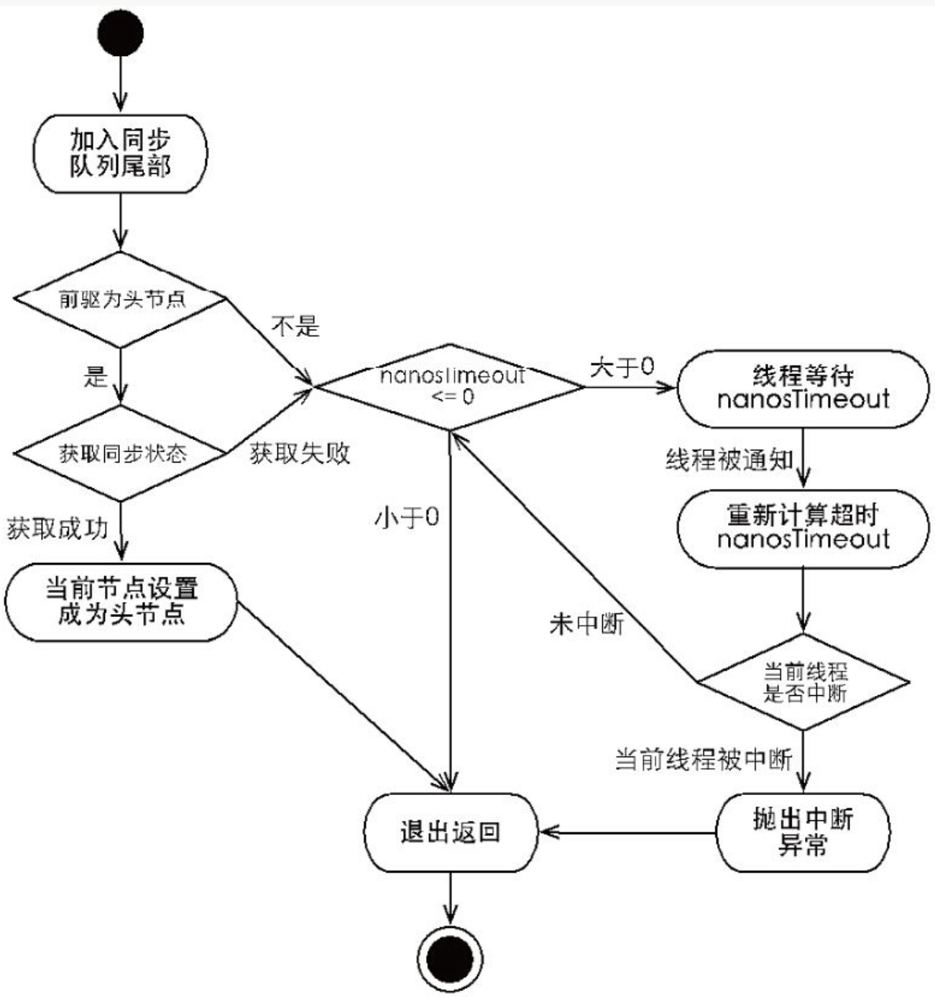

# 082-AQS-共享方式下获取和释放资源的流程

## 目录

------

[TOC]

## 共享方式获取资源的流程图




## 共享方式获取资源的流程描述

共享式获取与独占式获取最主要的区别在于同一时刻能否有多个线程同时获取到同步状态.

以文件读写为例:

- 如果一个程序在对文件进行读操作,那么其他程序写被 **阻塞**, 读 允许
- 写操作要求对资源的独占式访问,而读操作可以是共享式访问


> - 左半部分为共享式访问资源 **小册,大厅,可以被看**
>
> - 又半部分是独占式访问资源,同一时刻其他访问均被访问 , **上大策,包房,不能被看**

## 共享获取流程

- 调用 `acquireShared(int arg`)获取共享资源时,会先使用`tryAcquireShared`获取同步状态,

  > ```java
  > public final void acquireShared(int arg) {
  >     if (tryAcquireShared(arg) < 0)
  >         doAcquireShared(arg);
  > }
  > ```

- `tryAcquireShared` 由不同的实现类实现,成功则直接返回,失败则创建一个类型为` Node.SHARED`的节点插入到 AQS 则色队列的尾部,并使用 `LockSupport.park(this)`方法挂起自己
  - [`CountDownLatch`实现](#countDownLatch实现)
  - [Semaphore](#Semaphore实现)
  - ReentrantReadWriteLock
- [执行`doAcquireShared`](#执行doAcquireShared)

## tryAcquireShared

#### countDownLatch实现

仅仅获取一个自己维护的 state 变量,即计数器的个数

>  [01-CountDownLatch.md](../10-Java中的并发工具类/01-CountDownLatch.md) 

```java
protected int tryAcquireShared(int acquires) {
  return (getState() == 0) ? 1 : -1;
}
```

#### Semaphore实现

```java
//Fair version
protected int tryAcquireShared(int acquires) {
  for (;;) {
    if (hasQueuedPredecessors()) // 判断是否有前驱
      return -1;
    int available = getState();
    int remaining = available - acquires;
    if (remaining < 0 ||
        compareAndSetState(available, remaining))
      return remaining;
  }
}
```

#### 执行doAcquireShared

创建一个类型为` Node.SHARED`的节点插入到 AQS 则色队列的尾部,并使用 `LockSupport.park(this)`方法挂起自己

```java
//通过自旋,如果当前节点的前驱是头结点,尝试获取同步状态,如果返回值>=0,表示该次获取同步状态成功并从自旋过程退出
private void doAcquireShared(int arg) {
    final Node node = addWaiter(Node.SHARED);
    boolean failed = true;
    try {
        boolean interrupted = false;
        for (;;) {
            final Node p = node.predecessor();//前节点的的前驱
            if (p == head) {//如果前驱是头节点
                int r = tryAcquireShared(arg);//尝试获取同步状态
                if (r >= 0) {//获取同步状态成功
                    setHeadAndPropagate(node, r);
                    p.next = null; // help GC
                    if (interrupted)
                        selfInterrupt();
                    failed = false;
                    return;
                }
            }
            if (shouldParkAfterFailedAcquire(p, node) && 
                parkAndCheckInterrupt())//判断是否需要park,然后调用 parkAndCheckInterrupt进行 park
                interrupted = true;
    } finally {
        if (failed)
            cancelAcquire(node);
    }
}
```

## 共享释放流程

```java
public final boolean releaseShared(int arg) {
  if (tryReleaseShared(arg)) {
    doReleaseShared();
    return true;
  }
  return false;
}
```

释放

```java

    private void doReleaseShared() {
        for (;;) {
            Node h = head;
            if (h != null && h != tail) {
                int ws = h.waitStatus;
                if (ws == Node.SIGNAL) {
                    if (!compareAndSetWaitStatus(h, Node.SIGNAL, 0))
                        continue;            // loop to recheck cases
                    unparkSuccessor(h);
                }
                else if (ws == 0 &&
                         !compareAndSetWaitStatus(h, 0, Node.PROPAGATE))
                    continue;                // loop on failed CAS
            }
            if (h == head)                   // loop if head changed
                break;
        }
    }
```

