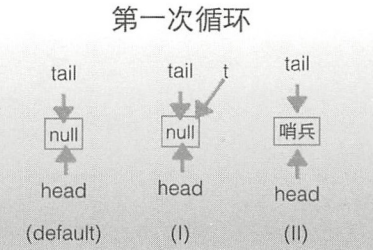
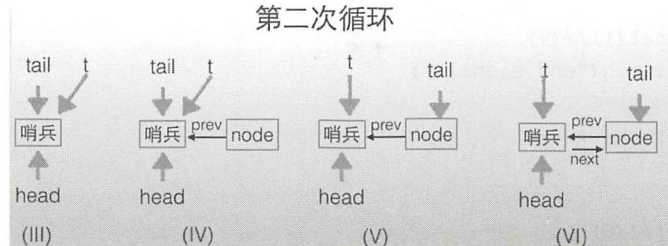

# AQS-入队代码源码分析

## 目录

------

[TOC]

## 入队操作源码

```java
    /**
     * Inserts node into queue, initializing if necessary. See picture above.
     * @param node the node to insert
     * @return node's predecessor
     */
    private Node enq(final Node node) {
        for (;;) {
            Node t = tail;//① 设置节点t指向尾节点
            if (t == null) { // Must initialize
                if (compareAndSetHead(new Node()))//② 设置一个哨兵为头结点，如果CAS成功，则让尾节点也执行哨兵节点
                    tail = head;
            } else {
                node.prev = t;
                if (compareAndSetTail(t, node)) {// ④ 设置尾部节点=                   t.next = node;
                    return t;
                }
            }
        }
    }

```

##### 第一次循环

第一次循环中要在AQS的尾部插入元素， AQS的状态如下图，也就是队列的头结点和尾节点都指向 null . 当执行代码①后节点 t 指向了尾部节点 ， 如下图 （default）

 

- 这个时候t = null ，所以执行代码 ② ，  使用CAS算法插入一个哨兵节点为头节点， 如果 CAS设置成功， 则让尾部节点也指向哨兵节点 ， 这个时候 队列为 上图 （II）

##### 第二次循环

第一次循环仅仅只是插入了一个哨兵节点，而且将tail和head 指向了它

第二次循环执行代码① ， 这时 t 指向的是哨兵节点 （图 III）,然后执行代码3  设置node节点为尾节，状态点。 CAS成功后（图IV）。然后通过CAS 算法设置node节点为尾节点 ，CAS 成功后队列如（V） 所示， 

CAS成功后再设置原来的尾部节点后缀节点为node ， 这样就完成了node节点在双向链表中的插入



