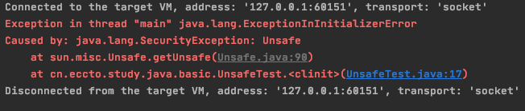

# Unsafe

[TOC]

## UnSafe简介

`Unsafe` 类是在 `sun.misc` 包下，不属于 Java 标准。但是很多 Java 的基础类库，包括一些被广泛使用的高性能开发库都是基于 `Unsafe` 类开发的，比如 `Netty`、 `Hadoop`、`Kafka` 等;

Unsafe 可认为是 Java 中留下的后门，提供了一些低层次操作，如直接内存访问、 线程的挂起和恢复、CAS、线程同步、内存屏障

## Unsafe 类中的重要方法

Unsafe 里提供了硬件级别的原子操作, Unsafe 类中的方法都是 native 方法,他们使用 JNI 的方式访问本地 C++ 实现库

### objectFieldOffset

返回指定变量所属类中的内存偏移地址

```java
//返回指定变量所属类中的内存偏移地址
public native long objectFieldOffset(Field var1)
```

这个偏移地址仅仅在这个 Unsafe 函数中访问指定字段时候使用

一个 Java 对象可以看成是一段内存，每个字段都得按照一定的顺序放在这段内存 里，通过这个方法可以准确地告诉你某个字段相对于对象的起始内存地址的字节 偏移。用于在后面的 `compareAndSwapInt` 中，去根据偏移量找到对象在内存中的具体位置

```java
//获取变量 value 在 AtomicLong 对象中的内存偏移
 static {
     try {
         valueOffset = unsafe.objectFieldOffset(AtomicLong.class.getDeclaredField("value"));
     } catch (Exception ex) { throw new Error(ex); }
 }
```

### 获取数组中第一个元素的地址-arrayBaseOffset

获取数组中第一个元素的地址

```java
public native int arrayBaseOffset(Class<?> var1);
```

### 获取数组中的一个元素占用的字节-arrayIndexScale

获取数组中的一个元素占用的字节

```java
public native int arrayIndexScale(Class<?> var1);
```

### 获取数组中的一个元素占用的字节

获取数组中的一个元素占用的字节

```java
public final native boolean compareAndSwapLong(Object var1, long var2, long var4, long var6);
```

比较对象 object 对象中的 offset  的变量的值是否与 expect 相等, 相等则使用 update 更新,返回 true, 否则很么也不做返回 false

### getLongVolatile

获取对象中offset 偏移量为 long 类型的 field 的值 为 value ,支持 volatile

```java
public native long getLongVolatile(Object var1, long var2);
```

### putOrderedLong

设置 object 对象中 offset 便宜地址对应的 lang 类型的 field的值为 value 不保证值修改对其他线程立即尅建

只有在变量使用 vlatile 修饰并且预计会被意外修改的时候才会使用这个方法

```java
public native void putOrderedLong(Object var1, long offset, long value);
```

### park

```java
public native void park(boolean isAbsolute, long time);
```

阻塞当前线程

- isAbsolute  = false 
  - 且 time = 0  : 表示一直阻塞
  - time > 0 : 表示等待指定的事件后阻塞线程会被唤醒, time 是相对值,是个增量值, 累加当前时间
- isAbsolute = true
  - time > 0 ,表示阻塞的线程到达指定的时间点后会被唤醒, time 是个绝对值

当其他线程调用了当前阻塞线程的 interrupt 方法中断时, 当前线程也会返回

当其他线程调用了 unpark 方法, 把当前阻塞的线程当做参数时, 当前线程也会返回

### getAndAddLong

```java
public final long getAndAddLong(Object obj, long offset, long addValue)
```

获取对象 obj 中偏移量为 offset 的变量 vliatile 语义的当前值, 并设置变量为 原始值 + addValue

## Unsafe 的使用

- 没有限制地创建一个类,即使构造器是私有的
- [通过 CAS 替换一个对象变量的值](#通过 CAS 替换一个对象变量的值)

#### 通过 CAS 替换一个对象变量的值

```java
public class UnsafeTest {
    /**
     * 获取 Unsafe 实例 ,
     */
    static final Unsafe unsafe = Unsafe.getUnsafe();
    /**
     * 记录变量 state 在类 TestUnsafe 中的偏移量 ,
     */
    private static final Long stateOffset;
    /**
     * 变量 state 并设置为 0
     */
    static volatile long state = 0;

    static {
        try {
            //获取偏移量
            stateOffset = unsafe.objectFieldOffset(UnsafeTest.class.getDeclaredField("state"));
        } catch (NoSuchFieldException e) {
            throw new Error(e);
        }
    }
    public static void main(String[] args) {
        UnsafeTest unsafeTest = new UnsafeTest();
        //如果 unsafeTest 对象上的 state 变量为 0 ,则更新成 1
        final boolean b = unsafe.compareAndSwapInt(unsafeTest, stateOffset, 0, 1);
        System.out.println(b);
    }
}

```

##### 报错了,为什么?



### getUnsafe 方法的问题

```java
@CallerSensitive
public static Unsafe getUnsafe() {
  //1-获取当前 Caller 类
  Class var0 = Reflection.getCallerClass();
  //1-获取当前的 类加载器
  if (!VM.isSystemDomainLoader(var0.getClassLoader())) {
    throw new SecurityException("Unsafe");
  } else {
    return theUnsafe;
  }
}

public static boolean isSystemDomainLoader(ClassLoader classloader) {
  //3-判断类加载器是不是 Bootstrap 类加载器
  return classloader == null;
}
```

很显然,我们使用 main线程去调用,采用的是 application 应用类加载器,所以会报错

##### 为什么要有这个判断呢

JDK 开发组认为直接操作内存不安全,所以做了这个限制,引导开发人员使用 rt.jar 包里的包装类来使用 Unsafe 功能

##### 我们可以使用反射突破这个限制

```java
public class UnsafeTestUseRefection {
    /**
     * 获取 Unsafe 实例 ,
     */
    static final Unsafe unsafe ;
    /**
     * 记录变量 state 在类 TestUnsafe 中的偏移量 ,
     */
    private static final Long stateOffset;
    /**
     * 变量 state 并设置为 0
     */
     static volatile long state = 0;

    static {
        try {
            //使用反射获取 Unsafe 的成员变量 theUnsafe
            final Field theUnsafe = Unsafe.class.getDeclaredField("theUnsafe");
            //设置为可取
            theUnsafe.setAccessible(true);
            //获取该变量的值
            unsafe = (Unsafe) theUnsafe.get(null);
            //获取偏移量
            stateOffset = unsafe.objectFieldOffset(UnsafeTestUseRefection.class.getDeclaredField("state"));
        } catch (Exception e) {
            throw new Error(e);
        }
    }
    public static void main(String[] args) {
        UnsafeTestUseRefection unsafeTest = new UnsafeTestUseRefection();
        //如果 unsafeTest 对象上的 state 变量为 0 ,则更新成 1
        final boolean b = unsafe.compareAndSwapInt(unsafeTest, stateOffset, 0, 1);
        System.out.println(b);
    }
}
```

