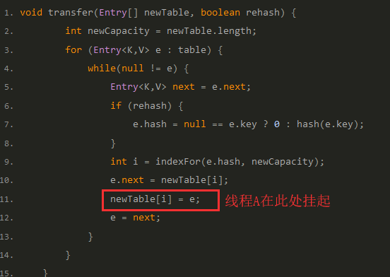
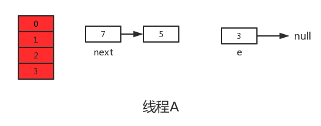
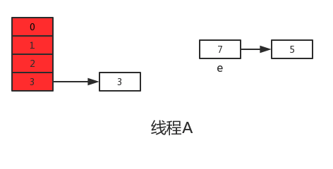
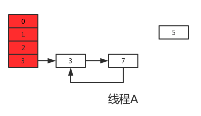

# HashMap 为什么线程不安全

 [051-hashMap的底层原理.md](../../../02-collections/03-map/051-hashMap的底层原理.md) 

> 在多线程情况下,使用 HashMap 进行 put 的操作的时候会引发死循环
>
> 是因为 Java8 之前 的 HashMap 在扩容的 Rehash 时,采用的是头插法 ,会导致形成链状结构

## 扩容引发的线程不安全

`HashMap`的线程不安全主要是发生在扩容函数中，即根源是在**transfer函数**中，JDK1.7中`HashMap`的`transfer`函数如下：

```java
void transfer(Entry[] newTable, boolean rehash) {
        int newCapacity = newTable.length;
        for (Entry<K,V> e : table) {
            while(null != e) {
              //循环原链表,获取到下一个 entry
                Entry<K,V> next = e.next;
              //进行 rehash
                if (rehash) {
                    e.hash = null == e.key ? 0 : hash(e.key);
                }
              //获取到 rehash 后的索引值
                int i = indexFor(e.hash, newCapacity);
              //把目前尾结点的 next 指向新的索引地址  
              e.next = newTable[i];
              //将rehash 后的 element 插入索引地址
                newTable[i] = e;
              //将
                e = next;
            }
        }
    }

```

这段代码是`HashMap`的扩容操作，重新定位每个桶的下标，并采用头插法将元素迁移到新数组中。头插法会将链表的顺序翻转，这也是形成死循环的关键点。理解了头插法后再继续往下看是如何造成死循环以及数据丢失的。

#### 扩容造成死循环和数据丢失的分析过程

假设现在有两个线程A、B同时对下面这个`HashMap`进行扩容操作：


正常扩容后的结果是下面这样的：


但是当线程A执行到上面`transfer`函数的第11行代码时，

```
newTable[i] = e;
```

CPU时间片耗尽，线程A被挂起。即如下图中位置所示：



此时线程A中：e=3、next=7、e.next=null



当线程A的时间片耗尽后，CPU开始执行线程B，并在线程B中成功的完成了数据迁移


重点来了，根据Java内存模式可知，线程B执行完数据迁移后，此时主内存中newTable和table都是最新的，也就是说：

```java
7.next=3
3.next=null
```

随后线程A获得CPU时间片继续执行newTable[i] = e，将3放入新数组对应的位置，执行完此轮循环后线程A的情况如下：


执行下一次循环可以发现，next=e.next=null，所以此轮循环将会是最后一轮循环。接下来当执行完

```
e.next=newTable[i]
```

即3.next=7后，3和7之间就相互连接了，当执行完newTable[i]=e后，3被头插法重新插入到链表中，执行结果如下图所示：



并且从上图可以发现，元素5在扩容期间被莫名的丢失了，这就发生了数据丢失的问题。

## JDK1.8中的线程不安全

根据上面JDK1.7出现的问题，在JDK1.8中已经得到了很好的解决，如果你去阅读1.8的源码会发现找不到`transfer`函数，因为JDK1.8直接在`resize`函数中完成了数据迁移。另外说一句，JDK1.8在进行元素插入时使用的是尾插法。

```java
final V putVal(int hash, K key, V value, boolean onlyIfAbsent,
                   boolean evict) {
        Node<K,V>[] tab; Node<K,V> p; int n, i;
        if ((tab = table) == null || (n = tab.length) == 0)
            n = (tab = resize()).length;
        if ((p = tab[i = (n - 1) & hash]) == null) // 如果没有hash碰撞则直接插入元素
            tab[i] = newNode(hash, key, value, null);
        else {
            Node<K,V> e; K k;
            if (p.hash == hash &&
                ((k = p.key) == key || (key != null && key.equals(k))))
                e = p;
            else if (p instanceof TreeNode)
                e = ((TreeNode<K,V>)p).putTreeVal(this, tab, hash, key, value);
            else {
                for (int binCount = 0; ; ++binCount) {
                    if ((e = p.next) == null) {
                        p.next = newNode(hash, key, value, null);
                        if (binCount >= TREEIFY_THRESHOLD - 1) // -1 for 1st
                            treeifyBin(tab, hash);
                        break;
                    }
                    if (e.hash == hash &&
                        ((k = e.key) == key || (key != null && key.equals(k))))
                        break;
                    p = e;
                }
            }
            if (e != null) { // existing mapping for key
                V oldValue = e.value;
                if (!onlyIfAbsent || oldValue == null)
                    e.value = value;
                afterNodeAccess(e);
                return oldValue;
            }
        }
        ++modCount;
        if (++size > threshold) // 
            resize();
        afterNodeInsertion(evict);
        return null;
    }

```

其中第六行代码是判断是否出现hash碰撞，假设两个线程A、B都在进行put操作，并且hash函数计算出的插入下标是相同的，

- 当线程A执行完第六行代码后由于时间片耗尽导致被挂起，
- 而线程B得到时间片后在该下标处插入了元素，完成了正常的插入，
- 然后线程A获得时间片，由于之前已经进行了hash碰撞的判断，所有此时不会再进行判断，而是直接进行插入，这就导致了线程B插入的数据被线程A覆盖了，从而线程不安全。

除此之前，还有就是代码的第38行处有个++size，我们这样想，还是线程A、B，这两个线程同时进行put操作时，假设当前HashMap的zise大小为10，当线程A执行到第38行代码时，从主内存中获得size的值为10后准备进行+1操作，但是由于时间片耗尽只好让出CPU，

- 线程B快乐的拿到CPU还是从主内存中拿到size的值10进行+1操作，完成了put操作并将size=11写回主内存，
- 然后线程A再次拿到CPU并继续执行(此时size的值仍为10)，当执行完put操作后，还是将size=11写回内存，此时，线程A、B都执行了一次put操作，但是size的值只增加了1，所有说还是由于数据覆盖又导致了线程不安全。

## `HashMap`的线程不安全主要体现在下面两个方面：

1. 在JDK1.7中，当并发执行扩容操作时会造成环形链和数据丢失的情况。
2. 在JDK1.8中，在并发执行put操作时会发生数据覆盖的情况。