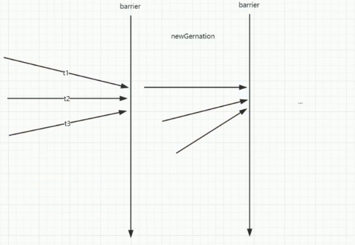

# CyclicBarrier 内存屏障

> 到齐才能吃

CyclicBarrier 的字面意思是可循环使用(Cyclic)的屏障 (Barrier)。它要做的事情是，让一组线程到达一个屏障(也 可以叫同步点)时被阻塞，直到最后一个线程到达屏障时， 屏障才会开门，所有被屏障拦截的线程才会继续工作。 CyclicBarrier 默认的构造方法是 CyclicBarrier(int parties)， 其参数表示屏障拦截的线程数量，每个线程调用 await 方 法告诉 CyclicBarrier 当前线程已经到达了屏障，然后当前

## 使用场景

当存在需要所有的子任务都完成时，才执行主任务，这个 时候就可以选择使用 `CyclicBarrier`

## 注意点




- 对于指定计数值 parties，若由于某种原因，没有足够的 线程调用 CyclicBarrier 的 await，则所有调用 await 的线程 都会被阻塞;
- 同样的 `CyclicBarrier `也可以调用 `await(timeout, unit)`， 设置超时时间，在设定时间内，如果没有足够线程到达， 则解除阻塞状态，继续工作;
- 通过 reset 重置计数，会使得进入 await 的线程出现 `BrokenBarrierException`;
- 如 果 采 用 是 CyclicBarrier(int parties, Runnable barrierAction) 构造方法，执行 barrierAction 操作的是最 后一个到达的线程

### 使用

CyclicBarrier 相比 CountDownLatch 来说，要简单很多， 源码实现是基于 ReentrantLock 和 Condition 的组合使 用。看如下示意图，CyclicBarrier 和 CountDownLatch 是 不是很像，只是 CyclicBarrier 可以有不止一个栅栏，因为 它的栅栏(Barrier)可以重复使用(Cyclic)

```java
public class CyclicBarrierTest {
    static CyclicBarrier cyclicBarrier = new CyclicBarrier(2);

    public static void main(String[] args) throws Exception{
        new Thread(()-> {
            try {
                cyclicBarrier.await();
            } catch (InterruptedException e) {
                e.printStackTrace();
            } catch (BrokenBarrierException e) {
                e.printStackTrace();
            }
            System.out.println(1);
        }).start();

        cyclicBarrier.await();
        System.out.println(2);
    }
}
```

输出有一定的随机性

有可能是1,2 也有可能是 2,1

这是因为主线程和子线程的调度是有CPU决定的,两个线程都有可能先执行,所以会产生两种输出,第一种可能输出如下

```java
public class CyclicBarrierTest2 {
    static CyclicBarrier cyclicBarrier = new CyclicBarrier(2, new A());//达到屏障后,优先执行 A

    public static void main(String[] args) throws Exception {
        new Thread(() -> {
            try {
                cyclicBarrier.await();
            } catch (InterruptedException e) {
                e.printStackTrace();
            } catch (BrokenBarrierException e) {
                e.printStackTrace();
            }
            System.out.println(1);
        }).start();
        try {
            cyclicBarrier.await();
        } catch (Exception e) {

        }
        System.out.println(2);
    }


    static class A implements Runnable {

        @Override
        public void run() {
            System.out.println(3);
        }
    }
}
```


```java
public class CyclicBarrierTest3 {

    static CyclicBarrier c = new CyclicBarrier(2);

    public static void main(String[] args) throws InterruptedException, BrokenBarrierException {
        Thread thread = new Thread(new Runnable() {

            @Override
            public void run() {
                try {
                    c.await();
                } catch (Exception e) {
                }
            }
        });
        thread.start();
        thread.interrupt();
        try {
            c.await();
        } catch (BrokenBarrierException e) {
            System.out.println(c.isBroken());//当线程被interrupt 的时候,会抛出异常
        }
    }
}
```

## CyclicBarrier 和 CountDownLatch 的区别

- CyclicBarrier 功能更多, 可以 reset
- 可以获得 getNumberWaiting 获取阻塞的线程数量, isBroken 可以获取线程是否中断

## 源码

CyclicBarrier 相比 CountDownLatch 来说，要简单很多， 源码实现是基于 ReentrantLock 和 Condition 的组合使 用

只是 CyclicBarrier 可以有不止一个栅栏，因为 它的栅栏(Barrier)可以重复使用(Cyclic)


