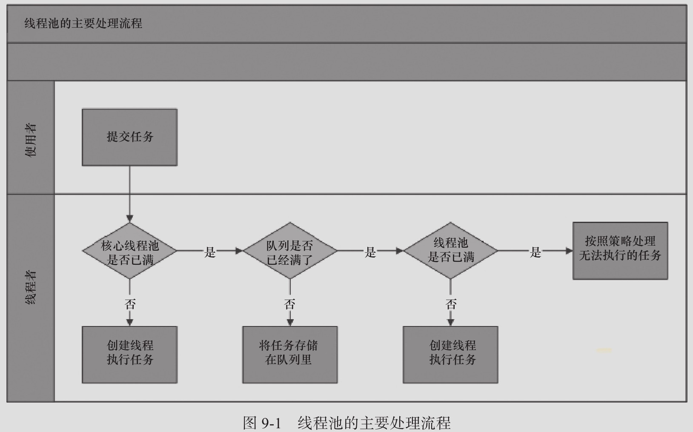
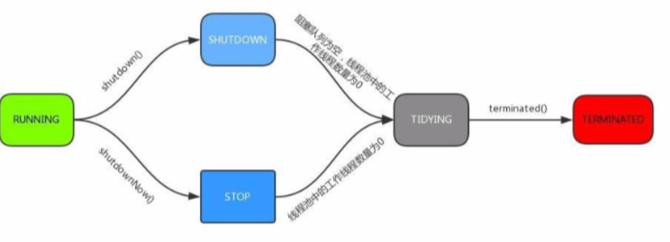

# 线程池的实现原理分析

## 线程池的核心组件

- 线程池管理器: 用于创建并管理线程池
- 工作线程 :  线程池中执行具体任务的线程
- 任务接口 : 用于定义工作线程的调度和执行策略,只有线程实现了该接口,线程中的任务才能够被线程池调度
- 任务队列: 存放待处理的任务,新的任务将会不断被加入队列中,执行完成的任务将被从队列中移除

Java中的线程池是通过 Executor 框架实现的, 在该框架中用到了

- Executor 
- Executors
- ExecutorService
- ThreadPoolExecutor 
- Callable 
- Future
- FutureTask

##### 

| 序号 | 参数                                | 说明                                                         |
| ---- | ----------------------------------- | ------------------------------------------------------------ |
| 1    | corePoolSize                        | 线程池中核心线程的数量                                       |
| 2    | maximumPoolSize                     | 线程池中最大线程的数量                                       |
| 3    | keepAliveTime                       | 当前线程数量超过 corePoolSize 时,空闲线程的存活时间          |
| 4    | TimeUnit                            | 时间单位                                                     |
| 5    | `BlockingQueue<Runnable> workQueue` | 任务队列,被提交但是违背执行的任务存放的地方                  |
| 6    | ThreadFactory threadFactory         | 线程工厂,用于创建线程,可以使用默认的线程工厂或自定义线程工厂 |
| 7    | RejectedExecutionHandler handler    | 由于任务过多或其他原因导致线程池无法处理时的任务拒绝策略     |

## 工作流程


## 原理

当向一个线程池提交一个任务之后,线程池是如何处理任务的呢?

1. 判断核心线程池是否都在执行任务
   - 不是,创建一个新的工作线程执行任务
2. 判断工作队列是不是已经满了
   - 没有满,将任务存储到工作队列中去
3. 判断线程池里的线程是否都出于工作状态,如果没有
   - 没有, 创建线程任务
4. 执行饱和策略



方法参考


## 源码分析

```
ExecutorService#execute();
```

```java
    public void execute(Runnable command) {
        if (command == null)
            throw new NullPointerException();
        /*
         * Proceed in 3 steps:
         *
         * 1. If fewer than corePoolSize threads are running, try to
         * start a new thread with the given command as its first
         * task.  The call to addWorker atomically checks runState and
         * workerCount, and so prevents false alarms that would add
         * threads when it shouldn't, by returning false.
         *
         * 2. If a task can be successfully queued, then we still need
         * to double-check whether we should have added a thread
         * (because existing ones died since last checking) or that
         * the pool shut down since entry into this method. So we
         * recheck state and if necessary roll back the enqueuing if
         * stopped, or start a new thread if there are none.
         *
         * 3. If we cannot queue task, then we try to add a new
         * thread.  If it fails, we know we are shut down or saturated
         * and so reject the task.
         */
        int c = ctl.get();
        if (workerCountOf(c) < corePoolSize) {//1.当前池中线程比核心数少，新建一个线 程执行任务
            if (addWorker(command, true))
                return;
            c = ctl.get();
        }
        if (isRunning(c) && workQueue.offer(command)) {//2.核心池已满，但任务队列 未满，添加到队列中
            int recheck = ctl.get();
            if (! isRunning(recheck) && remove(command))
                reject(command);////如果线程池处于非运行状态，并且把当前的任务从任务队列中 移除成功，则拒绝该任务
            else if (workerCountOf(recheck) == 0)//如果之前的线程已被销毁完，新建一个 线程
                addWorker(null, false);
        }
        else if (!addWorker(command, false))//3.核心池已满，队列已满，试着创建一个新 线程
            reject(command);//如果创建新线程失败了，说明线程池被关闭或者线程池完全满了， 拒绝任务
    }

```

### ctl 的作用

在线程池中，ctl 贯穿在线程池的整个生命周期中ctl:

```java
private final AtomicInteger ctl = new AtomicInteger(ctlOf(RUNNING,0));
```

它是一个原子类，主要作用是用来保存线程数量和线程池的状态。我们来分析一下这段代码， 其实比较有意思，用到了位运算,一个 int 数值是 32 个 bit 位，这里采用高 3 位来保存运行状态，低 29 位来保存线程数量。

我们来分析默认情况下，也就是` ctlOf(RUNNING)`运行状态，调用了 `ctlOf(int rs,int wc)`方法; 其中

```java
private static int ctlOf(int rs, int wc) {
  return rs | wc; 
}
```


其中` RUNNING =-1 << COUNT_BITS ; `

-1 左移 29 位. -1 的二进制是 32 个 1(1111 1111 1111 1111 1111 1111 1111 1111)

```
-1 的二进制计算方法
原码是 1000...001 . 高位 1 表示符号位。 然后对原码取反，高位不变得到 1111...110 然后对反码进行+1 ，也就是补码操作， 最后得到 1111...1111
```

那么-1 <<左移 29 位， 也就是 【111】 表示; rs | wc 。二进制的 111 | 000 。得到的结 果仍然是 111

那么同理可得其他的状态的 bit 位表示

```java
private static final int COUNT_BITS = Integer.SIZE - 3; //32-3
private static final int CAPACITY = (1 << COUNT_BITS) - 1; //将 1 的二进制 向右位移 29 位,再减 1 表示最大线程容量
//运行状态保存在 int 值的高 3 位 (所有数值左移 29 位)
= -1 << COUNT_BITS;// 接收新任务,并执行队 = 0 << COUNT_BITS;// 不接收新任务,但是执
private static final int RUNNING 列中的任务
private static final int SHUTDOWN 行队列中的任务
private static final int STOP
队列中的任务,中断正在执行中的任务
private static final int TIDYING
线程数量为 0,处于该状态的线程池即将调用 terminated()方法
private static final int TERMINATED = 3 << COUNT_BITS;// terminated()方法 执行完成

```

#### 状态转化



#### addWorker

如果工作线程数小于核心线程数的话，会调用 addWorker，顾名思义，其实就是要创建一个 工作线程。我们来看看源码的实现 源码比较长，看起来比较唬人，其实就做了两件事。

- 才用循环 CAS 操作来将线程数加 1;

- 新建一个线程并启用。

```java
    private boolean addWorker(Runnable firstTask, boolean core) {
        retry://goto语句,避免死循环
        for (;;) {
            int c = ctl.get();
            int rs = runStateOf(c);

            // Check if queue empty only if necessary.
          /*
          如果线程处于非运行状态，并且 rs 不等于 SHUTDOWN 且 firstTask 不等于空且且 workQueue 为空，直接返回 false(表示不可添加 work 状态)
1. 线程池已经 shutdown 后，还要添加新的任务，拒绝
2. (第二个判断)SHUTDOWN 状态不接受新任务，但仍然会执行已经加入任务队列的任 务，所以当进入 SHUTDOWN 状态，而传进来的任务为空，并且任务队列不为空的时候，是允许添加 新线程的,如果把这个条件取反，就表示不允许添加 worker
          */
            if (rs >= SHUTDOWN &&
                ! (rs == SHUTDOWN &&
                   firstTask == null &&
                   ! workQueue.isEmpty()))
                return false;

            for (;;) {//自旋
                int wc = workerCountOf(c);//获得Worker工作线程数
              //如果工作线程数大于默认容量大小或者大于核心线程数大小，则直接返回 false 表示不 能再添加 worker。
                if (wc >= CAPACITY ||
                    wc >= (core ? corePoolSize : maximumPoolSize))
                    return false;
                if (compareAndIncrementWorkerCount(c))//通过cas来增加工作线程数， 如果 cas 失败，则直接重试
                    break retry;
                c = ctl.get();  // Re-read ctl//再次获取ctl的值
                if (runStateOf(c) != rs)//这里如果不想等，说明线程的状态发生了变化继续重试
                    continue retry;
                // else CAS failed due to workerCount change; retry inner loop
            }
        }
//上面这段代码主要是对 worker 数量做原子+1 操作,下面的逻辑才是正式构建一个 worker
        boolean workerStarted = false;//工作线程是否启动的标识
        boolean workerAdded = false;//工作线程是否已经添加成功的标识
        Worker w = null;
        try {
            w = new Worker(firstTask);//构建一个Worker，这个worker是什么呢?我们 可以看到构造方法里面传入了一个 Runnable 对象
            final Thread t = w.thread;//从 worker 对象中取出线程
            if (t != null) {
                final ReentrantLock mainLock = this.mainLock;
                mainLock.lock();//这里有个重入锁，避免并发问题
                try {
                    // Recheck while holding lock.
                    // Back out on ThreadFactory failure or if
                    // shut down before lock acquired.
                    int rs = runStateOf(ctl.get());
//只有当前线程池是正在运行状态，[或是 SHUTDOWN 且 firstTask 为空]，才能添加到 workers 集合中
                    if (rs < SHUTDOWN ||
                        (rs == SHUTDOWN && firstTask == null)) {
                      //任务刚封装到 work 里面，还没 start,你封装的线程就是 alive，几个意思?肯定是要抛异常出去的
                        if (t.isAlive()) // precheck that t is startable
                            throw new IllegalThreadStateException();
                        workers.add(w);//将新创建的Worker添加到workers集合中
                        int s = workers.size();
                      //如果集合中的工作线程数大于最大线程数，这个最大线程数表示线程池曾经出现过的最大线程数
                        if (s > largestPoolSize)
                            largestPoolSize = s;//更新线程池出现过的最大线程数
                        workerAdded = true;//表示工作线程创建成功了
                    }
                } finally {
                    mainLock.unlock();//释放锁
                }
                if (workerAdded) {//如果worker添加成功
                    t.start();//启动线程
                    workerStarted = true;
                }
            }
        } finally {
            if (! workerStarted)
                addWorkerFailed(w);//如果添加失败，就需要做一件事，就是递减实际工作线程数(还记得我们最开始的时候增加了工作线程数吗)
        }
        return workerStarted;//返回结果
    }
```

#### Worker 类说明

我们发现 addWorker 方法只是构造了一个 Worker，并且把 firstTask 封装到 worker 中，它是 做什么的呢?我们来看看

1. 每个worker,都是一条线程,同时里面包含了一个firstTask,即初始化时要被首先执行的任务. 
2. 最终执行任务的,是 runWorker()方法

Worker 类继承了 AQS，并实现了 Runnable 接口，注意其中的 firstTask 和 thread 属性: firstTask 用它来保存传入的任务;thread 是在调用构造方法时通过 ThreadFactory 来创建的 线程，是用来处理任务的线程。
在调用构造方法时，需要传入任务，这里通过 getThreadFactory().newThread(this);来新建 一个线程，newThread 方法传入的参数是 this，因为 Worker 本身继承了 Runnable 接口， 也就是一个线程，所以一个 Worker 对象在启动的时候会调用 Worker 类中的 run 方法。 Worker 继承了 AQS，使用 AQS 来实现独占锁的功能。为什么不使用 ReentrantLock 来实 现呢?可以看到 tryAcquire 方法，它是不允许重入的，而 ReentrantLock 是允许重入的: lock 方法一旦获取了独占锁，表示当前线程正在执行任务中;那么它会有以下几个作用

1. 如果正在执行任务，则不应该中断线程;
2. 如果该线程现在不是独占锁的状态，也就是空闲的状态，说明它没有在处理任务，这时可
以对该线程进行中断;

3. 线程池在执行 shutdown 方法或 tryTerminate 方法时会调用 interruptIdleWorkers 方法来 中断空闲的线程，interruptIdleWorkers 方法会使用 tryLock 方法来判断线程池中的线程 是否是空闲状态
4. 之所以设置为不可重入，是因为我们不希望任务在调用像 setCorePoolSize 这样的线程池 控制方法时重新获取锁，这样会中断正在运行的线程

#### addWorkerFailed

addWorker 方法中，如果添加 Worker 并且启动线程失败，则会做失败后的处理。 这个方法主要做两件事

1. 如果 worker 已经构造好了，则从 workers 集合中移除这个 worker
2. 原子递减核心线程数(因为在 addWorker 方法中先做了原子增加)
3. 尝试结束线程池

```java
private void addWorkerFailed(Worker w) {
final ReentrantLock mainLock = this.mainLock; mainLock.lock();
try {
if (w != null) workers.remove(w);
       decrementWorkerCount();
tryTerminate(); } finally {
       mainLock.unlock();
   }
}
```

#### runWorker 方法

前面已经了解了 ThreadPoolExecutor 的核心方法 addWorker，主要作用是增加工作线程， 而 Worker 简单理解其实就是一个线程，里面重新了 run 方法，这块是线程池中执行任务的 真正处理逻辑，也就是 runWorker 方法，这个方法主要做几件事
1. 如果 task 不为空,则开始执行 task
2. 如果 task 为空,则通过 getTask()再去取任务,并赋值给 task,如果取到的 Runnable 不为空,则 执行该任务
3. 执行完毕后,通过 while 循环继续 getTask()取任务
4. 如果 getTask()取到的任务依然是空,那么整个 runWorker()方法执行完毕

```java
    final void runWorker(Worker w) {
        Thread wt = Thread.currentThread();
        Runnable task = w.firstTask;
        w.firstTask = null;
      /*
      unlock，表示当前 worker 线程允许中断，因为 new Worker 默认的 state=-1,此处是调用 Worker 类的 tryRelease()方法，将 state 置为 0，
而 interruptIfStarted()中只有 state>=0 才允许调用中断
      */
        w.unlock(); // allow interrupts
        boolean completedAbruptly = true;
        try {
          //注意这个 while 循环,在这里实现了 [线程复用] // 如果 task 为空，则通过 getTask 来获取任务
            while (task != null || (task = getTask()) != null) {
                w.lock();//上锁，不是为了防止并发执行任务，为了在shutdown()时不终止正在运行的 worker,线程池为 stop 状态时不接受新任务，不执行已经加入任务队列的任务，还中断正在执行的任务

              //所以对于 stop 状态以上是要中断线程的
              //(Thread.interrupted() &&runStateAtLeast(ctl.get(), STOP)确保线 程中断标志位为 true 且是 stop 状态以上，接着清除了中断标志
//!wt.isInterrupted()则再一次检查保证线程需要设置中断标志位
                // If pool is stopping, ensure thread is interrupted;
                // if not, ensure thread is not interrupted.  This
                // requires a recheck in second case to deal with
                // shutdownNow race while clearing interrupt
                if ((runStateAtLeast(ctl.get(), STOP) ||
                     (Thread.interrupted() &&
                      runStateAtLeast(ctl.get(), STOP))) &&
                    !wt.isInterrupted())
                    wt.interrupt();
                try {
                    beforeExecute(wt, task);//这里默认是没有实现的，在一些特定的场景中 我们可以自己继承 ThreadpoolExecutor 自己重写
                    Throwable thrown = null;
                    try {
                        task.run();//执行任务中的run方法
                    } catch (RuntimeException x) {
                        thrown = x; throw x;
                    } catch (Error x) {
                        thrown = x; throw x;
                    } catch (Throwable x) {
                        thrown = x; throw new Error(x);
                    } finally {
                        afterExecute(task, thrown);//这里默认默认而也是没有实现
                    }
                } finally {
                  //置空任务(这样下次循环开始时,task 依然为 null,需要再通过 getTask()取) + 记录该 Worker 完成任务数量 + 解锁
                    task = null;
                    w.completedTasks++;
                    w.unlock();
                }
            }
            completedAbruptly = false;
        } finally {
            processWorkerExit(w, completedAbruptly);
          //1.将入参 worker 从数组 workers 里删除掉;
//2.根据布尔值 allowCoreThreadTimeOut 来决定是否补充新的 Worker 进数组 workers
        }
    }
```

#### getTask

worker 线程会从阻塞队列中获取需要执行的任务，这个方法不是简单的 take 数据，我们来 分析下他的源码实现 你也许好奇是怎样判断线程有多久没有活动了，是不是以为线程池会启动一个监控线程，专 门监控哪个线程正在偷懒?想太多，其实只是在线程从工作队列 poll 任务时，加上了超时 限制，如果线程在 keepAliveTime 的时间内 poll 不到任务，那我就认为这条线程没事做， 可以干掉了，看看这个代码片段你就清楚了

```java
 private Runnable getTask() {
        boolean timedOut = false; // Did the last poll() time out?

        for (;;) {//自旋
            int c = ctl.get();
            int rs = runStateOf(c);
/* 对线程池状态的判断，两种情况会 workerCount-1，并且返回 null
1. 线程池状态为 shutdown，且 workQueue 为空(反映了 shutdown 状态的线程池还是
要执行 workQueue 中剩余的任务的)
2. 线程池状态为 stop(shutdownNow()会导致变成 STOP)(此时不用考虑 workQueue
的情况)
*/
            // Check if queue empty only if necessary.
            if (rs >= SHUTDOWN && (rs >= STOP || workQueue.isEmpty())) {
                decrementWorkerCount();
                return null;//返回 null，则当前 worker 线程会退出
            }

            int wc = workerCountOf(c);
// timed变量用于判断是否需要进行超时控制。
// allowCoreThreadTimeOut默认是false，也就是核心线程不允许进行超时; // wc > corePoolSize，表示当前线程池中的线程数量大于核心线程数量;
// 对于超过核心线程数量的这些线程，需要进行超时控制
            // Are workers subject to culling?
            boolean timed = allowCoreThreadTimeOut || wc > corePoolSize;
//1. 线程数量超过maximumPoolSize可能是线程池在运行时被调用了setMaximumPoolSize() 被改变了大小，否则已经 addWorker()成功不会超过 maximumPoolSize
//2. timed && timedOut 如果为 true，表示当前操作需要进行超时控制，并且上次从阻塞队列中 获取任务发生了超时.其实就是体现了空闲线程的存活时间
            if ((wc > maximumPoolSize || (timed && timedOut))
                && (wc > 1 || workQueue.isEmpty())) {
                if (compareAndDecrementWorkerCount(c))
                    return null;
                continue;
            }

            try {
              /*
              根据 timed 来判断，如果为 true，则通过阻塞队列 poll 方法进行超时控制，如果在 keepaliveTime 时间内没有获取到任务，则返回 null.
否则通过 take 方法阻塞式获取队列中的任务
                */
                Runnable r = timed ?
                    workQueue.poll(keepAliveTime, TimeUnit.NANOSECONDS) :
                    workQueue.take();
                if (r != null)//如果拿到的任务不为空，则直接返回给worker进行处理
                    return r;
                timedOut = true;//如果 r==null，说明已经超时了，设置 timedOut=true，在下次自旋的时候进行回收
            } catch (InterruptedException retry) {
                timedOut = false;// 如果获取任务时当前线程发生了中断，则设置 timedOut 为false 并返回循环重试
            }
        }
    }
```

这里重要的地方是第二个 if 判断，目的是控制线程池的有效线程数量。由上文中的分析可以 知道，在执行 execute 方法时，如果当前线程池的线程数量超过了 corePoolSize 且小于 maximumPoolSize，并且 workQueue 已满时，则可以增加工作线程，但这时如果超时没有 获取到任务，也就是 timedOut 为 true 的情况，说明 workQueue 已经为空了，也就说明了 当前线程池中不需要那么多线程来执行任务了，可以把多于 corePoolSize 数量的线程销毁 掉，保持线程数量在 corePoolSize 即可。
什么时候会销毁?当然是 runWorker 方法执行完之后，也就是 Worker 中的 run 方法执行 完，由 JVM 自动回收。
getTask 方法返回 null 时，在 runWorker 方法中会跳出 while 循环，然后会执行 processWorkerExit 方法。

#### processWorkerExit

runWorker 的 while 循环执行完毕以后，在 finally 中会调用 processWorkerExit，来销毁工作线 程。
到目前为止，我们已经从 execute 方法中输入了 worker 线程的创建到执行以及最后到销毁 的全部过程。那么我们继续回到 execute 方法.我们只分析完
addWorker 这段逻辑，继续来看后面的判断

#### execute 后续逻辑分析

如果核心线程数已满，说明这个时候不能再创建核心线程了，于是走第二个判断
第二个判断逻辑比较简单，如果线程池处于运行状态并且任务队列没有满，则将任务添加到

队列中
第三个判断，核心线程数满了，队列也满了，那么这个时候创建新的线程也就是(非核心线
程)
如果非核心线程数也达到了最大线程数大小，则直接拒绝任务

```java
if (isRunning(c) && workQueue.offer(command)) {//2.核心池已满，但任务队列未 满，添加到队列中
int recheck = ctl.get(); //任务成功添加到队列以后，再次检查是否需要添加新的线程，因为已存在的线程可能被销毁了
if (! isRunning(recheck) && remove(command)) reject(command);//如果线程池处于非运行状态，并且把当前的任务从任务队列
中移除成功，则拒绝该任务
else if (workerCountOf(recheck) == 0)//如果之前的线程已被销毁完，新建
一个线程
addWorker(null, false);
}
else if (!addWorker(command, false)) //3.核心池已满，队列已满，试着创建一个新 线程
reject(command); //如果创建新线程失败了，说明线程池被关闭或者线程池完全满 了，拒绝任务
```

拒绝策略
1、AbortPolicy:直接抛出异常，默认策略; 

2、CallerRunsPolicy:用调用者所在的线程来执行任务; 

3、DiscardOldestPolicy:丢弃阻塞队列中靠最前的任务，并执行当前任务; 

4、DiscardPolicy:直接丢弃任务;

当然也可以根据应用场景实现 RejectedExecutionHandler 接口，自定义饱和策略，如记录 日志或持久化存储不能处理的任务