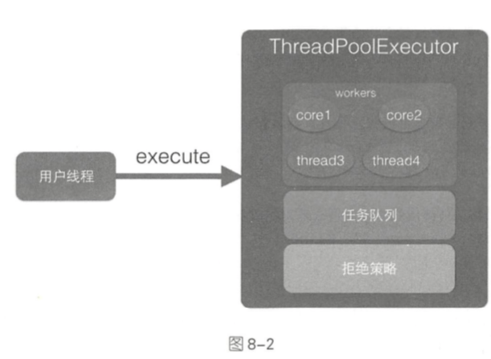

# ThreadPoolExecutor-源码分析

 [010-ThreadPoolExecutor.md](010-ThreadPoolExecutor.md) 

ThreadPoolExecutor 只是 Executors 工具类的一部分 ,线程池巧妙地使用一个 Integer 类型的原子变量来记录线程池状态和线程池中的线程个数,通过线程池状态来控制任务的执行,每个 Worker 线程可以处理多个任务,线程池通过现成的复用减少线程创建和销毁的开销

- [execute方法](#execute方法)
- [addWorker方法](#addWorker方法)

## execute方法

execute 方法的作用是提交任务 command 到线程池中进行执行 . 用户线程提交任务到线程池的模型图



#### 一个生产消费模型

从图中可以看出 ThreadPoolExecutor 实际上就是一个生产消费模型,

- 当用户添加任务到线程池时,相当于生产者生产元素
- workers 线程工作集中国的线程直接执行任务或者从任务队列里面获取任务时则相当于消费者消费元素

```java
    public void execute(Runnable command) {
      // ① 如果任务为 null , 则排除 NPE
        if (command == null)
            throw new NullPointerException();
      // ②    获取当前线程池的状态 + 线程个数变量的组合值
        int c = ctl.get();
      //// ③ 如果当前线程池的状态个数是否小于 corePoolSize ,小于则开启新线程运行
        if (workerCountOf(c) < corePoolSize) {
            if (addWorker(command, true))
                return;
            c = ctl.get();
        }
      // ④ 如果线程池出于 RUNNING 状态则添加任务到阻塞队列
        if (isRunning(c) && workQueue.offer(command)) {
          // 4.1 二次检查
            int recheck = ctl.get();
          // 4.2 如果当前线程状态不是 Running 状态,则从队列中删除任务, 并执行拒绝策略
            if (! isRunning(recheck) && remove(command))
                reject(command);
          // 4.3 否则如果当前线程池为空,则添加一个线程
            else if (workerCountOf(recheck) == 0)
                addWorker(null, false);
        }
      //⑤ 如果队列满,则新增线程池,新增失败则执行拒绝策略
        else if (!addWorker(command, false))
            reject(command);
    }
```

- 代码 ③ 判断如果当前线程小于 corePoolSize ,则会向 works 里面新增一个核心线程 core 线程执行该任务
- 如果当前线程池中线程个数大于等于 corePoolSize 则执行④代码,判断一下线程池是不是非 running 状态,如果是非 Running 状态,则抛弃
- 4.1 处的二次检查实际上是因为添加任务到任务队列后,执行代码 4.2 前有可能线程池的状态已经变化了
  - 如果不是线程池 running 状态了,则把任务从任务队列中移除并执行拒绝策略
- 如果二次校验通过则执行 4.3 , 添加一个线程
- 如果 添加失败,说明任务队列已经满了,那么执行 ⑤尝试新开启一个线程来执行任务 , 如果当前线程池中的线程个数 > maximumPoolSize 则执行拒绝策略

## addWorker方法

- 第一部分双重循环目的是通过 CAS 操作增加线程数
- 第二部分主要是把并发安全的任务添加到 workers 里面,并执行任务

添加失败的几种可能:

- 当线程池是 STOP/ TIDYING / TERMINATED
- 当线程池为 SHUTDOWN 并且已经有一个任务
- 当前线程为 SHUTDOWN 并且队列为空

```JAVA
private boolean addWorker(Runnable firstTask, boolean core) {
    retry:
    for (;;) {
        int c = ctl.get();
        int rs = runStateOf(c);

        // (6) 检查队列是否只在必要时为空
        if (rs >= SHUTDOWN &&
            ! (rs == SHUTDOWN &&
               firstTask == null &&
               ! workQueue.isEmpty()))
            return false;
				// (7) 循环 CAS增加线程个数	
        for (;;) {
            int wc = workerCountOf(c);
          	// (7.1) 如果线程个数超限则返回 fasle
            if (wc >= CAPACITY ||
                wc >= (core ? corePoolSize : maximumPoolSize))
                return false;
          //(7.2) CAS 增加线程个数,同时只有一个线程成功
            if (compareAndIncrementWorkerCount(c))
                break retry;
          //(7.3) CAS 失败了,则看线程池状态是否发生变化,变化了则跳到外层循环重新尝试偶去线程,状态,否则内循环重新 CAS
            c = ctl.get();  // Re-read ctl
            if (runStateOf(c) != rs)
                continue retry;
            // else CAS failed due to workerCount change; retry inner loop
        }
    }
	// (8) 到这说明 CAS 成功了
    boolean workerStarted = false;
    boolean workerAdded = false;
    Worker w = null;
    try {
      //(8.1) 创建 worker
        w = new Worker(firstTask);
        final Thread t = w.thread;
        if (t != null) {
            final ReentrantLock mainLock = this.mainLock;
          // (8.2) 独占加锁,为了实现 workers 同步,因为可能多个线程调用线程池的 execute方法
            mainLock.lock();
            try {
                // Recheck while holding lock.
                // Back out on ThreadFactory failure or if
                // shut down before lock acquired.
                int rs = runStateOf(ctl.get());

                if (rs < SHUTDOWN ||
                    (rs == SHUTDOWN && firstTask == null)) {
                    if (t.isAlive()) // precheck that t is startable
                        throw new IllegalThreadStateException();
                    workers.add(w);
                    int s = workers.size();
                    if (s > largestPoolSize)
                        largestPoolSize = s;
                    workerAdded = true;
                }
            } finally {
                mainLock.unlock();
            }
            if (workerAdded) {
                t.start();
                workerStarted = true;
            }
        }
    } finally {
        if (! workerStarted)
            addWorkerFailed(w);
    }
    return workerStarted;
}
```

## 工作线程的执行

用户线程提交任务到线程池后,由 Worker 来执行, 先看下 Work 的构造函数

```
Worker(Runnable firstTask) {
//① 在调用 runwirker 前禁止中断
    setState(-1); // inhibit interrupts until runWorker
    this.firstTask = firstTask;
    this.thread = getThreadFactory().newThread(this);
}
```

- 代码① 在构造函数内首先设置了 Worker 的状态是 -1, 这是为了避免当前 Wroker 在调用 runWorker 方法前被中断(当前其他线程调用了线程池的 shutdownNow时. 如果 Worker 状态 >  0 , 则会中断该线程), 这里设置了线程的状态为 -1, 所以该线程就不会被中断了


````
   final void runWorker(Worker w) {
        Thread wt = Thread.currentThread();
        Runnable task = w.firstTask;
        w.firstTask = null;
        w.unlock(); // allow interrupts
        //⑨ 将 state 设置为0 , 允许中断
        boolean completedAbruptly = true;
        try {
        //⑩ 
            while (task != null || (task = getTask()) != null) {
                w.lock();
                // If pool is stopping, ensure thread is interrupted;
                // if not, ensure thread is not interrupted.  This
                // requires a recheck in second case to deal with
                // shutdownNow race while clearing interrupt
                if ((runStateAtLeast(ctl.get(), STOP) ||
                     (Thread.interrupted() &&
                      runStateAtLeast(ctl.get(), STOP))) &&
                    !wt.isInterrupted())
                    wt.interrupt();
                try {
                //(10.2) 执行任务前干一些事
                    beforeExecute(wt, task);
                    Throwable thrown = null;
                    try {
                    //(10.3)执行任务
                        task.run();
                    } catch (RuntimeException x) {
                        thrown = x; throw x;
                    } catch (Error x) {
                        thrown = x; throw x;
                    } catch (Throwable x) {
                        thrown = x; throw new Error(x);
                    } finally {
                    // (10.4) 执行任务完毕后干一些事
                        afterExecute(task, thrown);
                    }
                } finally {
                    task = null;
                    //(10.5) 统计当前 worker 完成了多少任务
                    w.completedTasks++;
                    w.unlock();
                }
            }
            completedAbruptly = false;
        } finally {
        //(11) 执行清理工作
            processWorkerExit(w, completedAbruptly);
        }
    }
````

