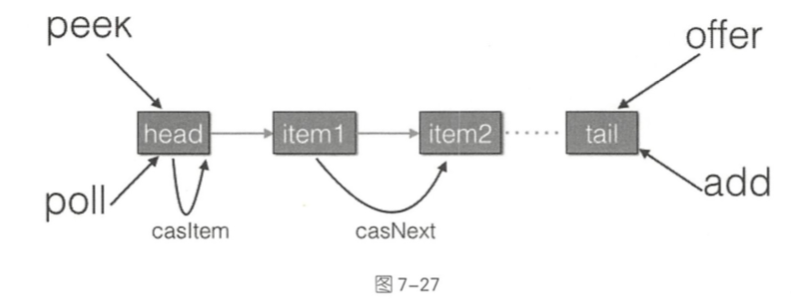
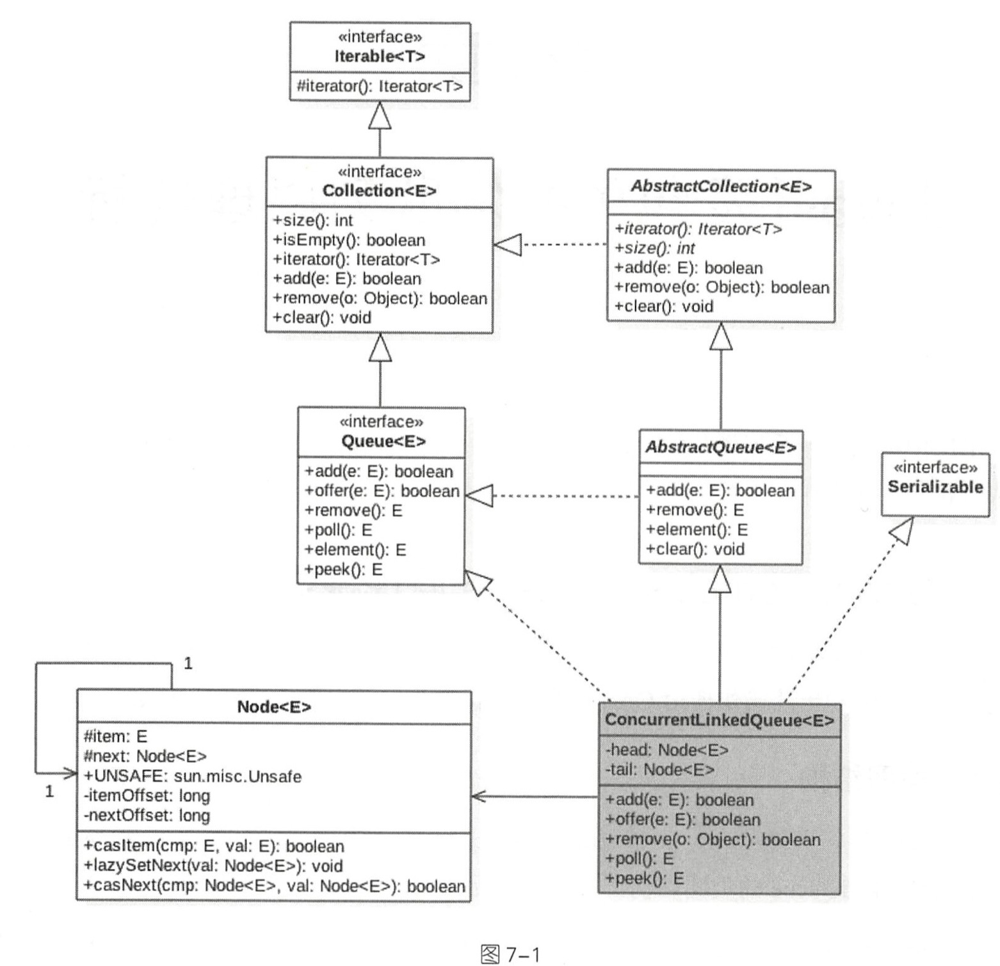
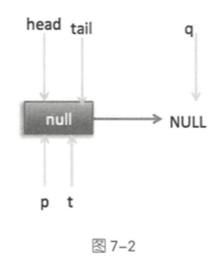
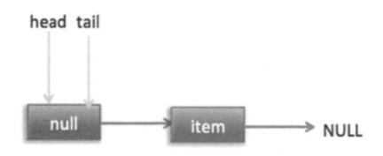

# ConcurrentLinkedQueue

[ConcurrentLinkedQueue 基础](031-ConcurrentLinkedQueue.md) 




## 类图



## 内部结构

ConcurrentLinkedQueue 采用的是单向链表的方式实现 , 其中两个` volatile` 类型的 Node 节点分别用来存放队列的 首/ 尾 节点

在默认情况下,看无参构造函数

```java
public ConcurrentLinkedQueue() {
  head = tail = new Node<E>(null);
}
```

默认头和尾及诶单指向的 item 为 null 的 **哨兵节点**

在 Node 节点内部,维护了一个 **volatile** 变量修饰的变量 item .用来存放节点的值

- next 节点用来存放链表的下一个节点 , 从而连接为一个单向的无界链表 
- 内部使用 UnSafe 工具类提供的 CAS 算法来保证出入队列是操作链表的原子性

## 实现原理

- [offer操作](#offer操作)

  > 在队列末尾添加一个元素  ; 不能为空 ;  使用 CAS 算法插入 ; 线程安全

- add操作直接调用的 offer

- [poll操作](#poll操作)

- [peek操作](#peek操作)

- [size操作](#size操作)

  > 计算当前队列的元素的个数,并发环境下会不支持, 因为 CAS 没有加锁,所以调用 size 函数到返回结果期间有可能增删元素,导致统计的元素个数不精确

- [remove操作](#remove操作)

  > 如果对列中存在该元素则删除改元素,如果存在多个则删除第一个,返回 true

- [contains操作](#contains操作)

  > 线程不安全, 判断是否包含指定对象 , 有可能调用该方法时元素还在对列里面,但是遍历过程中其他元素才把元素删除,那么就会返回 false

#### offer操作

offer 操作是在队列末尾添加一个元素,如果传递的参数是 null 则抛出 NPE 异常, 否则 ,由于 ConcurrentLinkedQueue 是一个**无界队列**, 该方法一直返回 true 

由于使用 CAS 无阻塞算法,因此该方法不会阻塞挂起调用线程

```java
    public boolean offer(E e) {
        checkNotNull(e); // 空指针检测 ①
      //构造Node 节点,在构造函数内部调用 unsafe.putObject ②
        final Node<E> newNode = new Node<E>(e);
      //尾插法 ③ 自旋插入
        for (Node<E> t = tail, p = t;;) {
            Node<E> q = p.next; // 查询节点的下一个节点
          //如果 q == null 说明 p 是尾节点 ,则执行插入 ④
            if (q == null) {
                // p is last node
              // 使用 CAS 设置 p 节点的 next 节点 ⑤
                if (p.casNext(null, newNode)) {
										// cas 成功,则说明新增节点已经被加入链表,然后设置当前尾结点 ⑥
                    if (p != t) // hop two nodes at a time
                        casTail(t, newNode);  // Failure is OK.
                    return true;
                }
                // Lost CAS race to another thread; re-read next
            }
            else if (p == q)
              //多线程操作时,由于 poll 操作移除元素后可能会把 head 变为自引用,也就是 head 的 next 变成了 head , 所以这里需要重新查找新的 head ⑦
                // We have fallen off list.  If tail is unchanged, it
                // will also be off-list, in which case we need to
                // jump to head, from which all live nodes are always
                // reachable.  Else the new tail is a better bet.
                p = (t != (t = tail)) ? t : head;
            else
              //寻找尾结点 ⑧
                // Check for tail updates after two hops.
                p = (p != t && t != (t = tail)) ? t : q;
        }
    }
```

- 代码 ① 用来对传参对空进行检查
- 代码 ② 使用 item 作为构造函数参数创建一个新的节点
- 代码 ③ 开始插入队列,从对列尾部开始循环

- 代码 ④  实际上已经找到了尾结点 . 实际上 q 指向的就是 null 节点



> 这个时候 , 可以看出 head , tail , p , t 都指向 item 为 null 的哨兵节点, 哨兵的next 节点为 null, 所以 q  也执行 null

- 代码 ⑤ , 通过 CAS 原子操作判断 p 节点的 next 节点是否为 null , 如果 为 null 则使用节点 newNode 替换 p 的 next 节点
- 代码 ⑥ , 这里由于 p == t 所以没有设置尾结点, 退出 offer 方法, 这时候队列是



上面是单线程情况,多线程情况下,  多个线程会调用代码 ⑤  , 假设 线程 A 调用 offer(item1) ; 线程 B 调用 offer(item2) , 同时执行到代码(5) p.casNext(null. newNode)

核心代码是⑤, 通过原子 CAS 操作来控制某时只有一个线程可以追加元素到队列末尾,进行 CAS 才做,知道 CAS成功才会返回,也就是通过 **自旋 CAS** 尝试方式来代替阻塞算法挂起调用贤臣

比起阻塞算法

**自旋算法 是使用 CPU资源换区阻塞所带来的开销**

#### add 操作

add 操作内部调用的 offer 方法

```java
public boolean add(E e) {
  return offer(e);
}
```


#### poll操作

**poll 操作是在队列头部获取并移除一个元素,如果队列为空则返回 null** 

poll 方法在移除一个元素时, 只是简单地使用 CAS 把当前节点的 item 值设置为 null , 

然后重新设置头结点将该元素从队列中移除, 被移除的节点就成了孤立节点, 会被垃圾回收器回收掉

如果在执行分支中发现头结点被修改了,则跳到外层循环重新获取头节点

```java
   public E poll() {
     // ① 循环标签 ; 相当于 goto 语句
        restartFromHead:
     //② 自旋
        for (;;) {
            for (Node<E> h = head, p = h, q;;) {
              // ③ 保存当前节点
                E item = p.item;
							// ④ 当前节点有值则 CAS 变为 null
                if (item != null && p.casItem(item, null)) {
                    // Successful CAS is the linearization point
                    // for item to be removed from this queue.
                  //⑤ CAS 成功则标记当前节点并从链表中移除
                    if (p != h) // hop two nodes at a time
                        updateHead(h, ((q = p.next) != null) ? q : p);
                    return item;
                }
              //⑥ 当前队列为空则返回 null
                else if ((q = p.next) == null) {
                    updateHead(h, p);
                    return null;
                }
              //⑦ 如果当前节点被自引用了,则重新寻找新的队列头节点
                else if (p == q)
                    continue restartFromHead;
                else
                  // ⑧ 
                    p = q;
            }
        }
    }
```


#### peek操作

peek 操作代码和 poll 操作类似, 

- peek 只获取队列头元素但是并不从队列中将它删除
- poll  获取后需要从队列里删除

在第一次调用 peek 操作时会删除哨兵节点,并让队列的 head 节点指向队列里面第一个元素或者 null

```java
    public E peek() {
      //①
        restartFromHead:
        for (;;) {
            for (Node<E> h = head, p = h, q;;) {
              //②
                E item = p.item;
              //③
                if (item != null || (q = p.next) == null) {
                    updateHead(h, p);
                    return item;
                }
              //④
                else if (p == q)
                    continue restartFromHead;
                else
                  //⑤
                    p = q;
            }
        }
    }
```


#### size操作

遍历链表获取 size

size 操作线程不安全, 因为CAS 没有加锁,所以从调用 size 函数到返回结果期间有可能增删元素,导致统计的元素个数不精确

```java
    public int size() {
        int count = 0;
        for (Node<E> p = first(); p != null; p = succ(p))
            if (p.item != null)
                // Collection.size() spec says to max out
              //最大值是 Integer.MAX_VALUE
                if (++count == Integer.MAX_VALUE)
                    break;
        return count;
    }
//获取第一个队列元素, 哨兵元素不算, 没有则返回 null
    Node<E> first() {
        restartFromHead:
        for (;;) {
            for (Node<E> h = head, p = h, q;;) {
                boolean hasItem = (p.item != null);
                if (hasItem || (q = p.next) == null) {
                    updateHead(h, p);
                    return hasItem ? p : null;
                }
                else if (p == q)
                    continue restartFromHead;
                else
                    p = q;
            }
        }
    }
```

```java
//获取当前节点的 next 元素,如果自引入节点则返回真正的头节点   
final Node<E> succ(Node<E> p) {
        Node<E> next = p.next;
        return (p == next) ? head : next;
    }
```

#### remove操作

如果队列里面存在这个元素则删除该元素,如果存在多个则删除第一个,并返回 true ,否则返回 false

```java
    public boolean remove(Object o) {
      
        if (o != null) {
            Node<E> next, pred = null;
            for (Node<E> p = first(); p != null; pred = p, p = next) {
                boolean removed = false;
                E item = p.item;
              //相等则使用 CAS 设置为 null .同时一个线程操作成功,失败的线程循环查找队列是否有匹配的其他元素
                if (item != null) {
                    if (!o.equals(item)) {
                      //获取 next 元素
                        next = succ(p);
                        continue;
                    }
                    removed = p.casItem(item, null);
                }

                next = succ(p);
              //如果有前驱节点, 并且 next 节点部位空则连接前驱节点到 next 节点
                if (pred != null && next != null) // unlink
                    pred.casNext(p, next);
                if (removed)
                    return true;
            }
        }
        return false;//为空直接返回 false
    }
```

#### contains操作

判断队列里是否包含有指定的对象,由于是遍历整个队列,所以像 size 操作一样的结果也不是那么精确,有可能调用该方法时元素还在队列里面,但是遍历过程中其他线程才把该元素删除了,那么就会返回 false

```java
    public boolean contains(Object o) {
        if (o == null) return false;
        for (Node<E> p = first(); p != null; p = succ(p)) {
            E item = p.item;
            if (item != null && o.equals(item))
                return true;
        }
        return false;
    }
```