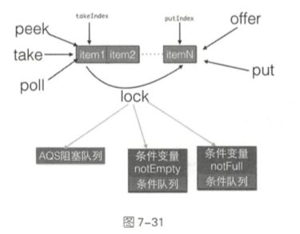
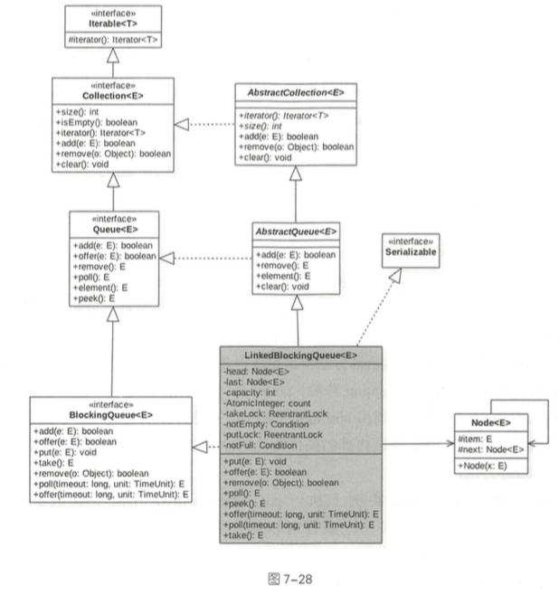

# ArrayBlockingQueue

ArrayBlockingQueue 通过使用全局独占锁实现了同时只能有一个线程进行入队和出队的动作, 这个锁的粒度比较大,有点类似于 在方法上添加 **synchronized** 的意思

-  offer 操作 和 poll 操作通过简单的加锁进行入队, 出队操作

- put 操作和 take 操作则使用条件变量实现了,如果队列满则等待,如果队列为空则等待,然后分别在出队和入队操作中发送信号激活等待线程实现同步

#### ArrayBlockingQueue 对比 LinkedBlockingQueue

- ArrayBlockingQueue 的 size 操作是精确的 ,  因为加了全局锁

- LinkedBlockingQueue 的 size 操作是不精确的



## 类图



```java
    /** Main lock guarding all access */
    final ReentrantLock lock;

    /** Condition for waiting takes */
    private final Condition notEmpty;

    /** Condition for waiting puts */
    private final Condition notFull;
```

- LinkedBlockingQueue 是使用单向链表实现的, 存储两个 Node , 一个 是 head 代表 头节点 , 一个是是 tail节点代表尾节点
- count 变量 的初始值为 0 , 用来计算元素的个数

```java
    public ArrayBlockingQueue(int capacity, boolean fair) {
        if (capacity <= 0)
            throw new IllegalArgumentException();
        this.items = new Object[capacity];
        lock = new ReentrantLock(fair);
        notEmpty = lock.newCondition();
        notFull =  lock.newCondition();
    }
```

由以上代码可知, 默认情况下使用 ReentrantLock 提供的非公平独占锁进行出入队列操作

### 操作

#### 插入方法

|      | 插入方法            | 特点       | 备注                                                         |
| ---- | ------------------- | ---------- | ------------------------------------------------------------ |
|      | add(e)              | 抛出异常   | 当队列满时,如果再插入元素,会抛出`illegalStateException("Queeue full ")`异常 |
|      | offer(e)            | 返回特殊值 | 成功返回 true                                                |
|      | put(e)              | 一直阻塞   | 当队列满时,会一直阻塞插入方法,直到中断或者队列可用           |
|      | offer(e, time,unit) | 超时退出   | 等待一段时间后退出                                           |

#### 移除方法

|      | 插入方法           | 特点       | 备注                                                       |
| ---- | ------------------ | ---------- | ---------------------------------------------------------- |
| 1    | remove()           | 抛出异常   | 当队列为空时,再获取元素,会抛出`NoSuchElementException`异常 |
| 2    | poll               | 返回特殊值 | 成功返回元素,失败返回 null                                 |
| 3    | take               | 一直阻塞   | 当队列为空时,阻塞当前队列,知道队列中有数据返回             |
| 4    | poll(e, time,unit) | 超时退出   | 等待一段时间后退出                                         |

#### 检查方法

|      | 检查方法 | 特点       | 备注 |
| ---- | -------- | ---------- | ---- |
| 1    | element  | 抛出异常   |      |
| 2    | peek     | 返回特殊值 |      |
| 3    | 不支持   | 一直阻塞   |      |
| 4    | 不支持   | 超时退出   |      |

## ArrayBlockingQueue 原理

- [offer操作](#offer操作) 
- [put操作](#put操作)
- [poll操作](#poll操作)
- [take操作](#take操作)
- [peek操作](#peek操作)
- [size操作](#size操作)

#### offer操作

向队列尾部插入一个元素, 如果队列有空闲空间则插入成功后返回 true ,

- 如果已经满则丢弃当前元素然后返回 false, 如果 e 元素 为 null 则抛出 NullPointerException 异常

- 这个方法是不阻塞的

```java
    public boolean offer(E e) {
      // ① e 为 null , 则抛出 NullPointerException
        checkNotNull(e);
      // ② 获取独占锁
        final ReentrantLock lock = this.lock;
        lock.lock();
        try {
          // ③ 如果队列满了则返回 false
            if (count == items.length)
                return false;
            else {
              //④ 插入元素
                enqueue(e);
                return true;
            }
        } finally {
          //⑤
            lock.unlock();
        }
    }
```

入队函数

```java
    private void enqueue(E x) {
        // assert lock.getHoldCount() == 1;
        // assert items[putIndex] == null;
      // ⑥元素入队
        final Object[] items = this.items;
        items[putIndex] = x;
      // ⑦计算下一个元素应该存放的下标位置
        if (++putIndex == items.length)
            putIndex = 0;
        count++;
      //⑧ 
        notEmpty.signal();
    }

```

- 代码⑥ 先把当前元素放入 item 数组
- 计算下一个元素应该存放的下标位置,
- 递增元素个数计数器
- 激活 notEmpty 的条件队列中因为调用 take 操作而被阻塞的一个线程

这里由于在操作共享变量 count 前加了锁,所以不存在内存不可见问题, 加过锁之后获取的共享变量都是从主内存获取的, 而不是从 CPU 缓存或者寄存器中获取的

- 代码⑤释放锁, 然后会把修改的共享变量刷新到主内存中,这样其他线程通过加锁再次读取这些共享变量时就可以看到最新的值

#### put操作

向着队尾插入一个元素,

- 如果队列有空闲则插入后直接返回 true

- 如果队列已经满了则阻塞当前线程直到队列有空闲并插入成功后返回 true

- 如果在阻塞时其他线程设置了中断标志,则被阻塞线程就会抛出 InterruptedException 异常而返回
- 如果 e 元素为 null  则抛出空指针

```java

    public void put(E e) throws InterruptedException {
      //①
        checkNotNull(e);
        final ReentrantLock lock = this.lock;
      //② 获取锁可以被中断
        lock.lockInterruptibly();
        try {
          //③ 如果队列已经满了了,则吧当前线程放入 notFull 管理的条件队列
            while (count == items.length)
                notFull.await();
          //④ 插入元素
            enqueue(e);
        } finally {
          //⑤ 
            lock.unlock();
        }
    }
```

- ③ 注意这里是 while 循环而不是 if 语句, 防止虚假唤醒

#### poll操作

从队列头部获取并移除一个元素,如果队列为空则返回 null, 这个方法是不阻塞的

```java
public E poll() {
  //① 获取锁  
  final ReentrantLock lock = this.lock;
    lock.lock();
    try {
      //② 当前队列 为空则返回 null , 否则调用 dequeue 获取
        return (count == 0) ? null : dequeue();
    } finally {
      //③释放锁
        lock.unlock();
    }
}
```

dequeue

```java

private E dequeue() {
        // assert lock.getHoldCount() == 1;
        // assert items[takeIndex] != null;
        final Object[] items = this.items;
  // ④ 获取元素值
        @SuppressWarnings("unchecked")
        E x = (E) items[takeIndex];
  // ⑤ 数组中的值为 null
        items[takeIndex] = null;
  //⑥ 对头指针计算,队列元素个数减一
        if (++takeIndex == items.length)
            takeIndex = 0;
        count--;
        if (itrs != null)
            itrs.elementDequeued();
  // 期 发送信号激活 notFull 条件队列里的一个线程
        notFull.signal();
        return x;
    }
```

- 获取当前队头元素并将其保存到局部变量
- 重置队头元素为 null , 并重新设置队头下标
- 递减元素计数器
- 发送激活信号 notFull 的条件队列里面一个因为调用 put 方法而被阻塞的线程

### take操作

获取当前队列头部元素并从队列里面移除它

如果队列为空则阻塞当前线程直到队列部位空然后返回元素,如果在阻塞时被其他线程设置了中断标志,则被阻塞线程会抛出 InterruptedException

```java
    public E take() throws InterruptedException {
      // ① 获取锁
      final ReentrantLock lock = this.lock;
      
        lock.lockInterruptibly();
        try {
          //②队列为空,则等待,直到队列中有元素
            while (count == 0)
                notEmpty.await();
          //获取队头元素
            return dequeue();
        } finally {
          //释放锁
            lock.unlock();
        }
    }
```

#### peek操作

获取队列头部元素但是不从队列里面移除它, 如果队列为空则返回 null,该方法不是阻塞的

```java
    public E peek() {
        final ReentrantLock lock = this.lock;
        lock.lock();
        try {
            return itemAt(takeIndex); // null when queue is empty
        } finally {
            lock.unlock();
        }
    }
```

peek 实现简单,首先获取独占锁,然后从数组 items 中获取到对头下标的值并返回,在返回前释放获取的锁

#### size操作

```java
public int size() {
    final ReentrantLock lock = this.lock;
    lock.lock();
    try {
        return count;
    } finally {
        lock.unlock();
    }
}
```

size 操作比较简单,获取锁后直接返回 count ,并在返回前释放锁

为什么要加锁? 因为count 不是 volatile 声明的

