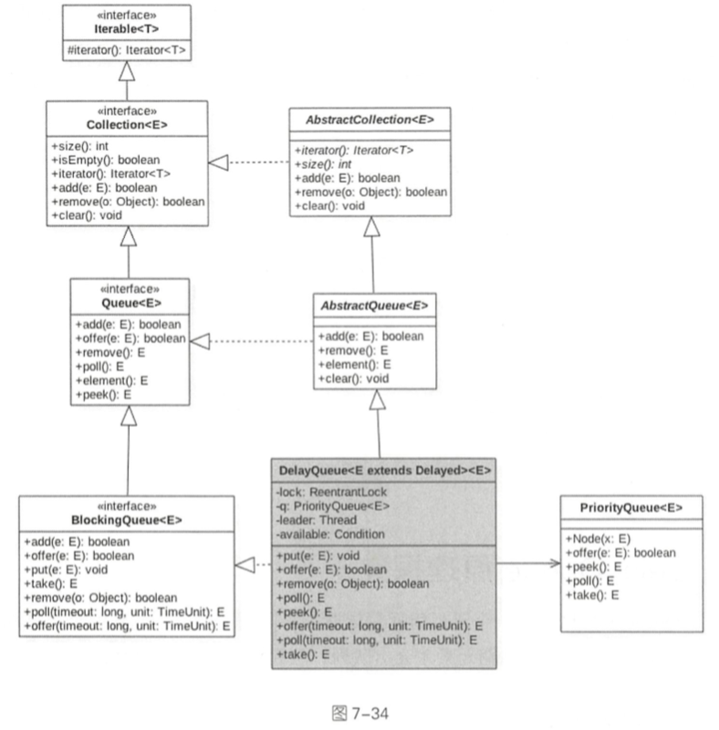

# DelayQueue

## 是什么

>  DelayQueue 并发队列是一个无界阻塞延迟队列, 队列中的每个元素都有个过期时间,当从队列获取元素时, 只有过期元素才能出队列,队列头元素时最快要过期的元素
>
>  优先级队列实现的无界阻塞队列

内部使用 PriorityQueue 存放数据, 使用 ReentrantLock 实现线程同步

- 队列里面的元素要实现 Delayed 接口 , 
  - 一个就是获取当前元素到期时间剩余时间的接口, 在出队列时判断是否过期了, 
  - 一个是元素之间比较的接口,因为这是一个有优先级的队列


## 类图



```java
public interface Delayed extends Comparable<Delayed> {

    /**
     * Returns the remaining delay associated with this object, in the
     * given time unit.
     *
     * @param unit the time unit
     * @return the remaining delay; zero or negative values indicate
     * that the delay has already elapsed
     */
    long getDelay(TimeUnit unit);
}

```

条件变量 **available** 与 **lock** 锁是对应的，其目的是为了实现线程问同步 。

```java
    private final Condition available = lock.newCondition();
    private Thread leader = null;
```

其中 leader 变量的使用基于 Leader-Follower 模式的变体，用于尽量减少不必要的线程 等待

当一个线程调用队列的 take 方法变 为 leader 线程后，它会调用条件变量 

```java
available.awaitNanos(delay);
```

等待 delay 时间，但是其他线程  (follwer线程)  则 会调用 **available. await()** 进行无限等待 。 

leader 线程延迟时间过期后，会退出 take 方法 ，并通过调用 **available.signal()** 方法唤醒一个 **follwer** 线程 ，被唤醒的 **follwer** 线程被选举为新的 **leader** 线程 。

## 主要函数原理讲解

- [offer](#offer)
- [take](#take)
- [poll](#poll)
- [size](#size)

##### offer

插入元素到队列

- 由于是无界队列,所以一直返回 true

- 插入元素不能为空,否则 NPE 

```java
    /**
     * Inserts the specified element into this delay queue.
     *
     * @param e the element to add
     * @return {@code true}
     * @throws NullPointerException if the specified element is null
     */
    public boolean offer(E e) {
        final ReentrantLock lock = this.lock;
        lock.lock();
        try {
            q.offer(e);
          //②
            if (q.peek() == e) {
                leader = null;
                available.signal();
            }
            return true;
        } finally {
            lock.unlock();
        }
    }
```

首先获取独占锁,然后添加元素到优先级队列

- 由于 q 是优先级队列,所以添加元素后, 调用 q.peek() 方法返回的并不一定是当前添加的元素

- 如果代码②判断结果为 true , 则说明当前元素 e 是先将过期的, 

- 那么重置 leader 线程为 null , 这个时候激活 avaliable 变量条件队列里面的一个线程,告诉它队列里有元素了

#### take

获取并移除队列里面延迟时间过期的元素,如果队列里面没有过期元素则等待

```java
    public E take() throws InterruptedException {
        final ReentrantLock lock = this.lock;
        lock.lockInterruptibly();
        try {
            for (;;) {
              //获取但不移除队首元素 ①
                E first = q.peek();
                if (first == null)
                  //② 如果队首没有元素,加入条件变量并等待
                    available.await();
                else {
                    long delay = first.getDelay(NANOSECONDS);
                    if (delay <= 0)
                      // ③ 
                        return q.poll();
                    first = null; // don't retain ref while waiting
                    if (leader != null)
                      //④
                        available.await();
                    else {
                        Thread thisThread = Thread.currentThread();
                      //⑤
                        leader = thisThread;
                        try {
                          //⑥
                            available.awaitNanos(delay);
                        } finally {
                            if (leader == thisThread)
                                leader = null;
                        }
                    }
                }
            }
        } finally {
            if (leader == null && q.peek() != null)
                available.signal();
            lock.unlock();
        }
    }
```

- 首先获取独占锁

- 假设线程 A 第一次调的队列的 take 方法时 队列为空,  则执行代码 ① 后 first == null 

  - 执行代码② 把当前线程放入available的条件队列并等待

- 当线程 B 调用 offer(item) 将 元素添加到队列后, 线程A 会从 available 条件队列中唤醒, 执行 q.peek()方法

- 线程 A 调用 first.getDelay(TimeUnit.UANOSECONDS) 方法查看该元素还剩多少时间就要过期

  - 如果 delay <= 0, 则说明这个元素已经过期, 直接出队列
  - 否则, 查看 leader 是否为 null, 不为 null 则说明其他线程也在执行 take, 则把该线程放入条件队列
  - 如果这个时候 leader 为 null , 则选取当前线程 A 为 leader 线程, 然后执行代码 ⑤ 等待 delay 时间(这期间该线程会释放锁, 所以其他线程可以 offer 添加元素, 也可以take 阻塞自己)
  - 剩余时间过期后,线程 A 会重新竞争得到锁,然后重置 leader 线程为 null , 重新进入循环, 这时候就会发现对头的元素已经过期, 会直接返回对头元素

  - 返回前会执行 finally 块, 如果执行结果为 true ,则说明当前线程从队列移除过期元素后, 又有其他线程执行了入队操作,那么这时候调用条件变量 singal 方法, 激活等待队列中的等待线程

#### poll 操作

获取并移除对头过期元素,如果没有过期元素则返回 null

```java
    public E poll() {
        final ReentrantLock lock = this.lock;
        lock.lock();
        try {
            E first = q.peek();
            if (first == null || first.getDelay(NANOSECONDS) > 0)
                return null;
            else
                return q.poll();
        } finally {
            lock.unlock();
        }
    }
```

- 获取锁,获取对头元素
  - 如果对头元素为null ,或者还没过期则返回 null
  - 否则返回对头元素

#### size

计算元素个数, 包含过期的和没过期的

```java
    public int size() {
        final ReentrantLock lock = this.lock;
        lock.lock();
        try {
            return q.size();
        } finally {
            lock.unlock();
        }
    }
```

## 使用案例

```java
public class DelayedQueueTest {

    static class DelayedEle implements Delayed {
        private final long delayTime;
        private final long expire;
        private String taskName;

        public DelayedEle(long delay, String taskName) {
            this.delayTime = delay;
            this.expire = System.currentTimeMillis() + delay;
            this.taskName = taskName;
        }

        @Override
        public long getDelay(TimeUnit unit) {
            return unit.convert(expire - System.currentTimeMillis(), unit);
        }

        @Override
        public int compareTo(Delayed o) {
            return (int) (this.getDelay(TimeUnit.MILLISECONDS) - o.getDelay(TimeUnit.MILLISECONDS));
        }

        @Override
        public String toString() {
            return "DelayedEle{" +
                    "delayTime=" + delayTime +
                    ", expire=" + expire +
                    ", taskName='" + taskName + '\'' +
                    '}';
        }
    }


    public static void main(String[] args) {
        DelayQueue<DelayedEle> delayQueue = new DelayQueue<>();
        Random random = new Random();
        for (int i = 0; i < 10; i++) {
            DelayedEle delayedEle = new DelayedEle(random.nextInt(500), "Task:" + i);
            delayQueue.offer(delayedEle);
        }
        DelayedEle ele = null;
        try {
            for (; ; ) { // 防止虚假唤醒
                while ((ele = delayQueue.take()) != null) {
                    System.out.println(ele.toString());
                }
            }
        } catch (Exception e) {
            e.printStackTrace();
        }
    }
}
```

- 创建延迟任务`DelayedEle` ,
  -  其中 delayTime 标识当前任务需要延迟多少 ms 时间过期, expire 则是当前时间 ms 值加上 delayTime 的值
  - 实现了delayed 接口, 实现了 getDelay 方法用来获取当前元素还剩下多少时间过期
  - 实现了 compareTo 方法用来决定优先级队列比较规则
- main函数 创建了一个延迟队列,并随机生成 10 个延迟任务, 最后依次获取延迟任务,并打印

```java
DelayedEle{delayTime=45, expire=1595310400974, taskName='Task:3'}
DelayedEle{delayTime=48, expire=1595310400977, taskName='Task:6'}
DelayedEle{delayTime=83, expire=1595310401012, taskName='Task:7'}
DelayedEle{delayTime=107, expire=1595310401036, taskName='Task:5'}
DelayedEle{delayTime=184, expire=1595310401112, taskName='Task:1'}
DelayedEle{delayTime=194, expire=1595310401123, taskName='Task:8'}
DelayedEle{delayTime=266, expire=1595310401195, taskName='Task:4'}
DelayedEle{delayTime=400, expire=1595310401329, taskName='Task:2'}
DelayedEle{delayTime=478, expire=1595310401405, taskName='Task:0'}
DelayedEle{delayTime=491, expire=1595310401420, taskName='Task:9'}
```

出队的顺序与 delay 有关,与创建任务的顺序无关

 