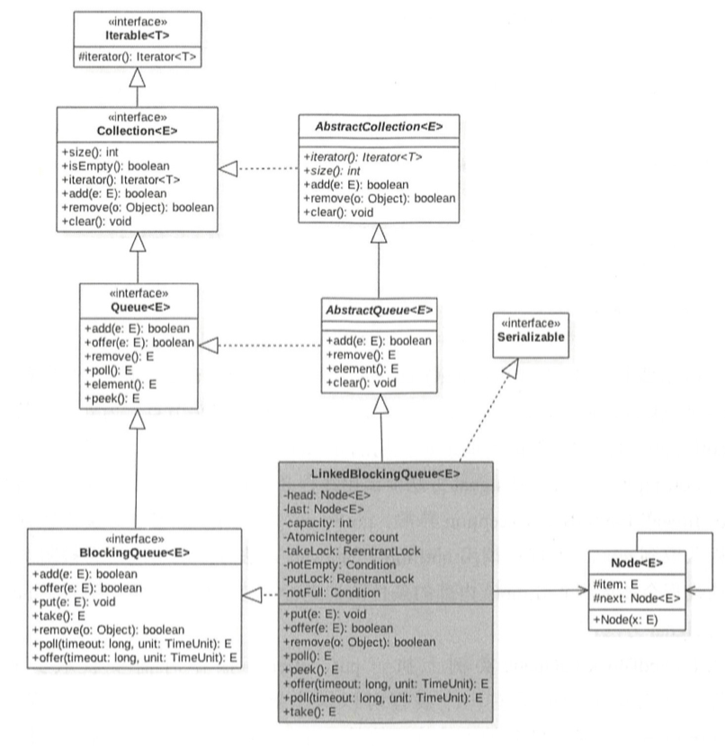

# LinkedBlockingQueue

链表实现的有界阻塞 FIFO 队列, 此队列的默认和最大长度为 **Integer.MAX_VALUE**。

`LinkedBlockingQueue` 的内部是通过**单向链表**实现的,使用**头节点,尾结点**来进行入队和出队操作,也就是入队操作都是对尾结点进行操作,出队列都是对头结点进行操作

#### 

对头结点和尾结点的操作分别使用了单独的独占锁从而保证了原子性,所以**出栈**和**入栈**可以同时进行的,另外对于头节点和尾结点都配对了条件队列,用来存放被阻塞的线程, 并结合入队、出队操作实现了一个生产消费模型


## 类图



## 内部结构来看

## 操作

- [offer操作](#offer操作)
- [put操作](#put操作)
- [poll操作](#poll操作)
- [peek操作](#peek操作)
- [take操作](#take操作)
- [remove操作](#remove操作)
- [size操作](#size操作)


#### offer操作

offer 阻塞插入一个元素

**offer 方法通过使用 putLock 锁保证了在队列尾新增元素操作的原子性, 另外调用条件变量的方法前一定要记得获取对应的锁,并且注意进队时只操作队列链表的尾结点**

向队列尾部插入一个元素,如果队列中有空闲则插入成功后返回 true, 如果队列已经满了则丢弃当前元素然后返回 false , 如果 e 元素 为 null 则 抛出 NullPointerException 异常,  

```java
    public boolean offer(E e) {
      //① 为空则抛出空指针
        if (e == null) throw new NullPointerException();
      
      //② 如果当前队列满则丢弃将要放入的元素,然后返回 false
        final AtomicInteger count = this.count;
        if (count.get() == capacity)
            return false;
      // ③ 构造新节点, 获取 putLock 独占锁
        int c = -1;
        Node<E> node = new Node<E>(e);
        final ReentrantLock putLock = this.putLock;
        putLock.lock();
        try {
          //④ 如果队列不满则进队列, 并递增元素计数
            if (count.get() < capacity) {
                enqueue(node);//插入队列
                c = count.getAndIncrement();//递增技术器
              //⑤
                if (c + 1 < capacity)
                    notFull.signal();
            }
        } finally {
          //⑥ 释放锁
            putLock.unlock();
        }
      // ⑦
        if (c == 0)
            signalNotEmpty();
      // ⑧
        return c >= 0;
    }
```

- ② 判断如果当前队列已经满了, 则丢弃当前元素

- ③ 获取到 putLock 锁, 当前线程获取到该锁之后, 则其他调用 put 或者 offer 的线程会被阻塞( 阻塞的线程被放到 putLock 锁的 AQS 阻塞队列
- ④ 这里重新判断当前队列是否满 , 因为 ②代码获取到 putLock 锁期间可能有其他线程通过 put 或者 offer 操作向队列里添加新元素 , 重新判断队列确实不满则新元素入队, 并递增计数器

- ⑤ 判断如果新元素入队后还有空闲空间, 则唤醒 notFull 的 条件队列里面因为调用了 notFull 的 await 操作 (比如 put 方法而队列满了的时候, 而被阻塞的一个线程, 因为队列现在有空闲所以这里可以提前唤醒一个入队线程)

- ⑥ 释放获取的 putLock 锁, 这里需要注意, 锁的释放一定要放在 finally 里面做, 即使 try 块抛出异常了也会执行

- ⑦ 中的 c ==0 说明在执行代码 ⑥的时候释放锁时候队列里面至少要有一个元素, 队列里面有元素则执行 signalNotEmpty 操作 , signalNotEmpty 的代码如下

  ```java
      private void signalNotEmpty() {
          final ReentrantLock takeLock = this.takeLock;
          takeLock.lock();
          try {
            //激活 notEmpty 条件队列中因为调用 notEmpty 的 await 方法, 比如 调用 take 方法并且队列为空的时候) 而被阻塞的一个线程, 这也说明了调用条件变量的方法前需要获取对应的锁
              notEmpty.signal();
          } finally {
              takeLock.unlock();
          }
      }
  ```

#### put操作

向队列尾部插入一个元素,

- 如果队列中有空闲则插入后直接返回
- 如果队列中已经满了则阻塞当前线程, 直到队列有空闲插入成功后返回
- 如果在阻塞时被其他线程设置了中断标志, 则被阻塞编程会抛出` InterruptedException` 异常并返回
- 如果插入的是 null 则会抛出 `NullPointerException`

```java
    public void put(E e) throws InterruptedException {
        if (e == null) throw new NullPointerException();
        // Note: convention in all put/take/etc is to preset local var
        // holding count negative to indicate failure unless set.
      //② 构建新节点,并获取独占锁 putLock
        int c = -1;
        Node<E> node = new Node<E>(e);
        final ReentrantLock putLock = this.putLock;
        final AtomicInteger count = this.count;
        putLock.lockInterruptibly();
        try {
            /*
             * Note that count is used in wait guard even though it is
             * not protected by lock. This works because count can
             * only decrease at this point (all other puts are shut
             * out by lock), and we (or some other waiting put) are
             * signalled if it ever changes from capacity. Similarly
             * for all other uses of count in other wait guards.
             */
          //③ 如果队列满则等待
            while (count.get() == capacity) {
                notFull.await();
            }
          //④ 进队列并递增计数
            enqueue(node);
            c = count.getAndIncrement();
            if (c + 1 < capacity)
                notFull.signal();
        } finally {
            putLock.unlock();
        }
        if (c == 0)
            signalNotEmpty();
    }
```

- 代码②使用了 putLock.lockInterruptibly(); 获取了独占锁,  也就是说 这个方法是可以被中断的

  > 当前线程在获取锁的过程中,如果被其他线程设置了中断标志则当前线程会抛出 InterruptedException 异常, 所以 put 操作会在获取锁的过程中是可以被中断的

- 代码③ 判断如果当前队列已经满了,则调用 notFull 的 await 方法 把当前线程放入 notFull 的条件队列, 当前线程放入 notFull  的条件队列, 当前线程被阻塞挂起后就会释放获取到 putLock 锁, 由于 putLock 锁被释放了, 所以现在在其他线程就有机会获取到 putLock 锁了

- 代码 ③ 判断队列是否为空时为何使用 while  循环而不是 if语句?

  > 虚假唤醒
  >
  > 其他线程没有调用 notFull 的 singal 方法时 , notFull.await 在某种情况下会自动返回,
  >
  > 如果使用 if语句那么虚假唤醒后执行代码④的元素入队操作,并且递增计数器, 这个时候队列已经满了, 从而导致队列元素个数大于队列被设置的容量,进而导致程序出错
  >
  > 
  >
  > 如果使用 while 语句呢, 加入 notFill.await() 被虚假唤醒了, 那么在此循环检查当前队列是否已经满了, 如果是则再次等待

#### poll操作

从队列头部获取并移除一个元素, 如果队列为空则返回 null, 该方法是不阻塞的

```java
    public E poll() {
      //① 队列为空时 返回 null
        final AtomicInteger count = this.count;
        if (count.get() == 0)
            return null;
        E x = null;
        int c = -1;
      //② 获取独占锁
        final ReentrantLock takeLock = this.takeLock;
        takeLock.lock();
        try {
          //③ 队列不空则出队并递减计数
            if (count.get() > 0) {
                x = dequeue();
                c = count.getAndDecrement();
              //④
                if (c > 1)
                    notEmpty.signal();
            }
        } finally {
          //⑤
            takeLock.unlock();
        }
      //⑥
        if (c == capacity)
            signalNotFull();
      //⑦
        return x;
    }
```

- ②获取独占锁,当前线程获取独占锁之后,其他线程调用 poll 或者 take 的时候方法会被挂起
- ③代码判断如果当前队列不为空则进行出队操作,然后递减计数器
- ④ 判断 c > 1 则说明当前线程移除掉队列里面的最后一个元素后队列不为空 (c 是删除元素前队列元素个数), 这个时候就可以激活因为 take 方法而被阻塞到 notEmpty 的条件队列的一个线程
- 获取元素的时候实际上只操作了队列的头结点

```java
    private void signalNotFull() {
        final ReentrantLock putLock = this.putLock;
        putLock.lock();
        try {
            notFull.signal();
        } finally {
            putLock.unlock();
        }
    }
```

#### peek操作

获取头部元素但是不移除队列, 如果队列为空则返回 null 该方法时不阻塞的

```java
    public E peek() {
        if (count.get() == 0)
            return null;
        final ReentrantLock takeLock = this.takeLock;
        takeLock.lock();
        try {
            Node<E> first = head.next;
            if (first == null)
                return null;
            else
                return first.item;
        } finally {
            takeLock.unlock();
        }
    }
```

#### take操作

获取当前队列头部元素 并从队列里面移除它, 如果队列为空则当前线程直到队列不为空后返回元素, 如果在阻塞时被其他线程设置了中断标志,则被阻塞线程会抛出 InterruptedException 异常并返回

```java
    public E take() throws InterruptedException {
        E x;
        int c = -1;
        final AtomicInteger count = this.count;
      //①获取锁,当前线程获取独占锁,其他线程会放入 notEmpty 的条件队列
        final ReentrantLock takeLock = this.takeLock;
        takeLock.lockInterruptibly();
        try {
          //②当前队列为空则阻塞挂起
            while (count.get() == 0) {
                notEmpty.await();
            }
          //③出队并递减 
            x = dequeue();
            c = count.getAndDecrement();
          	//④ 判断如果 c> 1  则说明当前队列不为空, 那么唤醒 notEmpty 的条件队列里面的一个因为调用 take 操作而被阻塞的线程
            if (c > 1)
            
                notEmpty.signal();
        } finally {
           //⑤释放锁
            takeLock.unlock();
        }
      //判断如果 c == capacity 则说明至少还有一个空闲位置,激活 notFull 的条件队列里面的一个因为调用 put 操作而被阻塞的线程
        if (c == capacity)
            signalNotFull();
        return x;
    }
```

#### remove操作

删除队列里面指定的元素, 有则删除并返回 true ,没有则返回 false

```java
   public boolean remove(Object o) {
        if (o == null) return false;
     //双重加锁 , 入队和出队操作都会被阻塞挂起
        fullyLock();
        try {
          //遍历队列找到则删除返回 true
            for (Node<E> trail = head, p = trail.next;
                 p != null;
                 trail = p, p = p.next) {
                if (o.equals(p.item)) {
                  //移除头并唤醒等待线程
                    unlink(p, trail);
                    return true;
                }
            }
          //找不到返回 false
            return false;
        } finally {
          //解锁
            fullyUnlock();
        }
    }
    void fullyLock() {
        putLock.lock();
        takeLock.lock();
    }

```

#### size操作

因为出队和入队都加了锁,所以结果相比 ConcurrentLinkedQueue 的 size 更加准确

```java
    public int size() {
        return count.get();
    }
```

