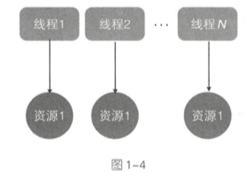
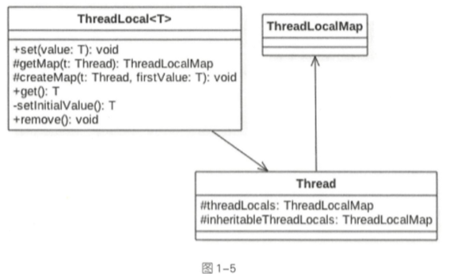
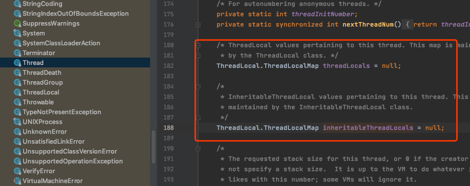

# ThreadLocal

 [100-使用ThreadLocal不当可能会导致内存泄漏.md](../15-并发编程实战/100-使用ThreadLocal不当可能会导致内存泄漏.md) 

## 目录

- [是什么](#是什么)

- [源码分析](#源码分析)

## 是什么

ThreadLocal 是 JDK 包提供的,它提供了线程本地变量,也就是如果你创建了一个 ThreadLocal 变量, 那么访问这个变量的每个线程都会有这个变量的一个**本地副本**

- 当多线程操作这个变量时,实际操作的就是自己本地内存里面的变量,从而避免了线程安全问题

- 当创建一个 ThreadLocal 变量后, 每个线程都会复制一个变量到本地内存



#### 总结

每个线程内部都维护了一个名为 threadLocals 的成员变量,该变量的类型为 ThreadLocalMap , 其中 key 为我们定义的 ThreadLocal 变量的 this 引用,value 则为我们使用 set 方法设置的值

每个线程的本地变量存放在自己内存变量 threadLocals 中, 如果当前线程一直不消亡, 那么这些本地变量会一直存在,所以可能会造成内存溢出

因此使用完毕之后要记得 remove 掉 , JUC 中的 ThreadLocalRandom 就是借鉴了这个思想

## 使用

 [简单使用](../08-Java并发容器和框架/07-ThreadLocal.md) 

## 实现原理

### 类图



Thread 类中有一个 threadLocals 和一个 inheritableThreadLocals

**他们都是 ThreadLocalMap 类型的变量, 而 ThreadLocalMap 是一个定制化的 HashMap**

#### 值得注意的是

- 默认情况下, 每个线程中的这个两个变量都为 null , 只有当前线程第一次调用 ThreadLocal 的 set 和 get 方法时才会创建它们
- 每个线程的本地变量不是存放在 ThreadLocal 实例里面,而是存放在当前线程的 threadLocals 变量里面
- ThreadLocal 就是一个工具壳, 所有 ThreadLocal 类型的本地变量存放在具体的线程内存空间中 , 通过 set 方法把 value 值存放调用线程的 threadLocals 变量里面, 当线程调用 get 方法时, 再从当前的 threadLocals 变量里面将其拿出来使用
- 如果调用线程一直不终止,那本地变量会一直存放在 threadLocals 变量里面 , **所以不使用的时候一定要 remove掉**, 因为我们的应用大部分会使用线程池对线程进行复用

## 源码分析

为什么 Thread 类中的 threadLocals 变量设计成 map 结构, 很明显每个线程可以关联多个 ThreadLocal 变量



- [ThreadLocal#set](#ThreadLocal#set)
- [ThreadLocal#get](#ThreadLocal#get)
- [ThreadLocal#remove](#ThreadLocal#remove)

#### ThreadLocal#set

```java
    public void set(T value) {
      //(1)获取当前线程
        Thread t = Thread.currentThread();
      //(2)将当前线程作为 key, 查找对应的线程变量, 找到则设置
        ThreadLocalMap map = getMap(t);
        if (map != null)
            map.set(this, value);
        else
          //(3)第一次调用就创建当前线程对应的 HashMap
            createMap(t, value);
    }
```

在 getMap 方法里, 我们可以看到实际上是拿到了 Thread 类的 threadLocals 变量,这个变量就是 ThreadLocalMap 类型的变量

```java
ThreadLocalMap getMap(Thread t) {
    return t.threadLocals;
}
```

创建 ThreadLocalMap , 为当前线层创建一个 ThreadlocalMap

```java
void createMap(Thread t, T firstValue) {
    t.threadLocals = new ThreadLocalMap(this, firstValue);
}
```

#### ThreadLocal#get

```java
    public T get() {
      //(4) 获取当前线程
        Thread t = Thread.currentThread();
     	//获取当前线程的 ThreadLocal 变量
        ThreadLocalMap map = getMap(t);
        if (map != null) {
          //如果不为空则从 Map 中获取
            ThreadLocalMap.Entry e = map.getEntry(this);
            if (e != null) {
                @SuppressWarnings("unchecked")
                T result = (T)e.value;
                return result;
            }
        }
      //如果 threadLocals 为空则初始化当前线程的 threadLocals 成员变量
        return setInitialValue();
    }

    private T setInitialValue() {
      //初始化为空
        T value = initialValue();
        Thread t = Thread.currentThread();
        ThreadLocalMap map = getMap(t);
      //如果当前线程的 threadlocals 变量不为空
        if (map != null)
            map.set(this, value);
        else
          //如果当前线程的 threadLocals 变量为空
            createMap(t, value);
        return value;
    }

    protected T initialValue() {
        return null;
    }
```

#### ThreadLocal#remove

```java
public void remove() {
    ThreadLocalMap m = getMap(Thread.currentThread());
    if (m != null)
        m.remove(this);
}
```

## 不具备继承性

同一个 ThreadLocal 变量在父线程中被设置后,在子线程是获取不到的

解决办法是 [02-InheritableThreadLocal.md](02-InheritableThreadLocal.md) 