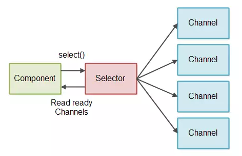
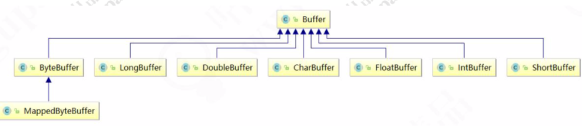
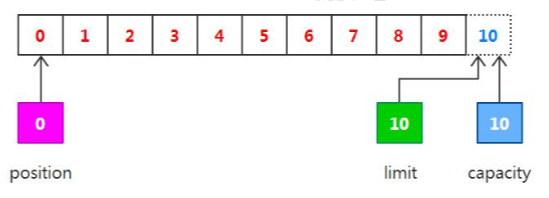
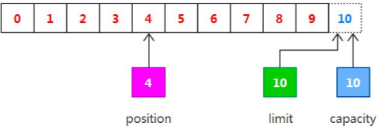
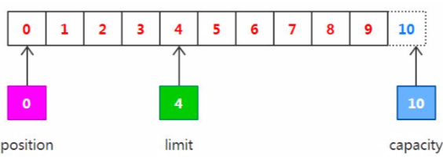
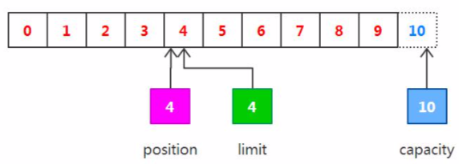
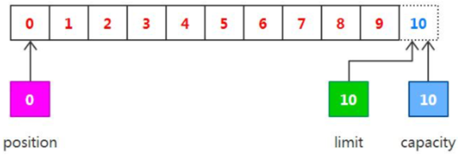
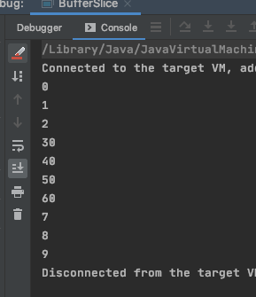

# 缓冲区 Buffer



## Buffer 操作基本 API

缓冲区实际上是一个容器对象，更直接的说，其实就是一个数组，**在 NIO 库中，所有数据都是用缓冲区处理的**。

在读 取数据时，它是直接读到缓冲区中的;

在写入数据时，它也是写入到缓冲区中的;

任何时候访问 NIO 中的数据，都是将它放到缓冲区中。

而在面向流 I/O 系统中，所有数据都是直接写入或者直接将数据读取到 Stream 对象中。

在 NIO 中，所有的缓冲区类型都继承于抽象类 Buffer，最常用的就是 ByteBuffer，对于 Java 中的基本类型，基本都有 一个具体 Buffer 类型与之相对应，它们之间的继承关系如下图所示:



```
/**
 * <p>
 * Buffer 的例子 Example 
 * </p>
 *
 * @author EricChen 2020/05/11 12:22
 */
public class IntBufferDemo {

    public static void main(String[] args) {
        //分配新的 int 缓冲区, 参数为缓冲区容量
        //新缓冲区的当前位置将为 0,其接线(限制位置)将为其容量,它将具有一个底层实现数组,器数组偏移量为 0
        IntBuffer buffer = IntBuffer.allocate(8);
        for (int i = 0; i < buffer.capacity(); i++) {
            int j = 2 * (i + 1);
            //将给定整数写入次缓冲区的当前位置,当前位置递增
            buffer.put(j);
        }
        //重设此缓冲区,将限制设置为当前位置,然后将当前位置设置为 0
        buffer.flip();
        //查看在当前位置和限制位置之间是否有元素
        while (buffer.hasRemaining()) {
        // 读取此缓冲区当前位置的整数，然后当前位置递增
            int j = buffer.get();
            System.out.println(j + " ");
        }

    }

}
```

### buffer 的基本的原理

在谈到缓冲区时，我们说缓冲区对象本质上是一个数组，但它其实是一个特殊的数组，缓冲区对象内置了一些机制， 能够跟踪和记录缓冲区的状态变化情况，如果我们使用 get()方法从缓冲区获取数据或者使用 put()方法把数据写入缓冲 区，都会引起缓冲区状态的变化。

在缓冲区中，最重要的属性有下面三个，它们一起合作完成对缓冲区内部状态的变化跟踪:

- position:指定下一个将要被写入或者读取的元素索引，它的值由 get()/put()方法自动更新，在新创建一个 Buffer 对象 时，position 被初始化为 0。
- limit:指定还有多少数据需要取出(在从缓冲区写入通道时)，或者还有多少空间可以放入数据(在从通道读入缓冲区时)。
- capacity:指定了可以存储在缓冲区中的最大数据容量，实际上，它指定了底层数组的大小，或者至少是指定了准许我们使用的底层数组的容量。

以上三个属性值之间有一些相对大小的关系:`0 <= position <= limit <= capacity`如果我们创建一个新的容量大小为 10 的 ByteBuffer 对象，在初始化的时候，position 设置为 0，limit 和 capacity 被设置为 10，在以后使用 ByteBuffer 对象过程中，capacity 的值不会再发生变化，而其它两个个将会随着使用而变化。

下面我们用一段代码来验证 position、limit 和 capacity 这几个值的变化过程，代码如下:

```
/**
 * <p>
 * BufferDemo 验证 position、limit 和 capacity 这几个值的变化过程
 * </p>
 *
 * @author EricChen 2020/05/11 12:30
 */
public class BufferDemo {
    public static void main(String[] args) throws Exception {
        //这用的是文件 IO 处理
        FileInputStream inputStream = new FileInputStream("fileTest.txt");
        //创建文件的操作 Channel 管道
        FileChannel channel = inputStream.getChannel();
        //分配一个 10 个大小的缓冲区,说白了就是分配一个 10 个大小的 byte 数组
        final ByteBuffer buffer = ByteBuffer.allocate(10);
        printBuffer("初始化", buffer);
        //读取一个
        int read = channel.read(buffer);
        printBuffer("调用 read()", buffer);
        //准备操作之前，先锁定操作范围
        buffer.flip();
        printBuffer("调用 flip()", buffer);
        //判断有没有可读数据
        while (buffer.remaining() > 0) {
            byte b = buffer.get();
            System.out.print(((char) b));
        }
        printBuffer("调用 get()", buffer);
        //可以理解为解锁
        buffer.clear();
        printBuffer("调用 clear()", buffer);
        //最后把管道关闭
        inputStream.close();
    }

    public static void printBuffer(String state, ByteBuffer buffer) {
        System.out.println(state + " : "); //容量，数组大小
        System.out.print("capacity: " + buffer.capacity() + ", "); //当前操作数据所在的位置，也可以叫做游标
        System.out.print("position: " + buffer.position() + ", "); //锁定值，flip，数据操作范围索引只能在 position - limit 之间
        System.out.println("limit: " + buffer.limit());
        System.out.println();
    }
}

```

输出

```
初始化 : 
	capacity: 10, position: 0, limit: 10
调用 read() : 
	capacity: 10, position: 10, limit: 10
调用 flip() : 
	capacity: 10, position: 0, limit: 10
this is a 调用 get() : 
	capacity: 10, position: 10, limit: 10
调用 clear() : 
	capacity: 10, position: 0, limit: 10
```

#### 初始化



我们可以从通道中读取一些数据到缓冲区中，注意从通道读取数据，相当于往缓冲区中写入数据。如果读取 4 个自己 的数据，则此时 position 的值为 4，即下一个将要被写入的字节索引为 4，而 limit 仍然是 10，如下图所示:

#### read



下一步把读取的数据写入到输出通道中，相当于从缓冲区中读取数据，在此之前，必须调用 flip()方法，该方法将会完 成两件事情:

#### flip

1. 把 limit 设置为当前的 position 值 
2. 把 position 设置为 0

由于 position 被设置为 0，所以可以保证在下一步输出时读取到的是缓冲区中的第一个字节，而 limit 被设置为当前的 position，可以保证读取的数据正好是之前写入到缓冲区中的数据，如下图所示:



#### get

现在调用 get()方法从缓冲区中读取数据写入到输出通道，这会导致 position 的增加而 limit 保持不变，但 position 不 会超过 limit 的值，所以在读取我们之前写入到缓冲区中的 4 个字节之后，position 和 limit 的值都为 4，如下图所示



#### clear()

在从缓冲区中读取数据完毕后，limit 的值仍然保持在我们调用 flip()方法时的值，调用 clear()方法能够把所有的状态变 化设置为初始化时的值，如下图所示:



## 缓冲区的分配

用静态方法 allocate()来指定缓冲区的容量，其实调用 allocate()相当于创建了一个指定大小的数组，并把它包装为缓冲区对象。或者我们也可以直接将一个现有的数组，包装为缓冲区对 象，如下示例代码所示:

```
import java.nio.ByteBuffer;
/** 手动分配缓冲区 */ public class BufferWrap {
public void myMethod() {
// 分配指定大小的缓冲区
ByteBuffer buffer1 = ByteBuffer.allocate(10);
// 包装一个现有的数组
byte array[] = new byte[10];
       ByteBuffer buffer2 = ByteBuffer.wrap( array );
    }
}
```

## 缓冲区分片

在 NIO 中，除了可以分配或者包装一个缓冲区对象外，还可以根据现有的缓冲区对象来创建一个子缓冲区，即在现有缓冲区上切 出一片来作为一个新的缓冲区，但现有的缓冲区与创建的子缓冲区在底层数组层面上是数据共享的，也就是说，子缓冲区相当于是 现有缓冲区的一个视图窗口。调用 slice()方法可以创建一个子缓冲区，让我们通过例子来看一下:

在该示例中，分配了一个容量大小为 10 的缓冲区，并在其中放入了数据 0-9，而在该缓冲区基础之上又创建了一个子缓冲区，并 改变子缓冲区中的内容，从最后输出的结果来看，只有子缓冲区“可见的”那部分数据发生了变化，并且说明子缓冲区与原缓冲区是 数据共享的，输出结果如下所示:




## 只读缓冲区 ReadOnlyBuffer

只读缓冲区非常简单，可以读取它们，但是不能向它们写入数据。可以通过调用缓冲区的 asReadOnlyBuffer()方法，将任何常规缓 冲区转 换为只读缓冲区，这个方法返回一个与原缓冲区完全相同的缓冲区，并与原缓冲区共享数据，只不过它是只读的。如果原 缓冲区的内容发生了变化，只读缓冲区的内容也随之发生变化:

```java
/**
 * <p>
 * Example of 只读缓冲区
 * </p>
 *
 * @author EricChen 2020/05/11 20:54
 */
public class ReadOnlyBuffer {
    public static void main(String[] args) {
        ByteBuffer buffer = ByteBuffer.allocate(10);
// 缓冲区中的数据 0-9
        for (int i = 0; i < buffer.capacity(); ++i) {
            buffer.put((byte) i);
        }
// 创建只读缓冲区
        ByteBuffer readonly = buffer.asReadOnlyBuffer();
// 改变原缓冲区的内容
        for (int i = 0; i < buffer.capacity(); ++i) {
            byte b = buffer.get(i);
            b *= 10;
            buffer.put(i, b);
        }
        readonly.position(0);
        readonly.limit(buffer.capacity());
// 只读缓冲区的内容也随之改变
        while (readonly.remaining() > 0) {
            System.out.println(readonly.get());
        }
    }
}

```

如果尝试修改只读缓冲区的内容，则会报 ReadOnlyBufferException 异常。只读缓冲区对于保护数据很有用。在将缓冲区传递给某 个 对象的方法时，无法知道这个方法是否会修改缓冲区中的数据。创建一个只读的缓冲区可以保证该缓冲区不会被修改。只可以 把常规缓冲区转换为只读缓冲区，而不能将只读的缓冲区转换为可写的缓冲区。

## 直接缓冲区

直接缓冲区是为加快 I/O 速度，使用一种特殊方式为其分配内存的缓冲区，JDK 文档中的描述为:给定一个直接字节缓冲区，Java 虚拟机将尽最大努力直接对它执行本机 I/O 操作。也就是说，它会在每一次调用底层操作系统的本机 I/O 操作之前(或之后)，尝试避免将缓冲区的内容拷贝到一个中间缓冲区中或者从一个中间缓冲区中拷贝数据。要分配直接缓冲区，需要调用 allocateDirect() 方法，而不是 allocate()方法，使用方式与普通缓冲区并无区别，如下面的拷贝文件示例:

```java
/**
 * <p>
 * Example of DirectBuffer
 * </p>
 *
 * @author EricChen 2020/05/11 20:58
 */
public class DirectBuffer {
    static public void main(String args[]) throws Exception {
//首先我们从磁盘上读取刚才我们写出的文件内容
        String infile = "fileTest.txt";
        FileInputStream fin = new FileInputStream(infile);
        FileChannel fcin = fin.getChannel();
//把刚刚读取的内容写入到一个新的文件中
        String outfile = String.format("fileTest2.txt");
        FileOutputStream fout = new FileOutputStream(outfile);
        FileChannel fcout = fout.getChannel();
// 使用 allocateDirect，而不是 allocate
        ByteBuffer buffer = ByteBuffer.allocateDirect(1024);
        while (true) {
            buffer.clear();
            int r = fcin.read(buffer);
            if (r == -1) {
                break;
            }
            buffer.flip();
            fcout.write(buffer);
        }
    }
}
```

## 内存映射

内存映射是一种读和写文件数据的方法，它可以比常规的基于流或者基于通道的 I/O 快的多。内存映射文件 I/O 是通过使文件中的 数据出现为 内存数组的内容来完成的，这其初听起来似乎不过就是将整个文件读到内存中，但是事实上并不是这样。一般来说， 只有文件中实际读取或者写入的部分才会映射到内存中。如下面的示例代码:

```java
/**
 * <p>
 * description
 * </p>
 *
 * @author EricChen 2020/05/11 21:02
 */
public class MappedBuffer {
    static private final int start = 0;
    static private final int size = 1024;

    static public void main(String args[]) throws Exception {
        RandomAccessFile raf = new RandomAccessFile("fileTest2.txt", "rw");
        FileChannel fc = raf.getChannel();
//把缓冲区跟文件系统进行一个映射关联 //只要操作缓冲区里面的内容，文件内容也会跟着改变
        MappedByteBuffer mbb = fc.map(FileChannel.MapMode.READ_WRITE, start, size);
        mbb.put(0, (byte) 97);
        mbb.put(1023, (byte) 122);
        raf.close();
    }
}

```

