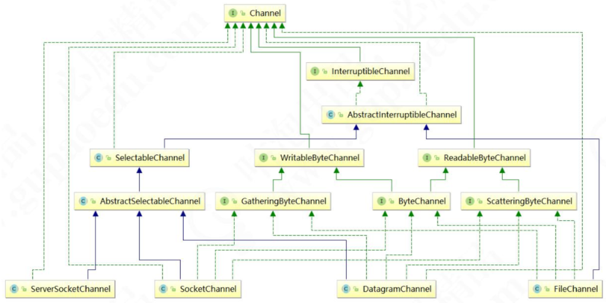
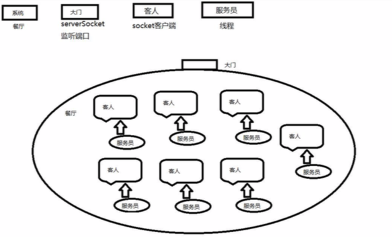
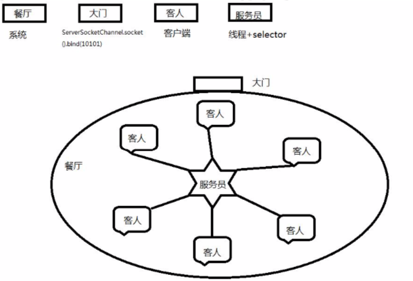

# 通道 Channel

通道是一个对象，通过它可以读取和写入数据，当然了所有数据都通过 Buffer 对象来处理。我们永远不会将字节直接写入通道中，相反是将数据写入包含一个或者多个字节的缓冲区。同样不会直接从通道中读取字节，而是将数据从通 道读入缓冲区，再从缓冲区获取这个字节。
在 NIO 中，提供了多种通道对象，而所有的通道对象都实现了 Channel 接口。它们之间的继承关系如下图所示:

## 使用 NIO 读取数据

在前面我们说过，任何时候读取数据，都不是直接从通道读取，而是从通道读取到缓冲区。所以使用 NIO 读取数据可 以分为下面三个步骤:
1. 从 FileInputStream 获取 Channel
2. 创建 Buffer
3. 将数据从 Channel 读取到 Buffer 中 下面是一个简单的使用 NIO 从文件中读取数据的例子:

## 使用 NIO 写入数据

使用 NIO 写入数据与读取数据的过程类似，同样数据不是直接写入通道，而是写入缓冲区，可以分为下面三个步

- 从 FileInputStream 获取 Channel。
- 创建 Buffer。
- 将数据从 Channel 写入到 Buffer 中。

## IO 多路复用

 我们试想一下这样的现实场景:
一个餐厅同时有 100 位客人到店，当然到店后第一件要做的事情就是点菜。但是问题来了，餐厅老板为了节约人 力成本目前只有一位大堂服务员拿着唯一的一本菜单等待客人进行服务。

那么最笨(但是最简单)的方法是(方法 A)，无论有多少客人等待点餐，服务员都把仅有的一份菜单递给其中 一位客人，然后站在客人身旁等待这个客人完成点菜过程。在记录客人点菜内容后，把点菜记录交给后堂厨师。然后 是第二位客人。。。。然后是第三位客人。很明显，只有脑袋被门夹过的老板，才会这样设置服务流程。因为随后的 80 位客人，再等待超时后就会离店(还会给差评)。

于是还有一种办法(方法 B)，老板马上新雇佣 99 名服务员，同时印制 99 本新的菜单。每一名服务员手持一本 菜单负责一位客人(关键不只在于服务员，还在于菜单。因为没有菜单客人也无法点菜)。在客人点完菜后，记录点 菜内容交给后堂厨师(当然为了更高效，后堂厨师最好也有 100 名)。这样每一位客人享受的就是 VIP 服务咯，当然 客人不会走，但是人力成本可是一个大头哦(亏死你)。

另外一种办法(方法 C)，就是改进点菜的方式，当客人到店后，自己申请一本菜单。想好自己要点的才后，就 呼叫服务员。服务员站在自己身边后记录客人的菜单内容。将菜单递给厨师的过程也要进行改进，并不是每一份菜单记录好以后，都要交给后堂厨师。服务员可以记录号多份菜单后，同时交给厨师就行了。那么这种方式，对于老板来 说人力成本是最低的;对于客人来说，虽然不再享受 VIP 服务并且要进行一定的等待，但是这些都是可接受的;对于 服务员来说，基本上她的时间都没有浪费，基本上被老板压杆了最后一滴油水。

  如果您是老板，您会采用哪种方式呢?
到店情况:并发量。到店情况不理想时，一个服务员一本菜单，当然是足够了。所以不同的老板在不同的场合下， 将会灵活选择服务员和菜单的配置。

- 客人:客户端请求
- 点餐内容:客户端发送的实际数据
- 老板:操作系统
- 人力成本:系统资源

菜单:文件状态描述符(FD)。操作系统对于一个进程能够同时持有的文件状态描述符的个数是有限制的，在 linux 系统中$ulimit -n 查看这个限制值，当然也是可以(并且应该)进行内核参数调整的。

服务员:操作系统内核用于 IO 操作的线程(内核线程) 厨师:应用程序线程(当然厨房就是应用程序进程咯) 方法 A:同步 IO
方法 B:同步 IO
方法 C:多路复用 IO
目前流行的多路复用 IO 实现主要包括四种:select、poll、epoll、kqueue。下表是他们的一些重要特性的比较:

| IO模型 | 相对性能 | 关键思路         | 操作系统      | JAVA支持                                                     |
| ------ | -------- | ---------------- | ------------- | ------------------------------------------------------------ |
| select | 较高     | Reactor          | windows/Linux | 支持,Reactor 模式(反应器设计模式)。Linux 操作 系统的 kernels 2.4 内核版本之前，默认使用 select;而目前 windows 下对同步 IO 的支持，都 是 select 模型。 |
| poll   | 较高     | Reactor          | Linux         | Linux 下的 JAVA NIO 框架，Linux kernels 2.6 内 核版本之前使用 poll 进行支持。也是使用的 Reactor 模式。 |
| epoll  | 高       | Reactor/Proactor | Linux         | Linux kernels 2.6 内核版本及以后使用 epoll 进行 支持;Linux kernels 2.6 内核版本之前使用 poll 进行支持;另外一定注意，由于 Linux 下没有 Windows 下的 IOCP 技术提供真正的 异步 IO 支 持，所以 Linux 下使用 epoll 模拟异步 IO。 |
| kqueue | 高       | Proactor         | Linux         | 目前 JAVA 的版本不支持。                                     |

多路复用 IO 技术最适用的是“高并发”场景，所谓高并发是指 1 毫秒内至少同时有上千个连接请求准备好。其他情 况下多路复用 IO 技术发挥不出来它的优势。另一方面，使用 JAVA NIO 进行功能实现，相对于传统的 Socket 套接字 实现要复杂一些，所以实际应用中，需要根据自己的业务需求进行技术选择。