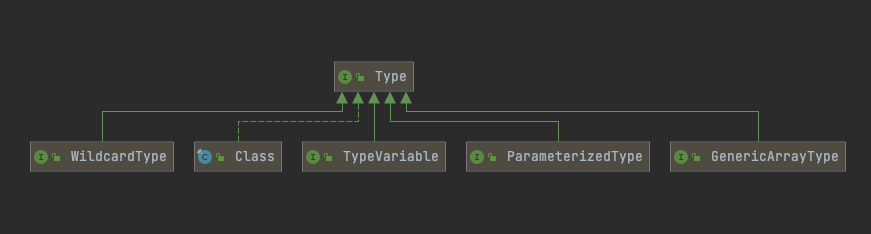

# 001-Java5类型接口-Type

[TOC]

## Java5类型接口-java.lang.reflect.Type

这个接口包含下列子类型：



| 派生类或接口                        | 说明                                                         |
| ----------------------------------- | ------------------------------------------------------------ |
| java.lang.Class                     | Java类API, 如java.lang.String ;描述具体类型                  |
| java.lang.reflect.GenericArrayType  | 描述泛型数组(如T[])                                          |
| java.lang.reflect.ParameterizedType | 描述泛型类或接口类型(如Comparable＜？super T＞)              |
| java.lang.reflect.TypeVariable      | 描述类型变量(如T extends Comparable＜？super T＞)<br />又比如Collection<E> 中的E |
| java.lang.reflect.WildcardType      | 描述通配符类型 (如？super T)。                               |

## 核心API

| 类型                             | 说明                                   |
| -------------------------------- | -------------------------------------- |
| 泛型信息(Generic Info)           | java.lang.Class#getGenericInfo()       |
| 泛型参数(Parameters)             | java.lang.reflect.ParameterizedType    |
| 泛型父类(Super Classes)          | java.lang.Class#getGenericSuperclass() |
| 泛型接口(Interfaces)             | java.lang.Class#getGenericInterfaces() |
| 泛型声明(Generic Declearation  ) | java.lang.reflect.GenericDeclearation  |

## API

#### java.lang.Class＜T＞1.0

```java
java.lang.Class＜T＞1.0
  ·TypeVariable[]getTypeParameters()5.0
  //如果这个类型被声明为泛型类型，则获得泛型类型变量，否则获得一个长度为0的数组。
  ·Type getGenericSuperclass()5.0
  //获得被声明为这一类型的超类的泛型类型；如果这个类型是Object或不是一个类类型(class type)，则返回null。
  ·Type[]getGenericInterfaces()5.0
  //获得被声明为这个类型的接口的泛型类型(以声明的次序)，否则，如果这个类型没有实现接口，返回长度为0的数组。
```

#### java.lang.reflect.Method 

```java
java.lang.reflect.Method 1.1
·TypeVariable[]getTypeParameters()5.0
//如果这个方法被声明为泛型方法，则获得泛型类型变量，否则返回长度为0的数组。
·Type getGenericReturnType()5.0
//获得这个方法被声明的泛型返回类型。
·Type[]getGenericParameterTypes()5.0
//获得这个方法被声明的泛型参数类型。如果这个方法没有参数，返回长度为0的数组。
```

#### java.lang.reflect.TypeVariable 5.0 类型变量

```java
java.lang.reflect.TypeVariable 5.0
·String getName()
//获得类型变量的名字。
·Type[]getBounds()
//获得类型变量的子类限定，否则，如果该变量无限定，则返回长度为0的数组。

```

#### java.lang.reflect.WildcardType 5.0 通配符类型

```java
java.lang.reflect.WildcardType 5.0
·Type[]getUpperBounds()
//获得这个类型变量的子类(extends)限定，否则，如果没有子类限定，则返回长度为0的数组。
·Type[]getLowerBounds()
//获得这个类型变量的超类(super)限定，否则，如果没有超类限定，则返回长度为0的数组。
```

#### java.lang.reflect.ParameterizedType 5.0

```java
java.lang.reflect.ParameterizedType 5.0
·Type getRawType()
//获得这个参数化类型的原始类型。
·Type[]getActualTypeArguments()
//获得这个参数化类型声明时所使用的类型参数。
·Type getOwnerType()
//如果是内部类型，则返回其外部类型，如果是一个顶级类型，则返回null。
```

#### java.lang.reflect.GenericArrayType 5.0

```java
java.lang.reflect.GenericArrayType 5.0
·Type getGenericComponentType()
//获得声明该数组类型的泛型组件类型。
```

## 实例代码

```java
public class GenericReflectionTest {
    public static void main(String[] args) {
        try {
            // print generic info for class and public methods
            Class<?> cl = Class.forName("java.util.ArrayList");
            printClass(cl);
            for (Method m : cl.getDeclaredMethods()) {
                printMethod(m);
            }
        } catch (ClassNotFoundException e) {
            e.printStackTrace();
        }
    }

    /**
     * 打印Class类
     */
    public static void printClass(Class<?> cl) {
        System.out.print(cl);
        printTypes(cl.getTypeParameters(), "<", ", ", ">", true);
        Type sc = cl.getGenericSuperclass();
        if (sc != null) {
            System.out.print(" extends ");
            printType(sc, false);
        }
        printTypes(cl.getGenericInterfaces(), " implements ", ", ", "", false);
        System.out.println();
    }

    public static void printMethod(Method m) {
        String name = m.getName();
        System.out.print(Modifier.toString(m.getModifiers()));
        System.out.print(" ");
        printTypes(m.getTypeParameters(), "<", ", ", "> ", true);

        printType(m.getGenericReturnType(), false);
        System.out.print(" ");
        System.out.print(name);
        System.out.print("(");
        printTypes(m.getGenericParameterTypes(), "", ", ", "", false);
        System.out.println(")");
    }

    public static void printTypes(Type[] types, String pre, String sep, String suf,
                                  boolean isDefinition) {
        if (pre.equals(" extends ") && Arrays.equals(types, new Type[]{Object.class})) {
            return;
        }
        if (types.length > 0) {
            System.out.print(pre);
        }
        for (int i = 0; i < types.length; i++) {
            if (i > 0) {
                System.out.print(sep);
            }
            printType(types[i], isDefinition);
        }
        if (types.length > 0) {
            System.out.print(suf);
        }
    }

    public static void printType(Type type, boolean isDefinition) {
        if (type instanceof Class) {
            Class<?> t = (Class<?>) type;
            System.out.print(t.getName());
        } else if (type instanceof TypeVariable) {
            TypeVariable<?> t = (TypeVariable<?>) type;
            System.out.print(t.getName());
            if (isDefinition) {
                printTypes(t.getBounds(), " extends ", " & ", "", false);

            }
        } else if (type instanceof WildcardType) {
            WildcardType t = (WildcardType) type;
            System.out.print("?");
            printTypes(t.getUpperBounds(), " extends ", " & ", "", false);
            printTypes(t.getLowerBounds(), " super ", " & ", "", false);
        } else if (type instanceof ParameterizedType) {
            ParameterizedType t = (ParameterizedType) type;
            Type owner = t.getOwnerType();
            if (owner != null) {
                printType(owner, false);
                System.out.print(".");
            }
            printType(t.getRawType(), false);
            printTypes(t.getActualTypeArguments(), "<", ", ", ">", false);
        } else if (type instanceof GenericArrayType) {
            GenericArrayType t = (GenericArrayType) type;
            System.out.print("");
            printType(t.getGenericComponentType(), isDefinition);
            System.out.print("[]");
        }

    }
}
```

